# Забытая война: как украинско-румынский конфликт 1918-го создал современную Молдову 
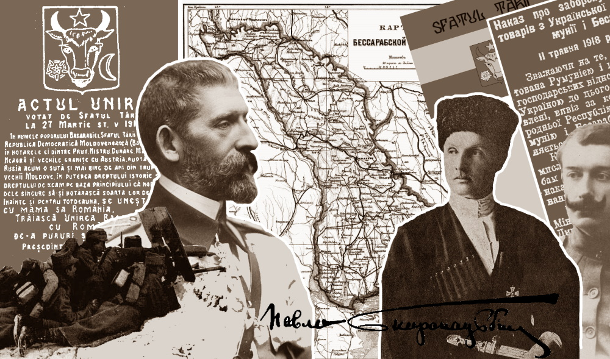

<small>(перевод [с Украинского 13/04/2020 09:00](https://novynarnia.com/2020/04/13/bessarabia-1918/))

автор: Максим Мирошниченко 
</small>

В течение 1918-1919 годов Бессарабия (а речь идет об области между реками Прут, Днестр и устьем Дуная и Черным морем) стала полем незаурядных баталий – политических, дипломатических, экономических и даже военных – между Украиной, Румынией и Молдовой.

Соглашения, интриги, эмбарго, восстания и их подавление… Как это происходило, чем закончилось и что за люди были фигурами на бессарабской «шахматной доске» – в материале «Новинарные» о малоизвестной странице нашей истории.

Румынская аннексия Бессарабии и годовщина ее непризнания
Зимой 1917-1918 годов на обломках России образовалось несколько государственных стран. В восьми губерниях "Юго-Западного края" возникла Украинская Народная Республика с Центральным Советом во главе, провозгласившей независимость IV Универсалом 22 января 1918 года. Вслед за Киевом в Бессарабской губернии местный Сфатул Церий ("Совет края") 23 января оформил независимую Молдавскую Демократическую Республику.

Ничто в соседских отношениях не предвещало беды. Украинцы тогда молдавских Хотина и Измаила делегировали своих представителей в Центральную Раду, а молдаване из украинских Тирасполя и Рыбницы (ныне это территории непризнанной “ПМР” в пределах Молдовы) – в Сфатул Церия. Однако такая идиллия длилась недолго.

Под ударами большевиков Украина обратилась за помощью в страны Четвертного союза, а Молдова – в соседнюю Румынию.

Немцы и австро-венгры признали независимость УНР и ввели войска, чтобы выгнать красных. Униженные тяжким миром с теми же немцами, румыны ввели в Бессарабию не только войска, но и цензуру и запрет митингов и стачек.

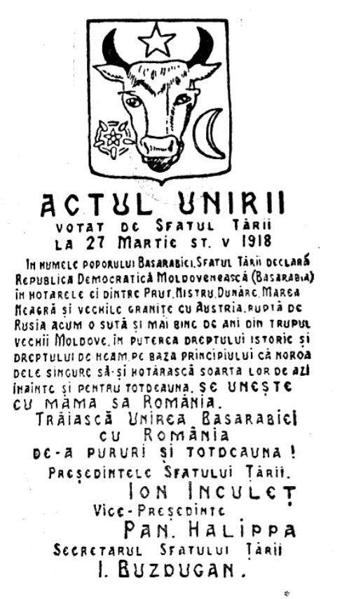  
<small>Акт об объединении Румынии и Молдовы 1918</small>

27 марта в присутствии вооруженных румынских солдат Сфатул Церий проголосовал за воссоединение Молдовы с Бухарестом.

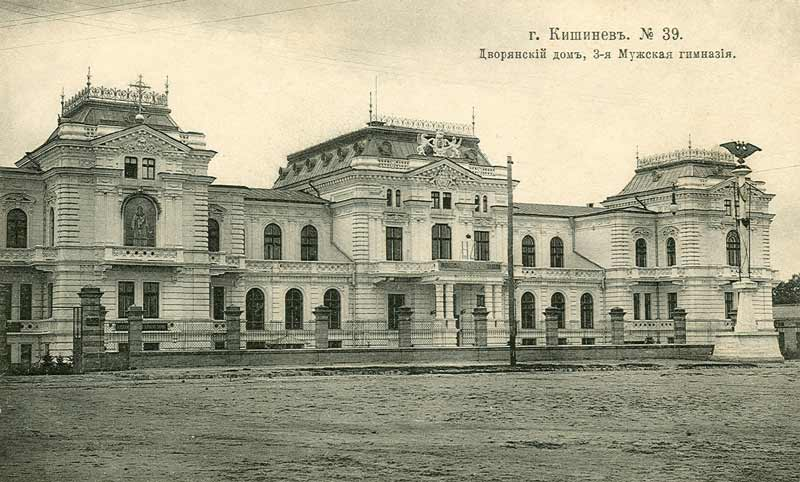  
<small>Здание Сфатул Церия в Кишиневе.</small>

Изгнав большевиков со своей территории, Украина стала меряться с Румынией способностями вокруг бессарабского вопроса. И если для наших это было вопросом опеки над украинцами в крае, то для другой стороны – спасением национальной катастрофы.

102 года назад, 13 апреля 1918 года, Центральная Рада принимает воинственную резолюцию о непризнании румынской аннексии Бессарабии. Совету Министров УНР приказали принять все средства, чтобы провести в крае полноценный референдум.

Вслед за нотой румынам телеграфом представили первого в истории украино-румынских отношений посла Николая Галагана.

Премьер чертит границу собственной рукой
О своем назначении Николай Галаган – уроженец Черниговщины, политический и общественный деятель, член Центральной Рады, бывший военный – узнал еще 5 апреля.

  
<small>Николай Галаган</small>

"Об истории Румынии, ее экономической политике знал меньше, чем о соседних с ней государства", - вспоминает он в мемуарах.

Впрочем, конечно, Галаган был в курсе ключевых вводных. В I Мировой войне Румыния выступала на стороне Антанты, быстро потерпела сокрушительные поражения от немцев, потеряла столицу, нефтяные месторождения, ключевые перевалы в Карпатах и ​​черноморское побережье. На незанятые немцами территории вошла Россия. Румынские золотовалютные запасы лежали в Петрограде.

Распад России не оставил румынам выбора: они подписали мир с Германией и только вход в Бессарабию спасал Румынию от национальной катастрофы.

Многочисленные склады оружия и военного имущества бывшего румынского фронта охранялись останками российской армии, и именно на это имущество претендовала сейчас Украина.

До этого дипломатический опыт 36-летнего офицера Николая Галагана ограничивался лишь непродолжительной миссией на Кубань в 1917 году, когда Центральная Рада попыталась совместно с дончанами и кубанцами создать федеративное правительство в противовес большевикам. Агрессия красных быстро похоронила эту инициативу.

По инструкциям новоназначенный посол прибыл к министру иностранных дел УНР. Но 27-летний глава МИД Николай Любинский затруднился сказать чего-то конкретного. Обещал прислать их позже и посоветовал взять с собой книгу львовского профессора Степана Рудницкого "Ukraina, Land und Volk", которая была издана на немецком языке для европейцев в 1914 году. Очевидно, по замыслу министра Галаган должен был распространять эту печатную презентацию в Румынии.

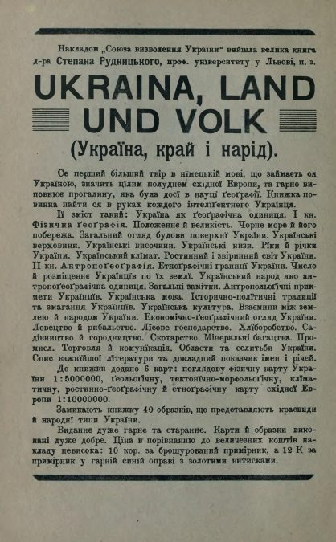

Еще больше дипломата озадачило общение с председателем Совета Министров. Здесь первый день румынской карьеры Галагана мог стать и последним. 33-летний премьер Всеволод Голубович не сказал ничего внятного, а о военном имуществе на миллиарды рублей в Бессарабии, скорее всего, впервые слышал.

Голубович начал говорить о домогательстве "справедливой" границы между УНР и Румынским королевством.

Глава правительства проводил границу по этнографической карте Бессарабии.

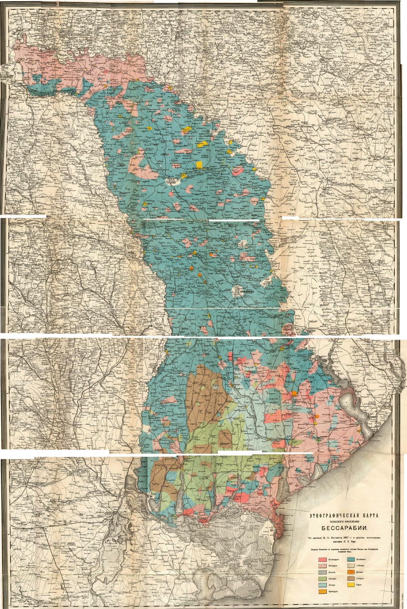
Карта этнического распределения сельских территорий Бессарабии (нынешняя Молдова и прилегающие территории Украины и Румынии), изданная в Российской империи 1907 по данным В. Бутовича.
Голубой цвет – молдаване, светло-розовый – украинцы, темно-розовый – россияне, зеленый – болгары, светло-голубой – немцы, коричневый – гагаузы, желтый – евреи, оранжевый – ромы, светло-оранжевый – французы, серый – поляки

“Его палец выводил какую-то такую ​​фантастическую путаницу, что мое терпение лопнуло и я посоветовал искать другого защитника его удивительных проектов.

В БЕССАРАБИИ НАСЕЛЕНИЕ ПОМЕШАНО, ПОЭТОМУ ПРОЕКТИРОВАННЫЕ ГОСУДАРСТВЕННЫЕ ГРАНИЦЫ СКИДАЛИСЬ НА КАКИЕ-ТОРОЧКИ НА КОНЦЕ РУШНИКА”, – Вспоминает ГАЛАГАН.

“На мое заявление среагировал Любинский. Он говорил, что начертанные границы есть не больше, чем личные соображения Голубовича, с которыми трудно согласиться”, – добавляет дипломат.

Конечно, Всеволод Голубович, возглавлявший правительство УНР с конца января до конца апреля 1918 года, был странным премьером и не имел авторитета даже среди подчиненных (впоследствии его арестовали и немцы – за участие в похищении банкира Абрама Доброго, и русские и большевики).

Едкая ирония судьбы заключается в том, что Голубович, пожалуй, был самым "молдованином" в руководстве Украинской Республики, ведь родился в селе Молдавка соседней с Бессарабией Подольской губернии.

Напряжение Николая Галагана сняла беседа с Михаилом Грушевским в его кабинете главы Центральной Рады. Профессор-историк дал послу много советов и объяснил, какие контраргументы по поводу бессарабского вопроса наводить в Яссах (на тот момент этот город на границе с Бессарабией был фактической столицей Румынии, потому что Бухарест был оккупирован немцами).

В поезде Галаган уже имел перечень украинцев, которые бы ему помогли в Румынии.

"Взятка" от староверов за присоединение к Украине
Прибыв в Тирасполь (тогда – уездный центр Херсонской губернии), Николай Галаган узнает, что прямое железнодорожное сообщение между берегами Днестра не осуществляется, поскольку украинские железнодорожники опасаются, что румыны могут отжать поезда и вагоны.

Переправу через реку посол ждал чуть ли не целый день.

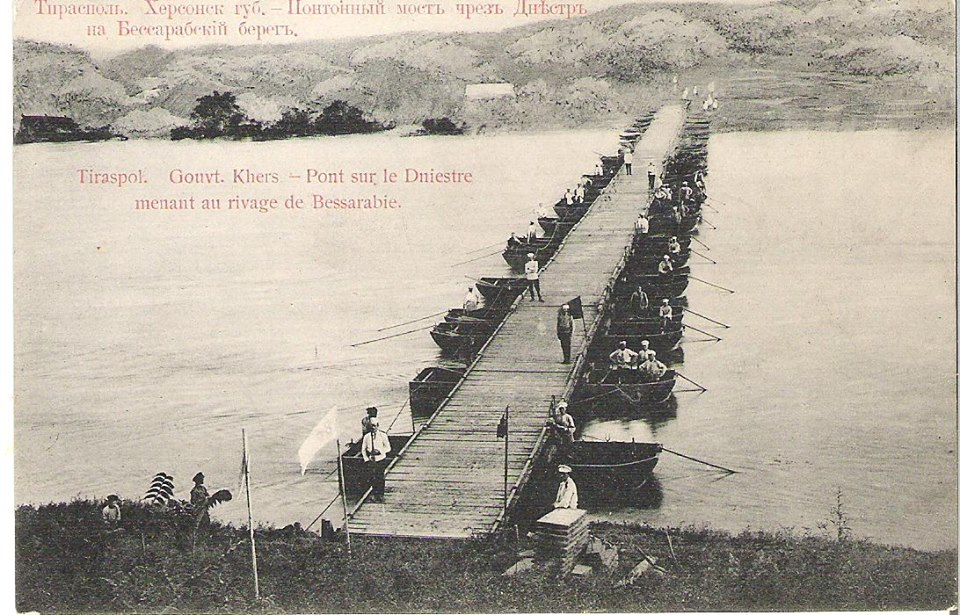
Понтонный мост между Тирасполем и Бендерами

В Бендерах едва удалось сесть на поезд в Ясс. Известие об украинском пославже облетело окрестности, и в поезде Галаган вынужден был дать автограф упрямому пассажиру-россиянину, коллекционировавшему росписи известных лиц.

– Я обыкновенный смертный, – открещивался дипломат.
– Вы сейчас стали исторической личностью. Вы – первый посланник независимой Украины в Румынии, – тараторил коллекционер, добиваясь своего.

Бессарабские реалии открылись Николаю Михайловичу в Кишиневе, где он задержался на несколько дней.

Здесь уже дислоцировались военные части бывшего румынского фронта. Охрану складов продовольствия, техники и оружия осуществляли исключительно украинцы. Их поддерживала вера в свое государство, которое поможет как-нибудь вывезти эти сотни тонн добра через Днестр.

Военные-россияне сдавали свои склады румынам и слонялись по городу. Конкуренция за склады между украинцами и румынами становилась все острее.

Военная и местная украинская интеллигенция, присутствующая в органах власти, была тем голосом из Бессарабского края, на который ориентировался Киев.

Украинский клуб в Кишеневе пригласил Галагана на вечер, но посла заранее предупредили, что публичные разговоры о политике станут известны румынам.

Дипломат начал убеждаться в том, что у бессарабского вопроса есть перспективы для УНР, ведь румынская фактическая оккупация отвлекла от официального правительства не только украинцев, но и некоторых молдаван. Местные россияне надеялись, что Украина присоединит Бессарабию и после свержения большевиков снова объединится с Россией.

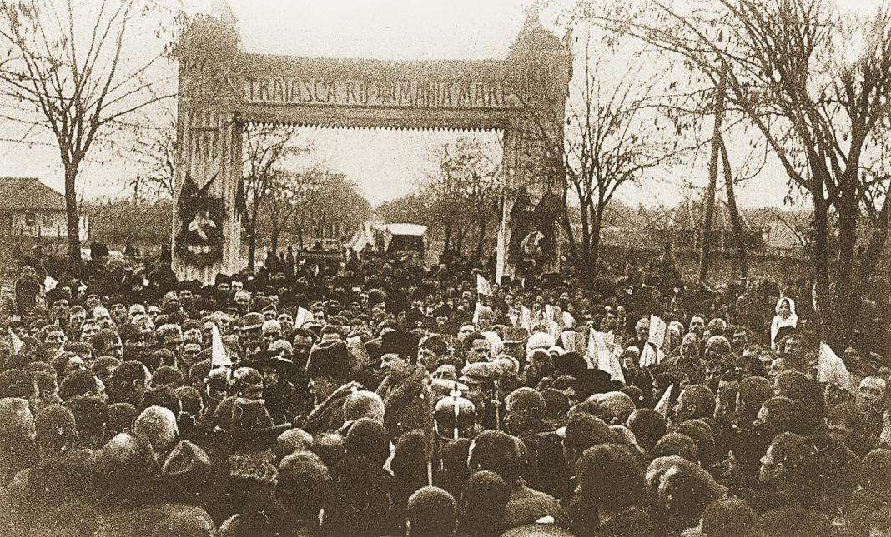
Митинг в Кишиневе

Позицию россиян подчеркнул яркий визит к послу Галагана нескольких староверов из устья Дуная (эта община до сих пор живет в Вилковом на юге Одесщины). Старые рыбаки, только узнав об украинском после в Кишиеневе, уже на следующее утро стучали к нему в дверь и просили "батюшку" и "благородие" не допустить присоединения края к Румынии.

"ПОСЛУЧИ ЗА НАС… ПРИСОЕДИНЕНИЯ К УКРАИНЕ" – И ДЛЯ Усиления просьбы презентовали полтора фонда черной икры.

“Да разве мыслим такого человека фунтом икры подкупить, – отвечали они на отказ Галагана. – Старой мы веры. Не оби нас… Вот честного труда своего подношение. Прими, батюшка”.

С презентом разобрался помощник посла – Галаган в воспоминаниях не уточнил, как именно. Зато дипломат задумался, что же такого происходило в крае, когда даже обычные рыбаки, только услышав о случайной остановке посланника Киева, мгновенно снарядить к нему "посольство".

Холодный прием в Румынии и попытки межгосударственных "коррупционных схем"

Глава правительства Молдавской Республики Йон Инкулец, по воспоминаниям Галагана, учился с ним в одном вузе и имел общих знакомых. Однако теплого общения не получилось. Молдавский лидер стоял на неотвратимости объединения с Румынией и заявлял, что у украинцев в Великой Румынии будут все гражданские и кильтурные права.

В Яссах Николай Галаган познакомился со штабскапитаном Корнелием Чоботаренком (Чеботаренко), который вел дела румынского фронта. Страстный сторонник Украины, тот изложил подробный учет всего военного имущества, включая солидный автопарк, автомастерскую и запасы топлива.

ЧОботаренко быстро помог набрать из местных украинцев штат первого украинского посольства в Румынии, организовал "офис" с печатными машинами, телефоном, автотранспортом и предлагал к услугам казну фронта.

От последнего Галаган отказался в надежде удержать миссию на выданные в Киеве 25 тысяч рублей.

Началось общение с румынскими кругами. Сначала прошла встреча с помощником госсекретаря. Тот намекнул, что Румыния не спешит признавать Украинскую Республику, поскольку ее признали не все крупные государства (Франция, Италия, Британия), а об аудиенции у короля Фердинанда пока не может быть и речи.

Госсекретарь дал понять, что в Яссах признают "небезосновательными" претензии Украины на имущество бывшей российской армии, признают УНР де-факто и предоставляют украинской миссии жилье с правом экстерриториальности.

"Чеботаренко может разместить в нашей квартире хоть все свои автомобили", - запишет Галаган в шутку, осматривая шестикомнатную квартиру.

Разговор с премьером Румынии Александру Маргиломаном был более плодотворным и показательно вежливым. Они обсудили "хотинский вопрос" - а на клочок земли в районе города Хотин, учитывая стратегическое значение переправы через Днестр на протяжении 1917-1918 годов, претендовали Украина, Молдова и Румыния, хотя в то время он контролировался Австро-Венгрией.

Маргиломан признал, что в Хотинском уезде преобладают украинцы, а на юге Бессарабии (в Килийском и Аккерманском) – украинцы и болгары.

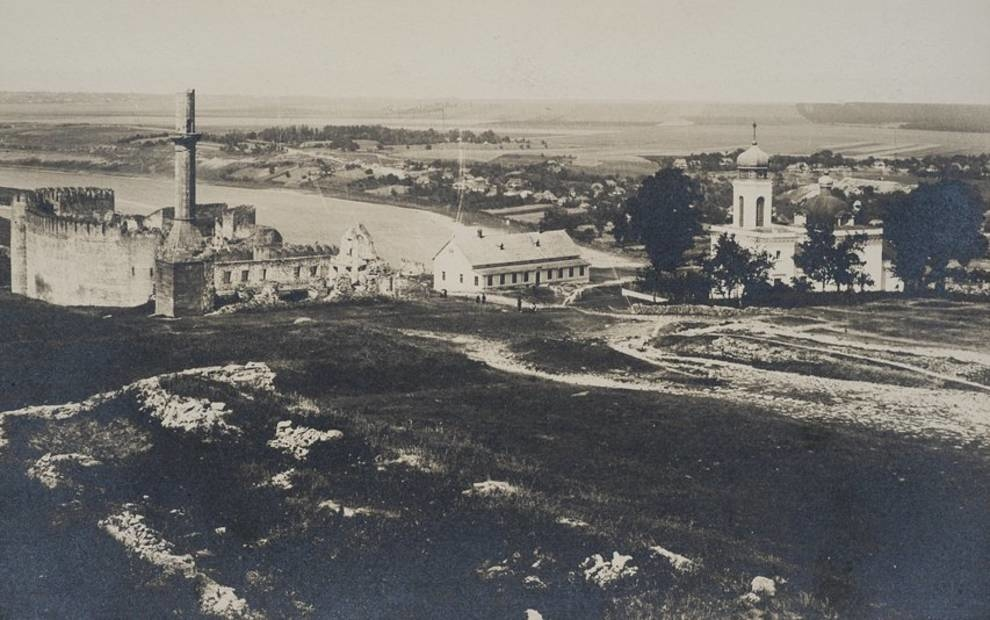
Хотин 1918: пейзаж на крепость и Днестр.

Румыния будет прислушиваться к их мнению, сказал Маргиломан, и пожелал, чтобы и на другом берегу Днестра прислушались к мнению молдаван из Тирасполя или Рыбницы.

Глава правительства отвергал тезисы о недовольстве румынскими порядками в Бессарабии, но Галаган утверждал, что имеет документальные показания противоположного (многочисленные письменные обращения местных общин), и он по желанию Киева даст им ход.

Забегая вперед, скажем, что когда украинский дипломат уедет в Киев, неизвестные нападут на украинское посольство и эти документы исчезнут.

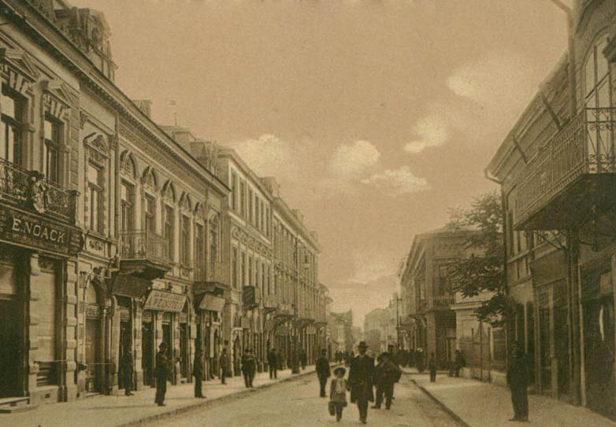
Город Яссы, 1918 год

Украинский дипломат быстро вливался в жизнь местного политического истеблишмента. Уже через несколько дней лидер одной парламентской партии предложил Николаю Галагану поработать на несколько местных фирм (вероятно, речь шла о поставке товаров в Украину), но посол вежливо отказался.

20 апреля из Киева пришли четкие инструкции. Правительство склонялось к тому, чтобы разделить прежнюю губернию. Посол должен был добиваться присоединения Хотинского уезда к Украине, а в Бессарабском Причерноморье организовать плебисцит (явно нежелательный Румынии, чье черноморское побережье контролировал Четвертный союз).

Новая линия гипотетической границы УНР казалась дипломату не совсем реальной, но была более перспективной, чем "торочки", очерченные Голубовичем.

Посол изложил эти притязания правительства и решил ехать в Киев, с которым все больше обрывалась связь.

Сразу после Пасхи, 6 мая, в Тирасполе Николай Галаган узнал о гетманском перевороте в Киеве и решил сложить полномочия.

Гетман начинает экономическую войну
Политика гетманского правительства кардинально отличалась от республиканского. В Яссы не отправляли посла – с небольшими задачами возился тот же Корнелий Чоботаренко.

Павел Скоропадский с правительством не признавал "воссоединение" Молдовы и Румынии, а 11 мая Министерство торга и промышленности Украинского Государства ввело полный запрет на перемещение каких-либо товаров через Днестр.

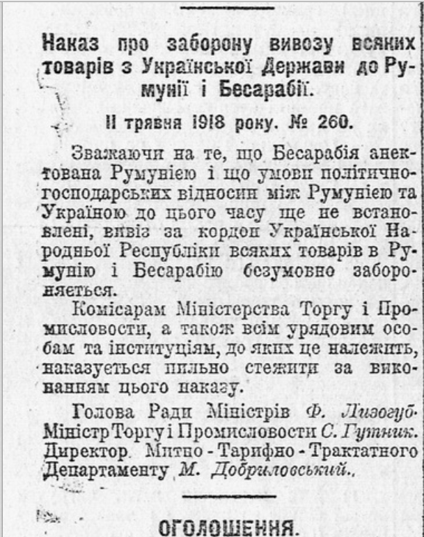
Постановление правительства УД об эмбарго. Газета "Государственный вестник"

5 июня Киев отправил ноту, в которой однозначно указывалось, что Бессарабия – это Украина. Яссы ответили обширной дискуссией и пожеланиями уладить ситуацию.

В ответ гетманские министры сосредоточились на подготовке вывоза военного имущества из подконтрольной Румынии территории и вывозе румынского имущества из Украины. На военные склады в Румынии из Киева отбыла спецкомиссия из 30 человек и с финансированием в 107 тысяч рублей. В гетманском дворце считали, что эскалация и торговая война больше ударит по Румынии, которая и так имела очень мало экономических партнеров.

Летом такая политика принесла первые плоды. В Украине потянулись бессарабские предприниматели и общественные деятели. Предприниматели стремились к персональному обходу эмбарго, а местные активисты доносили информацию о вопиющей экономической и социально-политической ситуации в Бессарабии. Говорилось даже о том, что

ОДНА-ЕДИНАЯ УКРАИНСКАЯ ДИВИЗИЯ МОЖЕТ БЕЗ ПРОБЛЕМ РЕШИТЬ “БЕССАРАБСКИЙ ВОПРОС”.

Впрочем, такой дивизии у Украины еще не было. В соседних с Бессарабией Подольской и Херсонской губерниях только формировались корпуса гетманской армии. Непосредственно у Днестра, в Тирасполе, стоял только пехотный полк.

Дмитрий Дорошенко – министр закордонных дел в правительстве гетмана Скоропадского

По воспоминаниям министра иностранных дел Дмитрия Дорошенко, украинская администрация начала работу с элитами Бессарабии.

Как наследница России Украинское Государство платило зарплату тем судебным чинам, которые не присягали румынскому королю. Местные предприниматели-виноделы получали по льготным ценам важный для них украинский сахар, отдельные общественные деятели тоже имели финансирование из Киева.

В сентябре, попав в беду, румынское правительство из Ясс отправляет в Киев спецпредставителя Константина Концеску.

Тот приезжает с официальным признанием Румынией Украинского Государства и пытается заключить торговое соглашение в надежде на поставки в Румынию хлеба и сахара, а взамен обещая вино из Бессарабии по льготным ценам (Украина его уже имела) и большие объемы бензина.

Дорошенко заключал такое соглашение на смех: "Киеву обещают то, что и так по праву принадлежит ему (вино)", а что касается бензина, то было известно, что Румыния не контролирует собственные нефтяные месторождения.

Концеску заявил, что Яссы готовы даже запретить в Румынии частный автотранспорт, лишь бы поставлять в Украину бензин!

Киев начал переговоры, но больше не для экономического соглашения, а потому, что признание Украины Румынией, которая имела связи с Антантой, могло помочь Скоропадскому получить официальное признание во Франции и Британии.

"Бессарабский вопрос" был поставлен на паузу - в Киеве ждали формирования весной 1919 года собственной армии, которая могла бы решить проблему силой.

Впрочем, в Яссы, впервые после Галагана, в октябре выехал официальный представитель Украины - Володислав Дашкевич-Горбацкий, который был начальником штаба гетмана.

О важности такого назначения свидетельствовало, что уроженец Обухова Дашкевич-Горбацкий в мае был и.о. военного министра УД, а в апреле-июле – начальником личного штаба гетмана. В июне личная охрана Скоропадского на Софиевской площади приносил присягу гетману при присутствии своего руководителя, генерального хорунжего Дашкевича-Горбацкого.

И вот с октября бывший генерал-майор русской армии стал главой чрезвычайной миссии Украинского государства в Румынии.

Однако падение режима Скоропадского и вторая украино-большевистская война снова кардинально изменили ситуацию.

Румынский контрудар, кровавые восстания и вмешательство большевиков
Румыния сразу воспользовалась очередным коллапсом украинской государственности и поражением Четвертого союза. В последний день мировой войны (11 ноября 1918 года) Яссы объявили войну Германии и ее союзникам, перешли в состояние государств-победителей и вдвое увеличили территорию Королевства за счет Венгрии и Болгарии.

Правительство вернулось в Бухарест, а зимой ликвидировало Молдавскую Республику, введя прямое правление и еще более острую цензуру и запрет на митинги и демонстрации.

Вслед за отступающими австрийскими войсками румыны наконец-то заняли такой желанный Хотинский уезд и развязали террор против местного населения.

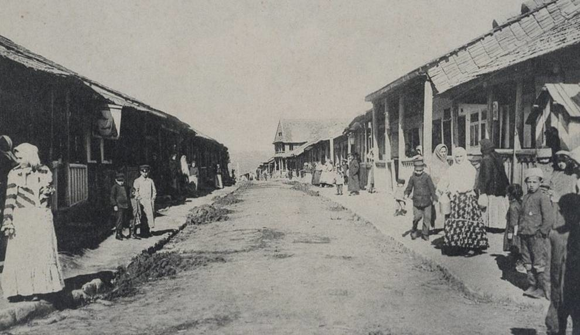
Хотин, 1918 год

Уже через несколько дней украинские крестьяне взялись за оружие, топоры и вилы. Оружием им помогали из украинского Подолья. Есть информация, что восстание усилило даже петлюровское бронепоезд.

Вошедший в край командир румынской дивизии был схвачен и повешен на мосту через Днестр. Восстание перекинулось в глубь Бессарабии.

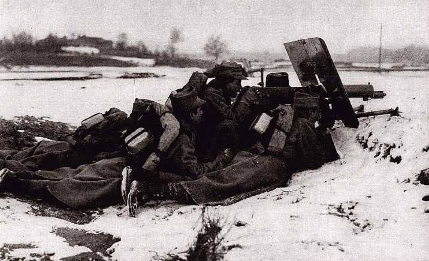
Румынские пулеметчики

В ответ румыны расстреливали восставшие деревни из артиллерии и бросали на подавление выступления дополнительные войска.

Через месяц выступление "Хотинской директории" во главе с М. Лискуном утонуло в крови. Причем, официальная Украина так и не вмешалась в события на стороне повстанцев своей военной силой. Ведь существовало соглашение Румынии с УНР: в обмен на признание Бессарабии на румынском, Бухарест поставлял украинской армии оружие, амуницию и лекарства. Украинские войска как раз оказались в окружении между белыми, красными и поляками.

<small>Памятник участникам Хотинского восстания в Хотине (авторы – В. Борисенко, В. Подольский), установленный советской властью в 1977 году.
В советской историографии это антирумынское выступление трактовали как социальное крестьянское.</small>

Впоследствии румыны еще раз воспользуются слабостью украинских сил – по соглашению с поляками, в мае 1919 года они оккупируют Покутье – тыл Галицкой армии, которая воевала за независимость Западноукраинской республики.

После этих событий антирумынские восстания в Бессарабии будут совершать уже большевики – в том же 1919 году в Бендерах и позже в Татарбунарах.

Что интересно, в то время Николай Галаган был послом УНР уже в Венгрии и на улицах Будапешта встретился со старым знакомым Корнием Чеботаренко, который при гетмане исполнял обязанности генконсула в Румынии.

По воспоминаниям Галагана, военное имущество в Румынии было по дешевке распродано Чоботаренко румынским компаниям, 40% выручки досталось посредникам.

Сам военный аеще будет бедствовать, будет вести полузаконную деятельность, заболеет туберкулезом и умрет в Вене в 1921 году.

Послесловие: что произошло со "спорной" Бессарабией
28 октября 1920 года страны Антанты (Великобритания, Франция, Италия и Япония) подписали с Королевством Румыния Бессарабский протокол, который отдал Бессарабию Румынии.
США заняли отдельную позицию, отказавшись подписывать Бессарабский протокол как противоречащий международному праву.

При этом в 1924-1940 годах на территории Украинской Социалистической Советской Республики была образована Молдавская Автономная ССР (с претензиями большевистского правительства на контроль над Бессарабией, расположенной через Днестр).

В 1940 году в результате пакта Молотова-Риббентропа Бессарабию передали в СССР.

Южную Бессарабию (Аккерманский и Измаильский уезды) и Северную Бессарабию (Хотинский уезд) присоединили к РСФСР, а остальные (современная Республика Молдова) были объединены с Молдавской АССР и превращены в новую союзную республику — Молдавскую ССР. В то же время некоторые районы бывшей Молдавской АССР (в частности, ее столица, город Балта) оставили за УССР.

Во время Второй мировой войны Бессарабию заняли румынские войска маршала Антонеску и превратили в губернаторство Бессарабия, просуществовавшее до августа 1944 года. После чего, присоединенное Советской армией, оно вновь вошло в состав СССР с восстановлением на этих землях административного разделения 1940 (Молдавская ССР, Измаильская область и часть Черновицкой области УССР).

После падения СССР административное разделение бывшей Бессарабии между Украиной и Молдовой сохранилось.

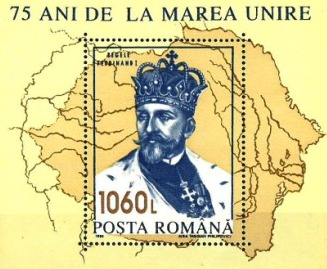
Румынская почтовая марка 1993 года с включенной территорией Молдовы и Хотином

При этом большая часть населения Молдовы выступает за новое объединение с Румынией.

А бывшие земли УНР и УССР на левом берегу Днестра, заселенные преимущественно этническими украинцами и россиянами (нынешнее Приднестровье с Тирасполем и Рыбницей) – хранят советский менталитет, ориентируются на Москву и контролируются самопровозглашенной непризнанной «Приднепровской». Также ПМР охватывает некоторые районы бывшей Бессарабии на правом берегу Днестра, в частности город Бендеры.

После войны 1992 г. в т. н. "ПМР" остаются русские войска, которые формально считаются "миротворцами".

=======
Статья является авто-переводом на Русский с Украинского. Оригинал: 
https://novynarnia.com/2020/04/13/bessarabia-1918/