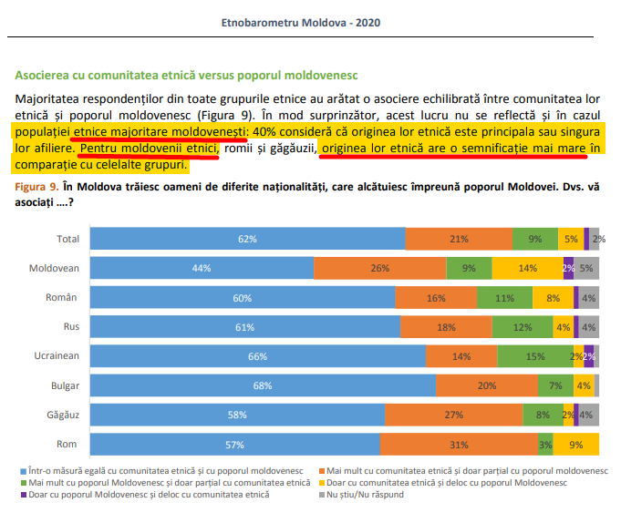
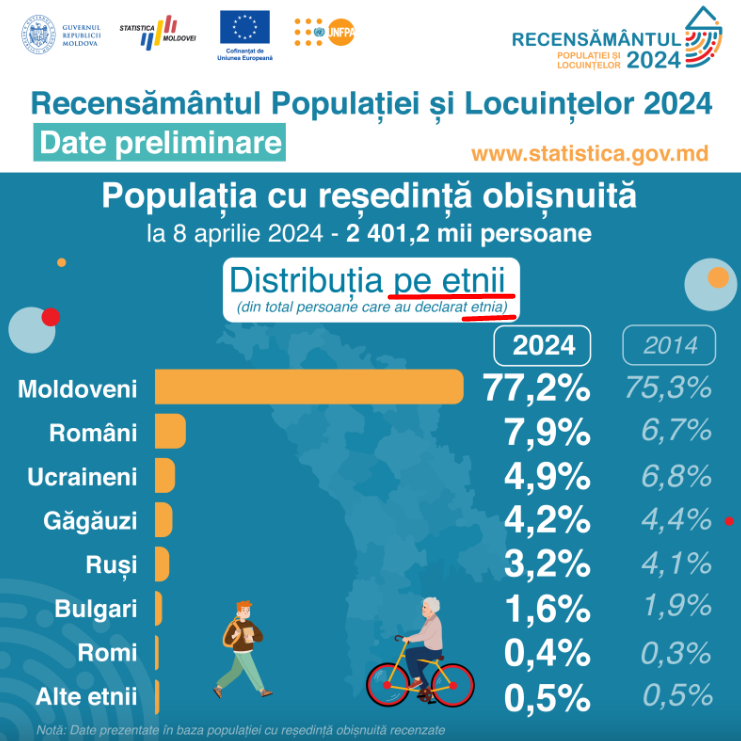
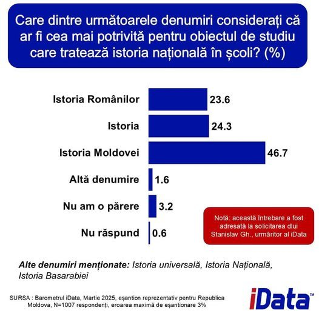

[← Назад на главную страницу](index.md)

## Ответ Народного адвоката по правам ребёнка (6 июня 2025 г.) и Народного адвоката (13 июня 2025 г.)

<iframe src="./assets/2025_06_06-answer-ombudsman-coroi.pdf#toolbar=0" width="100%" height="500"></iframe>

<iframe src="./assets/2025_06_13-refuz-panico.pdf#toolbar=0" width="100%" height="500"></iframe>

Ниже представляем наш ответ на решение Народного адвоката по правам ребёнка и Народного адвоката о прекращении рассмотрения заявления.

## Ответ Инициативной группы „За историю Молдовы"

Кому: Офис Народного адвоката Республики Молдова  
К сведению господина Чеслава Панько, Народного адвоката

**Тема: Уточнения относительно решения о прекращении рассмотрения заявления № 03-918/24 и просьба о возобновлении процедуры**

Уважаемый господин Панько,

Мы ознакомились с ответом, подписанным господином Василе Корой, Народным адвокатом по правам ребёнка, относительно нашего заявления, поданного 30 декабря 2024 года (зарегистрированного под № 03-918/24). Учитывая, что тема петиции касается не столько прав ребёнка per se, сколько установления наличия дискриминации в названии "История румын", продвигаемом Правительством Республики Молдова через Министерство образования и исследований (далее "Министерство образования" или "Министерство"), мы обращаемся теперь к Вам, чтобы изложить ряд серьёзных несоответствий и нарушений по существу и процедуре, которые оправдывают возобновление рассмотрения дела Народным адвокатом.

### Уточнения относительно даты и предмета заявления
- Заявление было подано 30 декабря 2024 года, а не 31 декабря, как ошибочно указано в письме.
- Первоначальное заявление не содержало никаких ссылок на языковую проблематику. Г-н Корой искусственно ввёл эту тему в своём ответе, чтобы отвлечь внимание от реального предмета петиции. Важно подчеркнуть:
  - В то время как в Республике Молдова существует конституционно признанный официальный язык, этническая принадлежность, как элемент идентичности, не регулируется официально таким же образом.
  - Румынская этническая группа, как и другие этнические группы, не имеет привилегированного официального статуса в рамках гражданской концепции государства.
- Даже название "История молдаван" было бы дискриминационным, по определению, если бы оно относилось исключительно к молдавской этнической группе, а не к молдавскому народу со всеми его этническими компонентами.
- Попытка связать языковую проблематику с этнической является отвлекающим манёвром, который уходит от сути петиции: этнической дискриминации в названии обязательного школьного предмета национальной истории.

### Компетенция и ответственность Народного адвоката
- Решение о принятии к рассмотрению, изданное 17 января 2025 года, принадлежит институту Народного адвоката, под подписью господина Панько. Таким образом, необоснованная передача ответственности Народному адвокату по правам ребёнка является процедурно некорректной и противоречит первоначальному решению.
- В течение почти трёх месяцев между принятием заявления (17 января 2025 г.) и передачей его Народному адвокату по правам ребёнка (2 апреля 2025 г.), у Народного адвоката было достаточно времени для анализа и выдачи собственного заключения.

### Противоречия в принятых решениях
- Первоначальное решение о принятии заявления подтверждало допустимость и компетенцию Народного адвоката в рассмотрении дела (решение № 03-918/24-75 от 17 января 2025 г.).
- Впоследствии решение Народного адвоката по правам ребёнка о прекращении рассмотрения по причине компетенции явно противоречит первоначальной позиции вашего учреждения.

### Уклонение от анализа дискриминации
- Наше заявление касается этнической дискриминации через название обязательного предмета "История румын и всеобщая история", навязанного всем учащимся.
- Полученный ответ уходит от анализа этого обвинения, перекладывая ответственность на Министерство образования и критикуя консультативное заключение Совета по равенству от 15 мая 2025 года, которое подтверждает прямую дискриминацию.

### Правовая база по вопросам дискриминации

Согласно Закону № 121 от 25.05.2012 об обеспечении равенства [3]:

> **дискриминация** – любое различие, исключение, ограничение или **предпочтение** в правах и свободах личности или группы лиц, [...];
>
> **прямая дискриминация** – обращение с одним лицом по любому из запретительных критериев **менее благоприятным образом**, чем с другим лицом в сопоставимой ситуации;

В нашем случае:
- Включение этнонима «румын» в официальное название обязательной дисциплины представляет собой **предпочтение** конкретной этнической группе
- Это исключительное выделение в школьной программе создает символическую иерархию между румынской этнической группой и другими этническими группами
- Наличие термина «всеобщая» не отменяет дискриминационный характер исключительного выделения только одной этнической группы
- Чтобы быть недискриминационным, название должно избегать любых этнических ссылок или включать все составляющие этнические группы Республики Молдова - очевидно невыполнимый сценарий

Это предпочтение нарушает право на этнически нейтральное образование в многоэтническом гражданском государстве.

### Неконституционные идеологические утверждения
Недопустимо, чтобы в официальном документе утверждалось, что "молдаване являются частью румынского народа". Это утверждение:
- грубо превышает законные полномочия Народного адвоката, который должен оставаться нейтральным в вопросах национальной идентичности;
- ссылка на предполагаемую "историческую реальность" относительно этнической идентичности молдаван полностью выходит за рамки мандата и профессиональной компетенции Народного адвоката, который не является историком, этнологом или референтом в вопросах "исторических реалий";
- прямо противоречит Преамбуле Конституции Республики Молдова, которая явно признает молдаван как отдельную этническую группу и учредительную часть государства:
  > *"ПРИНИМАЯ во внимание непрерывную государственность молдавского народа в историческом и ***этническом*** контексте его становления как нации, СТРЕМЯСЬ удовлетворить интересы граждан иного ***этнического*** происхождения, которые вместе с ***молдаванами*** составляют народ Республики Молдова"*
- нарушает принцип суверенитета и молдавской идентичности, предусмотренный в основном законе страны;
- является глубоко оскорбительным для населения Республики Молдова, где согласно переписи 2024 года только 7,9% граждан декларируют себя румынами;
- представляет собой чисто идеологическую позицию, несовместимую с ролью независимого органа, который должен защищать права всех граждан, независимо от их этнической принадлежности.

### Манипуляция данными о национальной идентичности
Ответ г-на Короя представляет тенденциозную интерпретацию социологических и демографических данных:

1. **Анализ Этнобарометра 2020** [1]:
- Рисунок 7 Этнобарометра (стр. 20) представляет ответы на вопрос: "При каких условиях человек может считаться частью молдавского народа?". Результаты показывают, что для всех этнических групп основным критерием является "проживание в Республике Молдова", в то время как "этничность" появляется на последнем месте (за исключением ромов).
- Эти данные демонстрируют прямо противоположное аргументам г-на Короя: для респондентов концепция "молдавского народа" является в первую очередь гражданской (основанной на совместном проживании в общем пространстве), а не этнической. Таким образом, национальная история должна отражать, согласно этому опросу, в первую очередь историю людей, которые "живут в Республике Молдова", и только в последнюю очередь историю определенного этнического пространства ("румынского", как утверждает г-н Адвокат).
- Омбудсмен, будучи Народным адвокатом, должен представлять всех граждан Республики Молдова, независимо от этнической принадлежности, а не продвигать "историческую правду" одной этнической общины.

- Более того, Рисунок 9 того же Этнобарометра (стр. 21) предоставляет важнейшие данные об ассоциации с этнической общиной в сравнении с молдавским народом:

Рис.1 Источник: Этнобарометр Республики Молдова 2020, страница 21

- Авторы Этнобарометра явно указывают, что "этническое большинство молдаван" ассоциирует себя сильнее с собственной этнической группой, чем любая другая национальность: 40% этнических молдаван считают свою собственную этническую группу ("молдавскую") более близкой, чем "молдавский народ", в то время как только 24% этнических румын считают свою этническую группу ("румынскую") более близкой, чем "молдавский народ".
- Эти данные показывают, что этнические молдаване гораздо больше дорожат своей специфической этнической идентичностью, чем этнические румыны, демонстрируя ещё раз несоответствие между восприятием большинства населения и некоторых чиновников административного аппарата, претендующих на монополию "исторической правды".

- Дополнительно, Рисунок 2 на странице 17, который явно касается концепции "этнической группы", показывает, что большинство респондентов связывают этничность с "происхождением родителей" (62%), "родным владением языком" (53%) или "местом рождения" (38%), что далеко от критериев гражданства (27%) или места проживания (26%).
- Этот факт подтверждает, что население понимает этничность как связанную преимущественно с врождёнными элементами (происхождение родителей), а не с приобретёнными (гражданство, место проживания), тем самым подтверждая, что данные переписи населения правильно отражают общее восприятие этничности.

2. **Игнорирование официальных данных переписи населения**:
- Перепись 2024 года, в отличие от Этнобарометра, явно спрашивала об этнической принадлежности (а не о гражданских ассоциациях), являясь первичным официальным источником в этом отношении
- Анкета переписи содержала конкретный вопрос об "этнической принадлежности", предлагая гражданам самоидентифицироваться с этнической точки зрения
- Результаты показывают, что подавляющее большинство населения идентифицирует себя как молдаване (77,2%), ассоциируя эту идентичность с исторической территорией Молдовы, местными обычаями и языком, который большинство называет "молдавским"

Рис.2 Распределение по этническим группам (из общего числа лиц, заявивших об этнической принадлежности)

- Эта этническая самоидентификация является объективным демографическим фактом, а не социологической интерпретацией
- Не существует ни одного научного исследования, которое бы показало, что молдавское население в большинстве своём или значительно самоидентифицируется, декларирует себя или ассоциирует себя с "румынами"
- Все исторические переписи, за исключением переписи 1930 года (где румынская администрация систематически заменяла упоминания "молдаван" в декларациях граждан на "румын"), указывали на присутствие молдавского этнического большинства
- Эта демографическая преемственность наблюдается даже до советского периода, опровергая ошибочный нарратив о том, что молдавская идентичность является "советским изобретением"
- Утверждения о "едином румынском народе" принадлежат некоторым миноритарным элементам политической элиты, находящейся сегодня у власти, не отражают демографическую и историческую реальность Республики Молдова и представляют собой дискриминацию через исключение других этнических групп, составляющих народ нашей Республики.

3. **Игнорирование актуальных и недавних данных**:
В свою очередь, у нас есть прямой и релевантный социологический опрос, проведенный iData в марте 2025 года, который явно спрашивал граждан: "Какое из следующих названий считаете наиболее подходящим для учебного предмета, освещающего национальную историю в школах?"

Рис.3 Источник: iData, март 2025

Результаты:

Как видно, 46,7% граждан высказались за название "История Молдовы", в то время как только 23,6% поддержали название "История румын". Этот недавний и репрезентативный для Республики Молдова опрос ясно демонстрирует предпочтение населением нейтрального и инклюзивного названия дисциплины.

Таким образом, использование Этнобарометра не только неуместно, но и игнорирует конкретный, недавний и репрезентативный источник, касающихся именно предмета нашей петиции.

### Название и символическая сегрегация

- Структура названия "История румын и всеобщая история" создаёт концептуальную сегрегацию, противопоставляя историю одной этнической группы (румын) мировой истории (всеобщей).
- Эта формулировка неявно приравнивает историю одной этнической группы (румынской) к национальной истории Республики Молдова, символически исключая другие составляющие этнические группы из концепции нации.
- Парадоксально, что понятие "румынского пространства" было навязано исключительно в учебниках Республики Молдова, в то время как в Румынии, где румынская этническая группа составляет 90% населения, изучается дисциплина, нейтрально названная "История". Аналогично, в Австрии, несмотря на то, что она разделяет языковое и культурное пространство с Германией, не изучается предполагаемое "немецкое пространство", а национальная история представляется через призму инклюзивного, этнически нейтрального подхода.
- Текущее название систематически маргинализирует учителей, учеников и их семьи, которые признают и ценят молдавскую этническую идентичность, создавая чувство неполноценности и отчуждения от собственного государства и его истории.
- Представляя спорные и оспариваемые в академической среде мнения как абсолютные научные истины, этот подход создает дискриминационную образовательную среду, подрывающую принцип равенства между всеми составляющими этническими группами Республики Молдова.
- Хотя некоторые могут утверждать, что в советский период существовали политики культурной гомогенизации, решение не заключается в принятии противоположной крайности - образования с этноцентрическими акцентами, которое символически привилегирует одну этническую группу в ущерб другим.

### Ошибочная интерпретация термина «всеобщая» со стороны Народного адвоката

Господин Корой утверждает, что термин «всеобщая» включает «все остальные этнические группы, кроме румынской этнической группы», что является фундаментально ошибочной интерпретацией, игнорирующей историю и структуру дисциплины:

1. **Исторический контекст и реальное значение**:
   - До 2006 года в образовательной системе существовали два отдельных школьных предмета: «История румын» (посвященная предположительно национальной истории) и «Всеобщая история» (посвященная глобальной истории).
   - После временного объединения при ПКРМ в один «интегрированный» предмет, в 2009 году министр образования восстановил этноним «румын».
   - Термин «всеобщая» очевидно относится к глобальной истории, а не к соседствующим этническим группам Молдовы.
   - Национальный куррикулум (2019) прямо подтверждает эту интерпретацию: *«Подход к изучению исторического прошлого начинается с местной истории к национальной, региональной и всеобщей истории»* [2]
   
2. **Лингвистический и концептуальный анализ**:
   - Женский род единственного числа «всеобщая» относится к «всеобщей истории» (глобальной), а не к этническим группам.
   - Содержание учебников по «Всеобщей истории» рассматривает такие темы, как капитализм, европейское Возрождение, мировые революции - а не коренные этнические группы.
   - Если бы имелись в виду другие этнические группы, название было бы сформулировано иначе (например: «история румын и других этнических групп»).
   - Даже если «всеобщая» относилась бы к другим этническим группам (чего на самом деле нет), исключительное выделение этнонима «румын» остаётся дискриминационным согласно правовому определению.

3. **Проблематичное приравнивание этнического к национальному**:
   - Термин «румын» сегодня заменяет понятия «местная», «автохтонная» или «национальная» история.
   - Термин «всеобщая» заменяет «мировую», «глобальную» или «внешнюю» историю.
   - Если со второй эквивалентностью нет никаких проблем, первая ставит серьезные вопросы с точки зрения прямой этнической дискриминации.
   - Все этнические группы Республики Молдова участвовали и участвуют в формировании истории государства, а не только румынская этническая группа, и все этнические группы платят налоги на издание учебников, названных, к сожалению, сегодня в честь одной этнической группы.
   - Приравнивание этнонима «румын» к концепции «национальной истории» Республики Молдова представляет собой искажение реальности и прямую дискриминацию по отношению к другим составляющим этническим группам.

Своей тенденциозной интерпретацией Народный адвокат пытается оправдать выделение одной этнической группы в названии обязательной дисциплины в многоэтническом государстве. Это противоречит принципам Республики Молдова как гражданского, а не этнического государства.

### Относительно утверждения ECRI

Господин Корой утверждает, что "Более того, никакого упоминания о нарушении прав этнических меньшинств через название или содержание дисциплины 'История румын и всеобщая история' не было включено в Отчет о шестом цикле мониторинга Республики Молдова ECRI, принятый 2 июля 2024 года."

Это утверждение игнорирует важный и релевантный прецедент: **В третьем отчёте ECRI о Румынии, принятом 24 июня 2005 года, явно отмечается (стр. 81)**:

> "ECRI отмечает, что несмотря на вышеупомянутые меры, которые она приветствует, многое ещё предстоит сделать в области образования. Неправительственные организации всё ещё сетуют на то, что румынские школьные учебники содержат стереотипы и предрассудки о группах меньшинств. Некоторые учебники, например, продолжают описывать прибытие в Румынию 'орд варварских кочевников, пришедших с востока, чтобы сеять террор', а венгры иногда описываются как чужаки, оккупировавшие Трансильванию. **ECRI также отмечает, что название курса истории, преподаваемого румынским ученикам, - 'История румын', а не 'История Румынии'.**"

Министерство образования и исследований Румынии ответило на эти замечания ECRI следующим образом:

> "**Учитывая рекомендации Совета Европы, Румыния ввела с 2004-2005 учебного года интегрированные курсы истории, названные 'История'. С введением новых программ для VIII и XII классов в последующие годы исчезнет и фраза 'История румын'**. В новые программы будут введены новые темы об истории меньшинств в Румынии и румынского меньшинства в соседних странах."

Этот случай ясно демонстрирует, что:
1. ECRI считала проблематичным точно такое же этническое название курса истории в Румынии
2. Румынские власти приняли это замечание и приняли меры для отказа от этнического названия
3. Существует чёткий прецедент ECRI по этому вопросу, применимый и к ситуации в Республике Молдова

Отсутствие подобного упоминания в отчёте по Республике Молдова не отрицает принцип, уже установленный ECRI в отчёте по Румынии. Мы официально запросили разъяснения у ECRI через корреспонденцию в декабре 2024 года относительно этого несоответствия между отчётами по Румынии и Республике Молдова, и будем настаивать на получении официального ответа. Независимо от объяснения, которое ECRI предоставит для этого упущения, юридические аргументы нашей петиции остаются действительными.

### Международная практика государств с межгосударственными этническими группами

В результате нашего сравнительного анализа европейских образовательных систем, мы констатируем, что:

- Ни одно другое европейское государство с межгосударственными этническими группами (как Австрия, Швейцария, Бельгия) не использует обязательные школьные учебники с моноэтническими названиями.
- Австрия, хотя и разделяет языковое и культурное пространство с Германией, не называет обязательный курс истории "Историей немцев", а использует этнически нейтральные названия.
- Этот факт был подтвержден в нашей официальной коммуникации с Австрийским омбудсменом, которому мы выразили сожаление о текущей ситуации в Республике Молдова.
- Республика Молдова представляет уникальную ситуацию в европейском пространстве из-за навязывания этнического названия для обязательной школьной дисциплины в многоэтническом государстве, конституционно определённом как гражданское.

### Итоговые требования:
1. Отмена решения о прекращении рассмотрения заявления № 03-918/24.
2. Возобновление рассмотрения дела Офисом Народного адвоката, в соответствии с первоначальным решением о принятии от 17 января 2025 года.
3. Личное рассмотрение дела Вами, господин Чеслав Панико, в качестве Народного адвоката, учитывая серьёзность проблемы и аргументы, изложенные в настоящем обращении.
4. Выдача официального и профессионального заключения от Народного адвоката о совместимости названия предмета "История румын и всеобщая история" с Конституцией Республики Молдова и международными конвенциями, участницей которых является наша страна.
5. Публичное разъяснение, является ли утверждение господина Василе Короя о том, что «молдаване являются частью румынского народа», официальной позицией учреждения Народного адвоката или личным мнением, и в случае если это личное мнение, принятие официальной позиции в отношении этого превышения институциональных полномочий.

### Процедурные основания для обжалования решения

Несмотря на то, что в решении от 13.06.2025 Народный адвокат, г-н Чеслав Панько, указывает, что "Решение о прекращении рассмотрения заявления не может быть обжаловано" (ст.23 ч.5 Закона №52), мы считаем, что:

1. **Применимость Административного кодекса**: Согласно ст. 1 и ст. 2, нормы административного производства применяются к любой форме административной деятельности с внешним эффектом. Процедура, инициированная нашей петицией, представляет собой административную процедуру, подчиняющуюся нормам Кодекса.

2. **Нарушение установленных законом сроков**: 
   - Стандартный 30-дневный срок (ст. 60 ч. (1)) был превышен
   - Отсутствовало официальное уведомление о продлении срока в пределах первоначальных 30 дней
   - Передача петиции Народному адвокату по правам ребёнка была осуществлена более чем через 90 дней после регистрации (2 апреля 2025 года), превысив максимальный установленный законом срок

3. **Противоречия в принятых решениях**: Первоначальное решение о принятии заявления (17 января 2025 года) подтверждает допустимость и компетенцию Народного адвоката, что противоречит последующему решению о прекращении рассмотрения.

4. **Конституционное право на обжалование**: Статья 20 Конституции Республики Молдова гарантирует свободный доступ к правосудию, а статья 53 гарантирует право лица, пострадавшего от публичного органа власти, на возмещение вреда.

5. **Фактическое молчаливое отклонение петиции**: Мы констатируем, что петиция была фактически отклонена молчаливо, поскольку не были соблюдены сроки, предусмотренные Административным кодексом для её рассмотрения. Эта чрезмерная и неоправданная задержка представляет собой серьезное процедурное нарушение.

6. **Отклонение от предмета петиции**: Народный адвокат по правам ребёнка сосредоточился в своей аргументации на вопросе, не относящемся к предмету петиции – национальной идентичности и лингвистических аспектах – не анализируя по существу обвинение в прямой дискриминации в названии школьного предмета через исключительное выделение одной этнической группы.

7. **Серьезные административные ошибки**: Мы отмечаем дезорганизацию в учреждении Народного адвоката, проявляющуюся в:
   - Ошибочном указании адреса проживания заявителя как адреса Совета по равенству на бул. Штефан чел Маре (заявитель не проживает "в Кабинете г-на Фельдмана")
   - Неверном указании даты подачи петиции (31 декабря вместо 30 декабря 2024 года)
   - Искажении предмета заявления г-ном Панько, который неверно истолковал объект петиции как вмешательство в работу Совета по равенству, когда в действительности запрашивался анализ дискриминации как таковой со стороны учреждения Народного адвоката. Совет по равенству является независимым органом, который на тот момент был признан неотвечающим.
   - Подобные административные ошибки свидетельствуют о поверхностном рассмотрении дела и вызывают сомнения относительно строгости анализа.

8. **Искажение предмета петиции Народным адвокатом по правам ребёнка**: Г-н Корой исказил предмет петиции, искусственно добавив вопрос об официальном языке - тему, которая не упоминалась в первоначальной петиции. Затем он построил аргументацию, основанную на этой посторонней теме, и частично принял решение о прекращении на основе этих соображений, не имеющих отношения к петиции. Недопустимо принятие решения о прекращении рассмотрения, основанного на аргументации посторонних тем, не связанных с реальным предметом петиции.

9. **Ошибочная интерпретация применимой правовой базы**: Г-н Панько в своем ответе от 28 мая 2025 года ошибочно утверждал, что деятельность Народного адвоката не регулируется Административным кодексом. Эта юридическая ошибка была оспорена нами в ответе от 8 июня, а отсутствие реакции на этот аргумент в отказе от 13 июня 2025 года указывает на отсутствие правовых контраргументов. Прискорбно, что мы вынуждены информировать руководство учреждения Народного адвоката о законодательстве, регулирующем институт, которым он руководит, что вызывает серьезные вопросы относительно юридической компетенции лиц, принимающих решения в этом органе, призванном защищать права граждан.

Эти процедурные и содержательные нарушения будут включены в досье для ЕСПЧ, в случае если проблема не будет решена на национальном уровне.

Следовательно, настоящий ответ является как обжалованием, так и просьбой о пересмотре дела, в силу конституционного права на подачу петиций и обжалование неблагоприятных административных актов.

В отсутствие прозрачного и соответствующего правовым нормам решения, мы передадим дело в компетентные международные институты (ECRI, ENOC, UNESCO, OHCHR, институты ЕС).

С уважением,  
Инициативная группа "За историю Молдовы"

---

**Ссылки:**  
[1] Этнобарометр Республики Молдова 2020: https://mecc.gov.md/sites/default/files/_etnobarometru_moldova_2020_ro_0.pdf  
[2] Национальный куррикулум по Истории румын и всеобщей истории: https://mecc.gov.md/sites/default/files/iru_gimnaziu.pdf  
[3] Закон № 121 от 25.05.2012 об обеспечении равенства: https://www.legis.md/cautare/getResults?doc_id=106454&lang=ro  
[4] ЕСПЧ – Протокол № 1, Статья 2 (РУ): https://www.echr.coe.int/documents/convention_rus.pdf  
[5] ЕСПЧ Информационный бюллетень: Право на образование (АНГ): https://www.echr.coe.int/documents/fs_education_eng.pdf  
[6] Кьельдсен, Буск Мадсен и Педерсен против Дании, Полное решение (АНГ): https://hudoc.echr.coe.int/eng?i=001-57495  
[7] Фольгерё и другие против Норвегии, Полное решение (АНГ): https://hudoc.echr.coe.int/eng?i=001-81356  
[8] Валсамис против Греции, Полное решение (АНГ): https://hudoc.echr.coe.int/eng?i=001-58011

### Протокол № 1 к Европейской конвенции о защите прав человека  
#### Статья 2 - Право на образование и запрещение индоктринации [[4]]

> **Статья 2 – Право на образование**  
>  
> «Никому не может быть отказано в праве на образование.  
> При осуществлении любых функций, которые государство принимает на себя в области образования и обучения, государство уважает право родителей обеспечивать такое образование и обучение, которое соответствует их религиозным и философским убеждениям.»

#### Толкование и юриспруденция ЕСПЧ

1. **Право на доступ к образованию** [[5]]
   - Каждый человек имеет право доступа к существующим образовательным учреждениям и право пользоваться образованием, предоставляемым государством, без дискриминации.

2. **Уважение убеждений родителей**
   - Государство не может навязывать учебную программу, которая нарушает религиозные или философские убеждения родителей.
   - Понятие «философские убеждения» включает в себя также светские, культурные и идеологические концепции, а не только религию.

3. **Запрещение индоктринации и нейтралитет государства**
   - Государство обязано соблюдать **нейтралитет и беспристрастность** в сфере государственного образования.
   - Не допускается использование системы образования для навязывания определенных идеологий, политических, этнических или религиозных взглядов.
   - Образование должно быть направлено на развитие критического мышления и уважение к социальному и культурному плюрализму.

4. **Соответствующие решения:**
   - **Кьельдсен, Буск Мадсен и Педерсен против Дании (1976):** Государство может разрабатывать национальный учебный план, но не имеет права использовать его для навязывания идеологических убеждений.
   - **Фольгерё и другие против Норвегии (2007):** Государственное образование не должно быть «индоктринирующим», и родители должны иметь возможность забрать детей из модулей, считающихся несовместимыми с их философскими или религиозными убеждениями.
   - **Валсамис против Греции (1996):** Государство должно обеспечивать баланс между уважением плюрализма и общественным интересом в отношении содержания образования.

5. **Критерии ЕСПЧ для выявления индоктринации:**
   - Существование систематического давления на учащихся с целью принятия определенной исторической, политической, этнической или религиозной точки зрения.
   - Отсутствие сбалансированного представления и плюрализма мнений в учебниках и школьных программах.
   - Исключение альтернатив/мнений меньшинств или спорных точек зрения из обязательной программы.

---

#### Актуальность для случая «История румын»

- Если название или содержание дисциплины продвигает исключительно одну этническую перспективу, игнорируя или маргинализируя другие идентичности и исторические версии, государство не соблюдает принцип нейтралитета и рискует превратить государственное образование в инструмент **этнической индоктринации**.
- Родители имеют право требовать, чтобы образование не нарушало их убеждения относительно истории и собственной идентичности.
- Практика ЕСПЧ обязывает государство обеспечивать **плюрализм** и **нейтралитет**, а не навязывать единственную «официальную» версию прошлого и идентичности.

