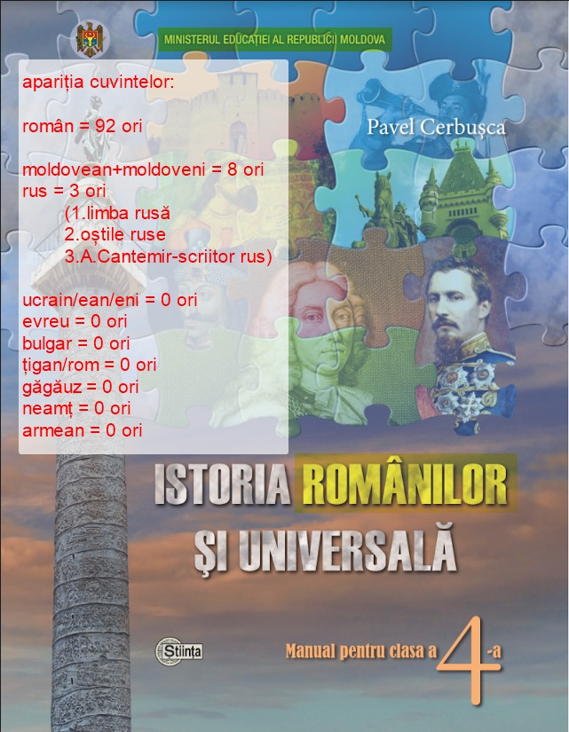

Despre discriminarea din „Istoria românilor” și miturile vehiculate în spațiul public
==

Referitor la articolul semnat de Alexandru Tănase pe Cotidianul.md
[„Identitatea românească ca delict: de la Stalin la consiliul pentru egalitate”](https://cotidianul.md/5464/identitatea-romaneasca-ca-delict-de-la-stalin-la-consiliul-pentru-egalitate/)

Articolul fostului președinte al Curții Constituționale, Alexandru Tănase, care s-a grăbit să se facă, sincer, de rușine, la emisiunea publică "Puterea a patra" la TV precum că petiția „pentru istoria Moldovei” ar fi operațiunea „serviciilor speciale ruse”, încearcă să prezinte avizul Consiliului pentru Egalitate drept un „atac la identitatea românească”, transferând întreaga discuție pe terenul geopoliticii și al interpretărilor subiective ale istoriei.

De altfel, dl Tănase a avansat teorii care au stârnit râsetele autorilor petiției, sugerând că decizia Consiliului pentru Egalitate ar fi fost „țintită” alegerilor din România, că „Sandu era în deplasare”, și alte fantasmagorii neverificate, menționate aici doar pentru a sublinia că fostul judecător și-a pierdut orice credibilitate profesională în ochii autorilor – oameni care, până nu demult, îl considerau serios și informat.

În realitate, problema ridicată de societatea civilă – și susținută de avizul Consiliului – este una simplă: **educația publică într-un stat multietnic trebuie să fie nediscriminatorie, neutră din punct de vedere etnic și să reflecte coeziunea tuturor cetățenilor, nu ideologia unui singur grup**, chiar dacă e aflat, temporar, la conducerea unui minister.

**Realitatea e mult mai simplă și ușor de verificat:**

* Petiția privind denumirea discriminatorie „Istoria românilor” a fost depusă încă din 2019, nu are nicio legătură cu cicluri electorale, geopolitică sau teorii conspiraționiste.
* Grupul de inițiativă a contactat de nenumărate ori președinția, Avocatul Poporului, Parlamentul, iar petiția a fost efectiv uitată pe rafturile Consiliului pentru Egalitate mai bine de cinci ani – ceea ce reprezintă o problemă gravă de administrație publică, nu o conspirație.
* Inițiativa a fost consultată cu **Asociația Europeană a Profesorilor de Istorie (EUROCLIO) din Haga, Olanda**, cu **Human Rights Research and Education Centre din Ottawa** (care a transmis și un amicus curiae), au existat schimburi de opinii cu **Institutul Georg Eckert pentru Cercetarea Internațională a Manualelor Școlare, Braunschweig, Germania**, și cu Oficiul Ombudsmanului din România, dar și Austria.
* **Ombudsmanul din Austria** a răspuns oficial subliniind că, încă din 1945, Austria a eliminat complet conceptele naționale sau etnice din predarea istoriei, tocmai pentru a preveni conflicte identitare și a stimula o perspectivă pan-europeană, incluzivă asupra trecutului. De asemenea, s-a precizat că la nivelul UE și Consiliului Europei există inițiative active de monitorizare și combatere a tendințelor naționaliste în educație, iar Consiliul Europei are un observator special care veghează la respectarea unei abordări echilibrate și nediscriminatorii în curricula școlară.

Încercarea de a deturna discuția în direcția conspirațiilor ține mai mult de nevoia unora de a evita argumentele, decât de realitate. Iată argumentele noastre împotriva unei isterii naționaliste, care, de altfel, și era de așteptat.

## 1. Discriminarea nu are legătură cu procente, identități sau “adevăruri istorice” subiective

Niciun stat democratic și niciun standard european nu permite ca o identitate etnică – fie ea “românească”, “moldovenească”, rusă, maghiară sau alta – să fie impusă întregii populații prin școală. Principiul egalității cere ca manualul de istorie să reflecte realitatea tuturor, nu doar a unui singur grup. Denumirea “Istoria românilor” este discriminatorie nu pentru că ar reflecta o identitate “greșită”, ci pentru că impune, prin titulatură și conținut, narativul unei singure etnii asupra tuturor copiilor Republicii Moldova.

## 2. Procentul “românilor” – argument irelevant

Dl Tănase invocă procentele minoritare/majore de “români” din recensăminte, sugerând că o “majoritate românească” ar legitima această denumire. Acest raționament este irelevant pentru faptul discriminării și este  utilizat de autor doar pentru a arăta ridicolul monopolizării obiectului de istorie de o minoritate statistică. Chiar dacă am presupune că “românii” ar fi 90%, nu există niciun drept democratic de a ignora sau exclude celelalte 10% din istoria națională. 

Mai mult, argumentul că recensămintele au fost “manipulate” poate avea două capete: cum a menționat chiar dl Tănase, mulți din conducerea Republicii Moldova sunt deținători de cetățenie română, care deja au avut practici, să zicem așa, discutabile, de modificări ale Consituției în favoarea sintagmei cu "român" (vezi p.10 mai jos). Cine dacă nu ei, ar fi avut interesul, și chiar posibilitatea de a influența rezultatele recensământului?! S-ar putea că cifra de aproape 8% să fie umflată, nu micșorată! "Cui bono?", cum spun romanii!

Insă reiterăm faptul că aceasta constatare este irelevantă în contextul discriminării etnice. Chiar dacă în țară ar ramâne *un singur* cetațean *ne-român*, ar avea tot dreptul să numească această denumire a obiectului - discriminatorie. 

## 3. Discriminarea directă – o realitate statistică

Oricine citește manualele analizate va observa un fapt: ponderea temelor, personajelor și evenimentelor dedicate altor etnii decât “românii” este aproape nulă. Aceasta nu creează coeziune multietnică, ci alimentează marginalizarea și excluziunea. Consiliul pentru Egalitate nu atacă o identitate, ci semnalează o situație de **privilegiere sistematică** a unui grup, exact ceea ce definește discriminarea directă. Aceasta am constat clar, la momentul depunerii petiției si analizei unui manual de istorie luat la întâmplare. Am văzut ca toleranța și prietenia între popoare nu este la ordinea de zi, deoarece despre alte popoare în manualul de istorie analizat practic nici nu se pomenește.

Coperta manualului Pavel Cerbușca; Min. Educației 2016

 
Totul este axat pe etnia română, începând de la titlu și terminând cu conținutul. Am luat spre exemplu conținutul unui manual - “Istoria românilor și universală: Man. pentru cl. a IV-a / Pavel Cerbușca; Min. Educației al Rep. Moldova - Ch.: Î.E.P. Știința, 2016”. După analiza lexicală a textului din manual, se poate constata cu stupoare, că cuvântul “moldovean”/”moldoveni” în manual se întâlnește de 8 ori, cel “rus” are trei aparențe (limba “rusă”, “oștile ruse” și “scriitor rus”), cuvintele “ucrain/ean/eni”, “evreu”, “bulgar”, “țigan/rom”, “găgăuz”, “neamț”, “armean” nu se întâlnesc niciodată(!), pe când cuvântul “român” se întâlnește sub diverse forme de 92 ori !

## 4. ECRI a criticat Istoria "românilor" după care România a renunțat la el

Raportul ECRI (Consiliul Europei) din 2005 menționează clar, la **punctul 81**, in care erau enumerate exclusiv *criticile* la adresa practicilor educaționale din România. Evident ca nu poate fi vorba de o mențiune neutra, ci de o *critică*:

> „ECRI notează că în ciuda măsurilor mai sus-menționate, pe care le întâmpină cu bucurie, *rămân multe lucruri de făcut în domeniul educației*. Organizații nonguvernamentale încă deplâng faptul că manualele școlare românești conțin *stereotipuri* și *prejudecăți* despre grupurile minoritare. Unele manuale, de
exemplu, continuă să descrie sosirea în România a unor “hoarde de nomazi barbari care au venit dinspre est pentru a răspândi teroare”, iar maghiarii sunt uneori descriși ca străini care au ocupat Transilvania. ECRI mai **notează că numele cursului de istorie predat elevilor români este “Istoria românilor”, și nu “Istoria României”**. S-ar părea de asemenea că deși cele mai multe referiri ofensatoare la adresa rromilor au fost șterse din manualele școlare, se acordă în continuare prea puțină atenție contribuției lor la dezvoltarea societății românești.”

Tot acest punct 81 al raportului ține de *deficiențe*, stereotipuri și lipsa includerii minorităților în conținutul manualelor – ECRI menționează explicit critica denumirii, în contextul general al nevoii de pluralism și incluziune.

Ca răspuns, însuși Ministerul Educației din România a modificat curriculumul, iar guvernul a comunicat Consiliului Europei:

> „Ținând cont de recomandările Consiliului Europei, România a introdus din anul școlar 2004-2005, cursuri de istorie integrată, denumite ‘Istorie’. Odată cu introducerea noilor programe \[...] va dispărea și sintagma 'Istoria românilor'.”

Prin urmare, **însăși România a eliminat această denumire, considerând-o inadecvată și nealiniată standardelor europene**. În aceste condiții, perpetuarea formulei „Istoria românilor” în Republica Moldova contravine atât bunelor practici europene, cât și răspunsului dat chiar de Guvernul Român acestor critici.

## 5. CtEDO: Școala nu este terenul îndoctrinării identitare – jurisprudență europeană

Practica CtEDO este clară: **statul nu are dreptul să folosească educația pentru a impune copiilor o singură viziune istorică, religioasă sau ideologică**. Orice curriculum școlar care promovează exclusiv valorile, istoria sau credințele unui singur grup, fără alternative reale sau fără respect pentru diversitate, încalcă Convenția Europeană a Drepturilor Omului (art. 2, Protocolul 1).

### Exemple relevante:

* **Folgerø și alții vs. Norvegia (2007)**
  Curtea a constatat că predarea obligatorie a unei religii/istorii dintr-o singură perspectivă, fără opțiunea unui curriculum pluralist sau de retragere, **încalcă dreptul la educație și dreptul părinților de a asigura educația conform convingerilor proprii**. Aplicabil și la istorie: “statul trebuie să asigure neutralitatea și pluralismul în educație” (par. 84-89, 100-102).

* **Hasan și Eylem Zengin vs. Turcia (2007)**
  Curtea a subliniat că “obiectivitatea, pluralismul și neutralitatea” sunt cerințe fundamentale. Nu este permis ca o materie să reflecte exclusiv o identitate sau o interpretare istorică/națională, mai ales într-o societate pluralistă.

* **Valsamis vs. Grecia (1996)**
  CtEDO a reiterat că “statul nu poate impune valori oficiale sau narative istorice în mod absolut; dreptul la educație înseamnă și dreptul la respect pentru diversitate și identitate proprie”.

**Aceste precedente sunt aplicabile și în cazul Republicii Moldova:**
Impunerea denumirii și conținutului “Istoria românilor”, fără alternative și fără reprezentarea adecvată a diversității, este o formă de îndoctrinare identitară, condamnată ca atare de Curtea Europeană a Drepturilor Omului.

### 6. Statutul limbii nu este același cu cel al etniei

Limba Moldovenească (în versiunea modificată ilegal a Constituției: "româna") are un statut **oficial** – fapt consfințit juridic și constituțional. Dar nu există nicio “etnie oficială” în Republica Moldova! Să transferi regulile limbii (care țin de funcționalitatea statului) asupra identității etnice este un abuz conceptual, nu un argument. Legislația și Constituția nu autorizează, nici explicit, nici implicit, existența unei etnii dominante, sau a supremației acestei etnii în orice maniera nu s-ar exprima, inclusiv prin evidențierea specială pe coperta manualelor școlare.

## 6. Comparațiile cu Franța, Polonia sau alte state – o eroare factuală

Citez din articolul dl Tănase:

> “a cere ca Franța să nu mai predea istoria *franceză* pentru că există arabi, bretoni sau alsacieni...”

Acest exemplu arată lipsa de documentare a autorului. În Franța, nu exista niciun obiect de istorie "franceză": obiectul școlar se numește *"Histoire/Géo"* sau simplu *"Histoire"*; în Polonia – *“Historia”*; în Austria – *“Geschichte”* (și nicicum istoria "nemților"). A propos, în România obiectul de istorie nu se numește "Istoria României", cum ar sugera dl Tanase, ci simplu: "Istoria". Nu există **nicio țară europeană, cu excepția Moldovei**, care să impună o istorie etnică la nivel de disciplină școlară.
Vă invităm să consultați celelalte denumiri de manuale [aici](https://dudnic.com/2019/11/22/denumirea-obiectului-scolar-de-istorie.html).

## 7. Ideologia de stat – interzisă de Constituție

Republica Moldova, ca stat de drept, nu poate avea o ideologie oficială (art. 5 și art. 10 din Constituție). A propune menținerea denumirii “Istoria românilor” ca unică și obligatorie, pe baza unei “misiuni istorice”, înseamnă a plasa statul în afara normelor constituționale și europene.

## 8. **Declarația de Independență : Falsificări și denaturări grosolane**

Un alt exemplu de manipulare flagrantă este afirmația dlui Tănase că „Declarația de Independență a Republicii Moldova \[...] afirmă continuitatea istorică și culturală cu spațiul românesc.”
**Aceasta este o denaturare gravă a realității.** În tot textul Declarației de Independență nu apare niciodată sintagma „spațiu românesc” și nici cuvântul „românesc”.

Formularea reală din Declarație este:

> „SPAȚIUL ISTORIC ȘI ETNIC AL DEVENIRII SALE NAȚIONALE”

Este evident că aici se vorbește despre spațiul istoric și etnic propriu al Republicii Moldova, nu despre o „continuitate cu spațiul românesc” așa cum insinuează Tănase.
Această tendință cronică de a suprapune și substitui orice concept național moldovenesc cu „românesc” se regăsește atât în discursul dlui Tănase, cât și în manipulările ce au dus la modificarea ilegală a denumirii limbii moldovenești în edițiile recente ale Constituției Republicii Moldova.

## 9. Integrarea Europeană - unica soluție pentru a înlătura șovinismul primitiv

Faptul că autoritățile își permit asemenea libertăți este deoarece încă nu suntem în UE, normele sale nu sunt aplicabile pe teritoriul național și autoritățile naționaliste au majoritatea și mâinile dezlegate de a abuza de cetățenii republicii cum le pare mai bine.

Adevărata întrebare nu este "cine suntem", ci "cum construim o societate incluzivă, echitabilă și europeană?". Răspunsul nu poate veni nici din geopolitică, nici din retorica identitară a elitelor, ci din respectarea egalității de șanse pentru toți copiii.

Republica Moldova trebuie să se **alinieze la modelul European** în materie de educație: niciun stat din Uniunea Europeană sau Consiliul Europei nu impune, prin titulatura obiectului școlar, istoria unei singure etnii. **“Istoria” trebuie să fie pentru toți**, nu pentru un grup selectat pe criterii identitare. Soluția europeană – dovedită, funcțională, adoptată peste tot – este un obiect școlar neutru, incluziv și pluralist, care reflectă istoria întregii societăți.

Este timpul să lăsăm în urmă excepționalismul, să renunțăm la formulele etniciste și să adoptăm aceleași principii care garantează coeziunea, respectul reciproc și egalitatea de șanse pentru toți copiii europeni. 

Moldova nu **trebuie să fie** o excepție negativă, ci **parte a familiei europene – și asta începe cu școala.**

Aici am încheiat. 

## 10. Notă despre abuzul cu denumirea limbii de stat.

Terminând aceste remărci, nu putem să nu reamintim fostului judecător al CC despre abuzul Parlamentar din 2023, când o lege organică (Legea nr. 52/2023) a fost folosită pentru a modifica textul unei legi constituționale, prin care sintagma  „moldovenească” a fost înlocuită cu „română”. Aceasta este fundamental neconstituțional din punct de vedere al ierarhiei normative și al procedurii prevăzute de Constituție. Mai mult, aceasta este neconstituțional și din cauza de fond, întrucât **nu au fost întrunite condițiile pentru existența unei divergențe explicite** între textul Constituției și Declarația de Independență. 

Declarația nu conține o **afirmație expresă** de tipul „limba de stat **este** limba română”, ci doar menționează această denumire în contextul unor denumiri interpretate liber de legi si hotărâri din 31 august 1989. În schimb, articolul 13 conținea o dispoziție clară, în formulare pozitivă, stabilind că limba de stat **este** limba moldovenească. 

Având în vedere că, potrivit Academiei de Științe, cele două denumiri se referă la **aceeași** entitate lingvistică, diferența este pur terminologică, nu de conținut, și nu poate constitui o contradicție juridică. Aplicarea deciziei Curții Constituționale din 2013 pentru modificarea textului constituțional a fost astfel abuzivă: Curtea poate constata priorități interpretative, dar nu are competența de a rescrie Constituția. La fel, majoritatea simplă a Parlamentului nu are dreptul de a modifica textul constituțional fără respectarea procedurii prevăzute pentru revizuire, ceea ce face intervenția nulă și lipsită de efect juridic.

În decizia sa din 2013, Curtea Constituțională a inclus o formulare discutabilă, afirmând că *„în cazul Republicii Moldova, sunt culese roadele unei ideologii perfide \[…] care se bazează pe conceptul existenței a două națiuni, a două limbi, a două istorii diferite”.*

Această afirmație nu are temei juridic sau științific, fiind o interpretare subiectivă și ideologizată. Existența a **două națiuni** este un fapt obiectiv, confirmat prin simpla **existență juridică a două state suverane** — România și Republica Moldova —, fiecare cu o **istorie politică distinctă**. În ceea ce privește limba, deși din perspectivă lingvistică este vorba despre aceeași entitate, **denumirea** acesteia poate varia legitim între popoare diferite, în funcție de tradiție, identitate și voință politică. La fel cum orașul german Köln este numit *Cologne* în franceză — fără ca această variație să fie considerată „perfidie” —, nici folosirea denumirii tradiționale „limba moldovenească” nu poate fi descalificată. Mai mult, **Muntenegru** recunoaște oficial limba **muntenegreană**, deși aceasta este practic identică cu limba sârbă. Totuși, nimeni nu contestă dreptul statului muntenegrean de a-și numi limba potrivit identității sale naționale.

În același sens, **nici România și nici Republica Moldova nu dețin un drept de exclusivitate sau copyright asupra unei valori culturale comune**, precum limba. O limbă este un patrimoniu viu al comunităților care o vorbesc, iar denumirea ei nu este proprietate ideologică, ci expresia libertății identitare a unui popor suveran. Pretinderea unui „monopol” asupra unei denumiri lingvistice echivalează cu o negare a egalității dintre state și popoare.

---

**Referințe suplimentare:**

* Studiul complet asupra denumirii obiectului școlar de istorie în Europa: [https://dudnic.com/2019/11/22/denumirea-obiectului-scolar-de-istorie.html](https://dudnic.com/2019/11/22/denumirea-obiectului-scolar-de-istorie.html)
* Recomandări ECRI, rapoarte Consiliul Europei, jurisprudență CtEDO.
