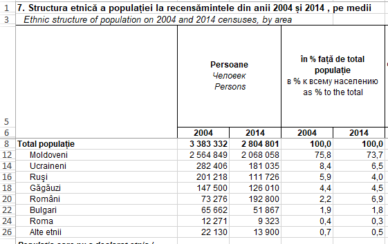
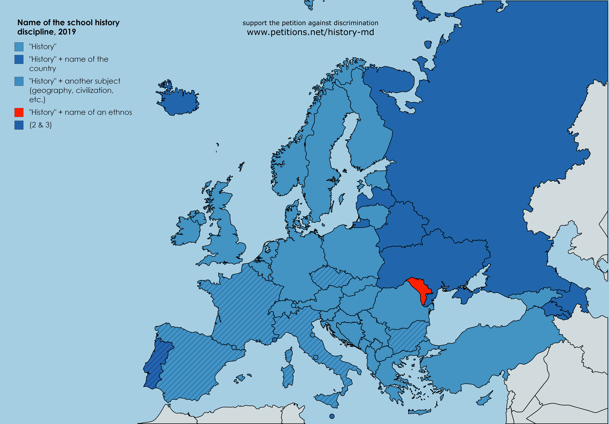
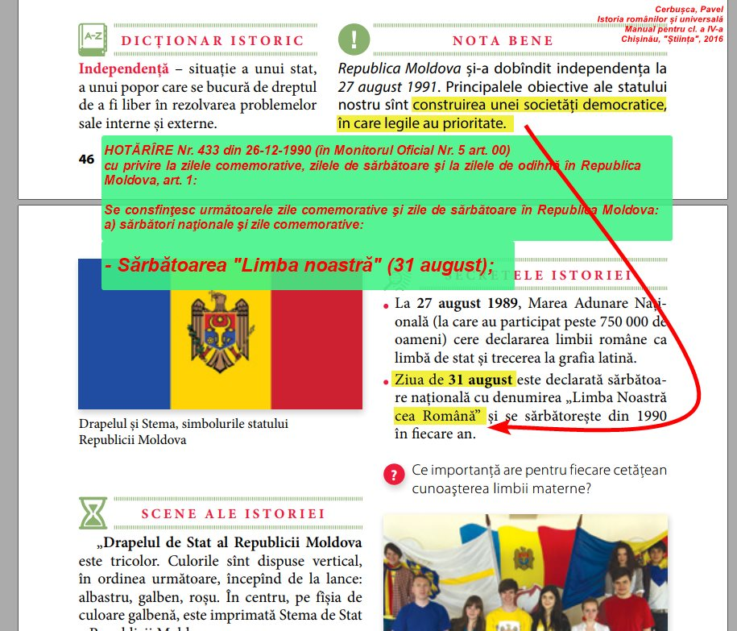

# Discrimination and the naming of National History in the Republic of Moldova

We, the undersigned, the Initiative Group “For the History of Moldova” (hereinafter the Group), ask the Council for Preventing and Eliminating Discrimination and Ensuring Equality in the Republic of Moldova (hereinafter the Council) to take the necessary steps such that the Ministry of Education, Culture and Research of the Republic of Moldova (hereinafter the Ministry of Education) renames the national school subject “History of Romanians” (or variants of names containing this phrase) in order to cease the practices of the ministry considered by the Group as ethnic discrimination.

We shall further provide the arguments that explain the Group’s position in this regard, the cases in the national and international legislation, as well as possible solutions considered by the Group as appropriate to be undertaken by the Ministry of Education. We consider that the Ministry imposes, in the school curriculum, a compulsory subject for all the pupils in the Republic of Moldova - "History of Romanians ..." - named in honor of a single ethnic group, claimed by 6.9% of the country's population at the last national census. The history, the current situation, the national and international legislation in the field and the practice of other states will be analyzed.

We shall only analyze the name of the subject as a source of discrimination, without expressing our opinion on the content of the textbooks, subject of a much more complex and subjective study. This study does not cover the content of history textbooks and is not intended to make any changes to thereto, although the petition’s authors would obviously want the textbooks to have a balanced content as well, highlighting objective facts, and not personal attitudes of the authors. The content of the textbooks, however, will be analyzed very briefly, in order to understand the background of the problem and to better explain the essence of the issue of the naming of the school object.
We would like to point out that the petition is evolving, new materials being added all the time, the latest version, in the state's language being available online at https://github.com/sdudnic/moldova/wiki/ro

# 1. General issues
It is a moment of deep confusion for the parents from the Republic of Moldova who consider themselves Jews, Moldovans, Ukrainians, Russians, Gagauzians, etc. when they have to explain to their children, from an early age, why they all need to learn a "history" dedicated exclusively to "romanians". In our opinion, the situation would be also confusing if this subject was called, for example, “History of Moldovans”, “History of Ukrainians” or “History of Romani” - in any of these cases the ethnic feelings of other ethnic groups would be hurt. They may feel as “separate” ethnicities, whose history does not deserve to be included in the name of a school subject for a reason or another.
While in the Republic of Moldova there is an official language laid down in the Constitution of the Republic, there is no official ethnicity/nationality found in the legislation.

The population censuses from 1989, 2004, 2014 show that the majority of the population of the Republic of Moldova - 69-76% - self-identifies with Moldovan nationality/ethnicity. The ethnic structure of the population of the Republic of Moldova, according to the results of the national census, is presented in the following table, which contains the official figures of the 2004 and 2014 population census:

_Fig. 1_ – Table representing different nationalities/ethnicities in the Republic of Moldova (source: Moldova National Bureau of Statistics, statistica.md, Results of 1 census)

We remind the fact that censuses record the personal statement of citizens regarding their ethnicity/nationality, so it is about self-identification - the only modern method of determining the ethnicity of an individual, taken in part. The sum of personal self-identification presents a democratic, independent, scientifically adapted method of identifying, measuring quantitatively and analyzing ethnic groups within a community.

The table shows that during the last census, in 2014, 73.5% of population declared themselves Moldovans, 6.9% Romanians, 6.5% Ukrainians, 4.5% Gagauzians, and 4% Russians etc. We emphasize that it is the direct, raw, declared opinion of the citizens. No subjective filter of individual "experts" or "scientific", political, or other groups is applied.

The Republic of Moldova remains the only country in Europe (probably in the world) with an ethnic element in the name of the school object of history. No other European country includes an ethnic element in the name of the school object of history. None. Not even Romania.

# 2. Definitions
## 2.1. Ethnicity and Nationality
In this document, we consider the notions of **ethnicity** and **nationality** as _equivalent_. This is because in national documents (birth certificates, national censuses, etc.) there is no difference between these notions, the principle being: one citizenship - several nationalities (ethnicities).

## 2.2. Discrimination

Taking into consideration the following national and international legal texts:

 * The Moldovan **law on ensuring equality** (no. 121 of 25.05.2012):

   * _discrimination_ - any difference, exclusion, restriction or preference in the rights and freedoms of the person or a group of persons, as well as the support of discriminatory behavior based on real criteria, stipulated by this law or on presumed criteria;
   * _direct discrimination_ - treating a person on the basis of any of the prohibitive criteria in a less favorable manner than treating another person in a comparable situation;
   * _indirect discrimination_ - any provision, action, criterion or seemingly neutral practice which has the effect of disadvantaging a person to another person on the basis of the criteria stipulated in this law, unless that provision, action, criterion or practice is justified in objectively, by a legitimate purpose and whether the means to achieve that purpose are proportionate, appropriate and necessary;
   * _discrimination by association_ - any act of discrimination committed against a person who, although not part of a category of persons identified according to the criteria stipulated by this law, is associated with one or more persons belonging to such a category of persons;
   * _racial segregation_ - any action or inaction that leads directly or indirectly to the separation or differentiation of persons based on criteria of race, color, national or ethnic origin;
   * _harassment_ - any unwanted behavior that leads to the creation of an intimidating, hostile, degrading, humiliating or offensive environment, with the purpose or effect of harming a person's dignity based on the criteria stipulated by this law;

 * **The International Convention on the Elimination of All Forms of Racial Discrimination** defines _racial discrimination_ as 
> "any distinction, exclusion, restriction or preference based on race, color, ancestry or national or ethnic origin, which has as its object or effect the destruction or compromise of recognition, use or the exercise, on equal terms, of human rights and fundamental freedoms in the political, economic, social and cultural spheres or in any other field of public life."

 * The **Romanian legislation** uses, in the Government Ordinance no. 137/2000, on the prevention and sanctioning of all forms of discrimination, in Art.2, a similar definition, _discrimination_ being 
> "any difference, exclusion, restriction or preference, based on race, nationality, ethnicity, [...] beliefs, ... or any other criterion which has as its object or effect the restriction or removal of the recognition, use or exercise, on equal terms, of human rights and fundamental freedoms or of rights recognized by law, in the political, economic, social and cultural field or in any other field of public life";

In particular, we can conclude from this that _racial discrimination_ is defined as "preference based on national or ethnic origin, which has the effect of restricting or removing the recognition, on an equal footing, of fundamental rights and freedoms".

 * In **Romania**, order no. 6134/2016 on the prohibition of school segregation in pre-university education units, Art.3, defines _segregation_ as 
> "a serious form of discrimination and has as a consequence the unequal access of children to a quality education, violation of the exercise of equal rights to education as well as human dignity"

 * **The People's Law Dictionary** by Gerald and Kathleen Hill, defines _discrimination_ as 
> "unequal treatment of persons, on a ground that has nothing to do with rights or legal capacity";

In conclusion, we will understand in this document the **ethnic discrimination** as 
> including, but not exclusively, the preference/highlighting of a certain group of citizens over other groups of citizens based on ethnic/national criteria, which would have the effect of favoring this group over others in expressing rights and fundamental human freedoms (in particular the right to inclusive education, the individual's right to decide which ethnic group it is or is not part of, the study of the common historical past, the recognition of the participation of individuals and the ethnic groups they belong to - or considers that they are - in the shaping of the past of their common state - the Republic of Moldova).

### 2.2.1 Segregation

The definition and prohibition of _ethnic segregation_ is present in the legislation of many European countries. Bellow we summarize the definitions of (ethnic, educational) _segregation_ in different countries, you can also find [the original study, as of april 2019, here](https://ec.europa.eu/info/sites/info/files/racial_discrimination_in_education_and_eu_equality_law_web.pdf):

 - Bulgaria: Article 5 and Additional Provision §1.6 Law on Protection Against Discrimination Racial segregation […] shall be deemed discrimination, [and] shall mean issuing an act, performing an action or omission to act, which leads to compulsory separation, differentiation or dissociation of persons based on their [...] ethnicity [...].

 - Croatia: Article 5, (1) and (2) Anti-Discrimination Act Segregation shall […] deem to be discrimination […] meaning [...] a forced and systematic separation of persons on any of the grounds referred to in Article 1 paragraph 1 of [the Anti-discrimination Act]

 - Hungary: Article 10 (2) and 27 (3) Antidiscrimination law. Segregation is a behaviour aimed at separating individuals or a group of persons from other individuals or another group of persons in a comparable situation, based on a characteristic defined in [the anti-discrimination law].
 
 - UK: Equality Act 2010 Section 13 (1) and (5) A person (A) discriminates against another (B) if, because of a protected characteristic, A treats B less favourably than A treats or would treat others. If the protected characteristic is race, less favourable treatment includes segregating B from others. NI Race Relations Order 1997, Art. 3(2) Race Relations Order Segregating a person from other persons on racial grounds is treating him less favourably than they are treated.

## 2.3 Discriminated subjects
Here are the subjects which, in the opinion of the working group, are discriminated by this name of the school subject:

a) **children**, citizens of the Republic of Moldova, of national/ethnic **minority**, non-Romanians, as they are excluded from the name of the textbook, in favour of Romanians;

b) **children**, citizens of the Republic of Moldova, of national/ethnic **majority** (Moldovans), who do not consider themselves Romanians, as they are excluded from the name of the textbook, in favour of Romanians;

c) the possible discrimination analyzed covers the whole period this name of the school subject exists in the Republic of Moldova, with small exceptions, it is almost the whole period of independence of the Republic of Moldova. This means that discriminated subjects include not only current pupils, but also all pupils who have learned this subject since the 1990s.
 
d) **the families** of the children referred to at point (a), as they are obliged to make an additional didactic effort within the family, and to explain to the children why they are not on the cover of the history textbook;
 
e) the families of the children referred to at point (b). If the Moldovan family does not consider themselves Romanians, they are disadvantaged compared to families conforming to the state ideology, because they have to cope with the double didactic task and potential confrontation with possible conflicts between teachers, pupils and parents regarding this ideology;
 
f) **history teachers**, who, regardless of their nationality and own opinion on this national subject, are obliged to teach history as seen on the cover of the textbook, namely the exclusive history of Romanians. How does a history teacher, who is not, or does not consider himself Romanian, feel about teaching the history of Romanians?

Families that do not want to educate their children in the style of the Ministry of Education are discriminated compared to other families that conform to the state ideology. Namely, the parents of non-Romanian Moldovans must make an additional didactic effort both to dispute the ideology imposed by the Ministry and to explain its point of view, which will be in constant competition with the ideas suggested by teachers and the history textbook. This creates unequal conditions for families conforming and non-conforming to the state ideology. This situation can be a source of additional potential tensions between Moldovan pupils and parents, between Moldovan pupils and teachers, and between Moldovan pupils and pupils who consider themselves Romanians.

The existence of a state ideology according to which Moldovans are Romanians, and its expression through the name of the school subject, favours an increased risk of conflicts both between parents and children, between parents and teachers, and between children who consider themselves Romanians and those who do not consider as such, creating confusion and tension in the classrooms of the schools in case of any conflict.

# 3. The legal framework
The following national and international documents have been studied for violations admitted by the Ministry (sources to documents available online are presented below):

## 3.1 International legislation
The segregation of children in schools is described by the Council of Europe as “the worst form of discrimination and a serious violation of the rights of the children concerned”. Although all Member States have taken on the responsibility to eliminate ethnic segregation in schools, the information from filed studies shows worryingly, not only that segregation persists, but also that at European level the percentage of segregated schools and classes has increased.

### 3.1.1 UN

 * **International Convention on the Elimination of All Forms of Racial Discrimination**
In addition to the definition of "racial discrimination" in the preceding paragraph, the Convention also mentions:
> Art.4 States Parties [...] undertake [...] c) not to permit public authorities or public institutions, national or local, to promote or incite racial discrimination.

**in fact**, in parallel with education focused on Romanian identity (and especially, on the object of national history) there can be observed a proliferation of associations, groups and parties aimed at segregating Romanian ethnic groups within a Romanian nation state, various Russophobic demonstrations, in particular protests at the Russian embassies, at the separation line with the Transnistrian region, etc. The authors believe that ethnocentric education encourages the emergence in society of extremely negative feelings about some peoples or ethnicities, and positive/compassionate towards others.

> Art.7 commits the signatory states "to take immediate and effective measures in the fields of education, education, culture and information, to combat prejudices leading to racial discrimination and to promote understanding, tolerance and friendship between nations and racial or ethnic groups".

 * **UNESCO Convention against Discrimination in Education 1960**
> Art.3 In order to eliminate or prevent any discrimination [...], the States Parties undertake:
 a) to abrogate any statutory provisions and any administrative instructions and to discontinue any administrative practices which involve discrimination in education;

This article, used by the ECHR in the case of the Transnistrian teachers’ trial against Moldova and Russia for the case of Latin-script schools, can probably be applied in this case, if it is confirmed that the name given to the textbook by the Ministry of Education discriminates non-Romanians by excluding them, and favours the Romanians by offering them exclusivity to appear on the cover.

This issue may be a violation of the ethnic rights of the population of the Republic of Moldova, and possibly a violation of children’s rights to a fair education.

 * **Universal Declaration of Human Rights**
> Art.26 (2): Education shall be directed to the full development of the human personality and to the strengthening of respect for human rights and fundamental freedoms. It shall promote understanding, tolerance and friendship among all nations and racial groups [...] (3) Parents have a prior right to choose the kind of education that shall be given to their children.

**in fact**, tolerance and friendship between peoples are not given due consideration, as the analyzed history textbook contains almost nothing about other nations. Everything is focused on the Romanian ethnicity, starting with the title and ending with the content. As for example the history textbook – “Istoria românilor și universala (History of Romanians and world history): Fourth grade textbook/Pavel Cerbușca; Ministry of Education of the Republic of Moldova - Ch.: Î.E.P. Știința, 2016”. After the lexical analysis of the text in the textbook, we have discovered with a certain amount of dismay that the word “Moldovan”/”Moldovans” is used 8 times, the word “Russian” 3 times (the Russian language, Russian armies and Russian writer), the words Ukraine, Ukrainian/Ukrainians, Jew, Bulgarian, Gypsy/Roma, Gagauz, German, Armenian are not used at all (!), while the word “Romanian” is used 92 times in various forms!

_Fig. 2_ An example of statistics of a textbook of the “History of Romanians”

Similar statistics can be found in the high school curriculum on history, 2019, where minorities are not mentioned at all (e.g. words as Ukrainian, Jew, Bulgarian are not mentioned), the word Moldovan/Moldovans” is found only once, Russian only with reference to the Empire, while Romanian/Romanians” is mentioned hundreds of times.

No consideration is given to parents’ priority: all children learn exclusively about Romanians regardless of the opinions of their parents. Respectively, school promotes ethnic indoctrination of children regardless of the position of their parents exposed at home, thus confusing children and imposing them to choose between school and parents, if those opinions differ.

 * **Declaration on the Rights of Indigenous Peoples of the UN General Assembly**
> Art.14 (2) Indigenous individuals, particularly children, have the right to all levels and forms of education of the State without discrimination. (3) States shall, in conjunction with indigenous peoples, take effective measures, in order for indigenous individuals, particularly children, including those living outside their communities, to have access, when possible, to an education in their own culture and provided in their own language.

**in fact**, notwithstanding the results of national censuses, the Ministry imposes nationalist clichés on the indigenous population statistically declared explicitly as “Moldovans”, imposing the ethnonim “Romanian” in the name of the subject of history. We shall note that the same clichés are applied to national subjects of language (according to Art.13 of the Constitution declared as “Moldovan”), and literature, but these are not currently the subject of this petition.

> Art.15 (1) Indigenous peoples have the right to the dignity and diversity of their cultures, traditions, histories and aspirations which shall be appropriately reflected in education and public information. (2) States shall take effective measures, in consultation and cooperation with the indigenous peoples concerned, to combat prejudice and eliminate discrimination and to promote tolerance, understanding and good relations among indigenous peoples and all other segments of society.

**in fact**, the dignity of Moldovans who do not consider themselves Romanians is not respected. Prejudices not only are not fought against, but are rooted and formalized by the school curriculum. The doctrine of including Moldovans as part of Romanians, through language, history and literature reflects a tendency of sick and consistent indoctrination manifested by ministry officials. Even the children in Romania have not learned the history of “Romanians” since a long time ago, but the officials of the Ministry of Education of the Republic of Moldova maintain this ideology probably remaining the last in the world, and certainly the last in Europe, using such a name for the subject concerned.

> Art.31 (1) Indigenous peoples have the right to maintain, control, protect and develop their cultural heritage, traditional knowledge and traditional cultural expressions [...] oral traditions, literatures [...]. (2) In conjunction with indigenous peoples, States shall take effective measures to recognize and protect the exercise of these rights.

**in fact**, popular expressions and Moldovan traditions, the traditional use of the name of the Moldovan language, ethnicity, people and nation, as accustomed to and written evidence of which we have at least since the sixteenth century, are systematically replaced by the terms “Romanian”, because this is what the ministerial elite consider to be, in their view, more correct. The name of the Moldovan language, used for at least 5 centuries, is not used anymore contrary to censuses and the majority public opinion. The name of the Moldovan ethnic group is replaced by the Romanian ethnic group. It is this concept that underlies the name of the national subject of history, considering it as part of the struggle against the Soviet past that has become unpopular. The name of the Moldovan ethnic group and the Moldovan language became sacrifices of the struggle of the scientific elites against the Soviet past. These clichés without alternative are presented to pupils as the only truth. Thus, not only ethnic minorities in the Republic of Moldova are practically excluded from history textbooks, but also the Moldovan majority is subject to methodical indoctrination during the last decades of independence.

 * **UN Convention on the Rights of the Child** (November 20, 1989)
> Art.2 (1) States Parties shall respect and ensure the rights set forth in the present Convention to each child within their jurisdiction without discrimination of any kind, irrespective of the child's or his or her parent's or legal guardian's [...] political or other opinion, national, ethnic or social origin, [...] of their birth or of another situation.
(2) States Parties shall take all appropriate measures to ensure that the child is protected against all forms of discrimination or punishment on the basis of the legal status, activities, expressed opinions, or beliefs of the child's parents, legal guardians, or family members.
Art. 8 (1) States Parties undertake to respect the right of the child to preserve his or her identity [...]

**in fact**, it is stated that the identity of Moldovan families who do not consider themselves Romanian is replaced by the Romanian identity. The name of the official course of national history leaves no doubt in this regard: the history is about the “Romanians”, which gives place to the Moldovan identity of these families. The children of Romanian ethnicity are the only ones whose ethnicity appears in the name of the compulsory school subject, in this way unequal conditions are created for the children studying this subject.

### 3.1.2 The Council of Europe
"In many countries, there may be a wish by pressure groups, by parts of the general public and by politicians to use history teaching as a tool to build up a feeling of superiority, and in some cases, hatred to ‘the others’, whether they are States, or ethnic/minority groups."
"The Council of Europe and School History", a CoE report, Ann Low-Beer, Strasbourg, 1997

History is studied in all the european states. In most cases the object is called "History", in some cases the name also includes the name of the country, but in no country (at least in Europe), except Moldova, is any ethnic name specified:

  

_Fig.3_ The name of the school object of history in the countries of Europe

For pupils between the ages of 10 and 14, the history is compulsory in all schools in Europe, the difference is the age at which they start learning history (at 5, 7 or 10 years), as well as the age at which history becomes optional (14, 15 or 17 years). Other differences refer to the time allocated weekly (between 45 and over 90 minutes), to the study form - disciplinary or integrated, as well as to the model of school curricula: linear, concentric or spiral.  On the other hand, other common elements stated in the study relate to common trends in the aims of learning history – making pupils understand the world in which they live, their contribution to the development of European citizenship and critical thinking, and the abandonment of the chronological criterion of organizing the contents in favour of the thematic one (EUROCLIO, 2003).

Below is a non-exhaustive list of Council of Europe conventions and legal texts that are subject to possible violation by the Ministry of Education:

 - **European Convention on Human Rights**

> Art.8 The right to respect for private and family life
(1) Everyone has the right to respect for his private and family life [...].
(2) There shall be no interference by a public authority with the exercise of this right except such as is in accordance with the law and is necessary in a democratic society in the interests of national security, public safety or the economic well-being of the country, for the prevention of disorder or crime, for the protection of health or morals, or for the protection of the rights and freedoms of others.

**in fact**, we notice the brutal involvement of the state in the family life. In particular, the right of parents to educate their child as a Moldovan is compromised by the ideology imposed in school textbooks according to which Moldovans are, in fact, Romanians. And this is expressed in the name of the integrated school course.

> Art.9 Freedom of thought, conscience and religion
(1) Everyone has the right to freedom of thought, conscience [...]; this right includes freedom to change his [...] belief and freedom [...] either alone or in community with others and in public or private, to manifest his [...] belief, in worship, teaching, practice [...].
(2) There shall be no interference by a public authority with the exercise of this right except such as is in accordance with the law and is necessary in a democratic society in the interests of national security, public safety or the economic well-being of the country, for the prevention of disorder or crime, for the protection of health or morals, or for the protection of the rights and freedoms of others.

**in fact**, we notice that the freedom of thought is limited by the name of the school subject of history, which marks the official theory of “Romanianism”. This imposed theory has no interference with national security, public safety or other elements listed in point 2 of this article. Respectively, the implication of the State limits the freedom of opinion and freedom of thought of children in the Republic of Moldova.

> **Additional Protocol (1)**
Art.2 Right to education
No person shall be denied the right to education. In the exercise of any functions which it assumes in relation to education and to teaching, the State shall respect the right of parents to ensure such education and teaching in conformity with their own religious and philosophical convictions.
Art.14 Prohibition of discrimination
The enjoyment of the rights and freedoms set forth in this Convention shall be secured without discrimination on any ground, such as [...] language, [...], opinion [...], national origin [...], association with a national minority [...].

> **Protocol no.12**; Art.1 General prohibition of discrimination
The enjoyment of any right set forth by law shall be secured without discrimination on any ground such as [...] language, opinion [...], national origin [...], association with a national minority [...] or other status.
No one shall be discriminated against by any public authority on any ground such as those mentioned in paragraph 1.

**in fact**, the state ignores the beliefs of a great part of population who declare themselves Moldovans, it ignores the philosophical conceptions of many parents who signed this petition, who do not agree that their children should be educated as Romanians. There is an obvious difference based on national origin. Ethnic minorities are completely absent in the history books analyzed by us, books accredited by the Ministry of Education of Moldova.

 - **Framework Convention for the Protection of National Minorities**

> Art.5 (2) [...] the Parties shall refrain from policies or practices
> aimed at assimilation of persons belonging to national minorities
> against their will and shall protect these persons from any action
> aimed at such assimilation.

**in fact**, it can be noted that the Convention does not prohibit voluntary assimilation, there is evidence that citizens of the Republic of Moldova are against ethnocentrism: for example the petition “For the History of Moldova” signed by thousands of people, attitudes can be seen in the comments where the signatories expressed their views on this issue.

> Art.6 (1) The Parties shall encourage [...] tolerance and dialogue [...] among all persons living on their territory, irrespective of ethnic, cultural, linguistic identity [...], especially in the fields of education [...].
Art. 7 The parties shall ensure the respect for the right [...] to freedom of thought [...]
Art.12 The Parties shall [...] take measures in the fields of education and research to foster knowledge of the culture, history, language and religion of both their national minorities and of the majority.

**in fact**, the national education system has monopolized the study of the history of a single national ethnic component, which is not even a majority.

> Art.20 In the exercise of rights and freedoms [...] any person belonging to a national minority shall respect [...] the rights [...] of the majority or other national minorities.

**in fact**, it is stated that people from the Republic of Moldova who identify themselves as “Romanians” have imposed, probably, a monopoly on the education system and on the ideas and beliefs exposed in the didactic literature for pupils, belonging to both other minorities and the majority - Moldovans [see the law on minorities] - of the population. That is why, the Ministry of Education renamed the state language from the official “Moldovan” into “Romanian”, instead of the “History of Moldova” children learn the “History of Romanians”, and the subject of Literature is called “Romanian Literature”, without consulting and listening to the general public and the opinions of the majority population, expressed through national censuses.

### 3.1.3 Recommendations of the Parliamentary Assembly of the Council of Europe

 - **Recommendation 15 (2001) on history teaching in the 21st-century in Europe**

“Appendix 1. [...]
make it possible to develop in pupils the intellectual ability to analyze and interpret information critically and responsibly, through dialogue, through the search for historical evidence and through open debate based on multiperspectivity, especially on controversial and sensitive issues;
enable European citizens to enhance their own individual and collective identity [...];”

**in fact**, we can see the following:
- a controversial and sensitive issue is the national identity. The idea that the identity is “Romanian” is imposed on pupils in the very title of the textbook. Where is the critical analysis or dialogue then?
- “citizens of Europe” in the Republic of Moldova are named, according to the title of the book as “Romanians”. Children see this cliché even when the textbook is closed, on the very cover. Which “own” identity can a pupil-citizen, who considers himself Moldovan, not Romanian, dream of? This cliché, imposed by certain nationalist academic circles, is considered by the ministry the only correct one and the only one officially promoted in school textbooks.

> "2. The misuse of history
Teaching history must not be an instrument of ideological manipulation, of propaganda or used to promote intolerance, ultra-nationalism, xenophobia or anti-Semitism.”

**in fact**, we can see the following:
 - the ideology of the “Romanian” ethnicity (promoted by the ultranationalist academic and political circles), is suggested to the young pupil directly and without detours, on the very cover of the textbook, promoting the idea that the only history worth learning at national level is that of the Romanians, the proof is that the title of the textbook includes the one and only ethnonym: “Romanians”, excluding other ethnic elements from the context of the national history of the multiethnic people of the Republic of Moldova, including, and perhaps, especially for pupils who would like to assert their majority identity – “Moldovan”, regardless of whether they considers it distinct or not from the “Romanian” one. Such “incorrect” ideas are eradicated from the beginning and encouraged to be viewed with irony and contempt, manifesting their discrimination, thus we have decided to come with this petition to the authorities.
 - through name of the history textbook they promote the idea that “national” – “national history” - is similar to “Romanian” – “history of Romanians”. Thus, the opinions of the majority of Moldovans, expressed in the national censuses, regarding their national identity – “Moldovan”, are explicitly ignored.
 - This contrast between the academic nationalist opinion and the factual reality creates favorable ground for misunderstanding, hatred, intolerance towards people who do not share the “Romanian” theory of identity of the majority population in the Republic of Moldova, mutual accusations, marches and ethnocentric manifestations, radicalization of opinions expressed in public and on social networks.

 - **Recommendation 1111 (1989) on the European dimension of education**

states that “for the purpose of the European dimension of education, Europe extends to the whole continent” (par.5) and that education must contribute to “knowing 'others'” [peoples, nations, n.r.] (par. 2)

**in fact**, “knowing others” is practically reduced to “Romanians”. The respect for the culture of others is virtual, because “others” are not even mentioned in the textbook. The notion of the citizen of the Republic of Moldova is largely replaced by the notion of Romanian, that resulting from the cover of the textbook, from the title of the textbook and the school subject imposed by the Ministry of Education.

 - Recommendation 98/5 of the Committee of Ministers of the Council of
   Europe on education for the preservation of historical heritage

states that “one of the aims of education is to train young people to have respect for diverse cultures, citizenship and democracy”, and that “cultural heritage is comprised of cultural contributions and interactions from many sources and periods”.

**in fact**, if it is about “common heritage”, we shall not exclude from the textbook, and especially from the title, the heritage left by other ethnic groups. It is regretfully to find the contrary when looking into the textbooks edited under the auspices of the national ministry of education.
Multilateralism is not encouraged, but preference is given to a single point of view on history - all information - starting with the title of the textbook - focuses on Romanian national ethnocentrism, and all origins are limited to the culture and contribution of Romanians, nothing or almost nothing being mentioned about other origins of cultural heritage of the Republic of Moldova.

 - **Recommendation 1353 (1998) of the Parliamentary Assembly of the Council of Europe on the access of minorities to higher education**

states that “minorities should be able to express their identity and develop their education, culture, language and traditions and that states should take all necessary measures to this end. Moreover, this is the only way by which Europe will be able to preserve its rich cultural diversity. "

 - **Parliamentary Assembly of the Council of Europe Recommendation 1880 (2009)** on history teaching in conflict and post-conflict areas

states that "history can contribute to a better understanding, tolerance and trust between individuals and between the peoples of Europe, or it can become a force for division, violence and intolerance. Therefore, teaching history can be both a tool of peace and reconciliation in conflict and post-conflict areas, and of tolerance and understanding in addressing phenomena such as migration, immigration and demographic change."

 - **EC Recommendation 1283 (1996) on history and learning of history in Europe**

states that learning history should not be "memorizing events by heart", but should "enable students to acquire critical thinking skills to analyze and interpret information effectively and responsibly, to recognize the complexity of problems and to appreciate cultural diversity"; it also states that "stereotypes should be identified, as well as any other distortions on a national basis"; it also argues that "the object of teaching history must be very open [...] to include all aspects [...] Local and national (but not nationalist) history should be taught in the same way, as should the history of minorities. Controversial, sensitive and tragic events should be balanced by positive mutual influences; "

**in fact**, we can see on the very cover of the history textbook the stereotype (promoted by certain academics and politicians from the extreme right), about the idea that Moldovans are Romanians. History is both local or national, namely nationalist, because the "Romanian" theory eclipses absolutely all aspects of national diversity in the Republic. We have nothing against informing the pupil that such a theory exists, and it is supported by many scientists, but we are against the uniqueness of this idea and the lack of alternative opinions that also exist in the society and are ignored by the authors of the textbooks. Let’s find in the textbook any traces of positive mutual influences of other countries, peoples, apart from Romania, on the Moldovan people! Unfortunately, external influences are often limited to the deportations and famine during the Soviet period, which is attributed exclusively to one neighbouring nation. Information about the positive influences of other peoples or nations is either very little or completely missing. Moldova and Wallachia are said (the same textbook as mentioned above, page 26) to be “Romanian” countries, while no historical sources were known then to attest these statements, or if such sources existed, they are not written in the textbook. The pupil is forced to believe the authors of the textbooks. In this way, stereotypical thinking is imposed on children whose ability to analyze and detect the propaganda is under formation. How can we fight stereotypes and falsehoods, when the official national holiday called “Limba noastra” (Our Language) (see decision 433 of the Supreme Soviet of the MSSR of 26-12-1990), celebrated on August 31, is described (on page 47 of the same textbook) as having the name of “Limba Noastră cea Română” (Our Romanian Language)?!

  

_Fig.4_ Page from the history textbook adding "Romanian" to the official name of the national holiday of August 31

### 3.1.4 EU

 - **The Memorandum on Lifelong Learning**

drawn up by the European Union in 2000, states that (point 2) “individuals [...] must learn to live positively with cultural, ethnic and linguistic diversity".

**in fact**, this principle is not reflected in the name of the school subject, neither in the content of history textbooks, nor in the history curriculum adopted by the Ministry of Education. Ethnic “diversity” in textbooks and in the curriculum is limited to “Romanian”, and the textbook has almost no information about the language or the culture of minorities, and we hardly find any single world about these minorities, as seen in the examples above.

 - **Treaty of Amsterdam (1997)**

allows all Member States of the European Community to take all appropriate action to combat discrimination based on ethnic origin or belief;

 - **The European Union Charter of Fundamental Rights**

> Art. 14 (Right to education according to one’s own convictions), 21 (Non-discrimination), 22 (Diversity) and 24 (Child’s right to opinion).

 - *Treaty on the Functioning of the European Union (MD)**

> Art.10 In defining and implementing its policies and actions, the Union shall seek to combat any discrimination based on sex, racial or ethnic origin [...].
> Art.19 The Council [...] may take the necessary measures to combat any discrimination based on sex, race or ethnic origin [...].
> Art.21 (1) It is forbidden to discriminate of any kind, based on reasons such as [...] ethnic or social origin, [...] beliefs, opinions [...], belonging to a national minority, [...].
(2) Any discrimination on grounds of nationality shall be prohibited within the scope of application of the Treaties and without prejudice to their special provisions.

> Art.24 (1) The children [...] can freely express their opinion. This is taken into account in the issues that concern them, depending on their age and degree of maturity.
(2) In all actions concerning children, whether carried out by public authorities or private institutions, the best interests of the child shall be a primary consideration.

 - **European Parliament resolution of 7 February 2018**

on protection and non-discrimination with regard to minorities in the EU Member States (2017/2937(RSP)) states that "discrimination based on ethnic origin is mentioned as the most common form of discrimination"

### 3.1.5 Other definitions
 * **The People's Law Dictionary** by Gerald and Kathleen Hill, defines _discrimination _as "unequal treatment of persons, on a ground that has nothing to do with rights or legal capacity";

**in fact**, in Moldova, the non-Romanian ethnicities/nationalities are missing from the name and content of the national history textbook, and this has nothing to do with the rights or legal capacity of those ethnic/national groups.

## 3.2 National (Republic of Moldova's) legislation

 - **The Constitution of the Republic of Moldova**

> Art.5 (2) “No ideology may be instituted as official ideology of the State”

**in fact**, the ideology of the “Romanian identity” of the Moldovan people and language is taught officially and without any alternative in the schools of the Republic of Moldova, both in the content of the textbooks and according to their names. Moldovan children have no choice but to call the language “Romanian”, literature – “Romanian”, and history – “Romanian”. This debatable idea and labelling is the only version imposed on Moldovan children. National minorities are practically excluded from these subjects. The majority of Moldovans only have to accept this state ideology, and accept the official indoctrination of the Ministry of Education.

> Art. 10. Unity of the people and the right to national identity (1) The State foundation is laid on the unity of the Republic of Moldova people. The Republic of Moldova is the common and indivisible motherland of all its citizens. (2) The State shall recognize and guarantee the right of all citizens to the preservation, development and expression of their ethnic […] identity.

**in fact**, the state imposes, through education, at national level, the studying of Romanian literature and the history of Romanians, although Romanians do not represent either the majority nationality, or official state ethnicity or nationality. The official Moldovan language (art. 13 of the Constitution of the Republic of Moldova), following the same trend, is renamed and taught to children as “Romanian”.

> Art.16 (2) “All citizens of the Republic of Moldova shall be equal before the law and public authorities, regardless of [...] nationality, ethnic origin [...]”.

**in fact**, Romanians are the only ones whose history is officially taught in national schools.

> Art.31 (1) “The freedom of conscience shall be guaranteed and its manifestation should be in a spirit of tolerance and mutual respect”.

**in fact**, freedom of conscience is limited by the ideology of Romanianism, officially taught in the school textbooks. The lack of alternative state ideology does not favour the development of freedom of conscience. Families whose point of view is different from the official one are disadvantaged compared to those who conform to it, because children from these families are confused and need greater efforts to learn the school materials.

 - **Law no. 121 of 25.05.2012 on equality**

has already been mentioned above with the definition of discrimination. Other points in this law mention:  
 Serious forms of discrimination are:  
    a) promoting or practicing discrimination by public authorities;  
    b) supporting discrimination through the media;  
    c) placing discriminatory messages and symbols in public places;  
    d) discrimination of persons on the basis of two or more criteria;  
    e) discrimination committed by two or more persons;  
    f) discrimination committed two or more times;  
    g) discrimination committed against a group of persons;  
    h) racial segregation.  

**in fact** the Ministry of Education, highlights a single ethnic/national group, on the cover of textbooks, which appear in the classrooms of national schools, in public libraries, etc.
There are also many media outlets, for which the segregation of people of one ethnicity in various republican and extra-republican political projects has become the norm. One of the main causes of these marginal behaviors is the national education of young citizens, who are inspired by history to build a future, whose uniqueness is indisputable and whose alternative is not analyzed by the history education system.

 - **Law no. 338 of 15.12.1994 on child rights**

> Art.3 All children are equal in rights regardless of nationality, ethnic origin, sex, language, [...] beliefs...
> Art.6 The state protects the inviolability of the child's person, protecting him from any form of [...] discrimination...
> Art.8 (1) The child's right to freedom of thought, opinion [...] may not be violated in any form... (2) The state guarantees the child [...], the right to freely express these opinions on any issue that concerns him. The opinion of the child who has reached the age of 10 shall be taken into account... (4) No child may be compelled to share one opinion or another, [...] contrary to his or her beliefs. The freedom of conscience of the child is guaranteed by the state... (5) The parents or legal surrogates have the right to educate the child according to their own convictions.
> Art. 9. The state ensures to all children equal possibilities and conditions for the acquisition of cultural values​​...
> Art. 31 (2) If the international agreement to which the Republic of Moldova is a party establishes other rules than those contained in this law, the rules of the international agreement shall apply.

 - **Law no. 382 of 19.07.2001 on the Rights of Persons Belonging to National Minorities and the Legal Status of their Organizations**

Demonstrating its devotion to the Universal Declaration of Human Rights [...], including the Framework Convention for the Protection of National Minorities; [...] taking into account the ethnic diversity [...] of the people of Moldova Moldova [...]; proceeding from the international legal principles according to which the protection of national minorities, and their rights and liberties are an inalienable part of the protection of human rights; the Parliament adopts this organic law.
> Art.1 For the purposes of this law, persons belonging to national minorities shall include persons who [...] differ from the majority of the population (Moldovans) and consider themselves to be of a different ethnic origin.

**in fact**, although the law specifies the majority of the population as being Moldovans, the Ministry of Education, for at least not objective reasons, imposes the name of the subject of history as the history of Romanians.

> Art.2 Any person belonging to a national minority has the right to freely choose whether or not to belong to that minority…
> Art.6 (4) Teaching of the Moldovan language and literature, as well as of the history of Moldova, in all educational institutions is mandatory.

**in fact**, the history of Moldova, the Moldovan language and literature are not taught in schools, they were replaced by bureaucrats from the Ministry with the history of Romanians, Romanian language and literature.

## 3.3 Similar legal precedents in the world

 - Brown v. Board of Education (EN, RU) - the US legal process that recognized the separate training of whites and blacks as unconstitutional. The work of psychologists Kenneth B. Clark, Mamie Clark, who demonstrated that segregation leads to the development of childhood complexes and prejudices, was used in those debates. One can draw parallels with education in the Republic of Moldova, where highlighting Romanian ethnics in textbooks could create complexes for children of other ethnicities, including the majority of Moldovans.
 - ECHR: Case of Kjeldsen, Busk Madsen and Pedersen v. Denmark on refusal to attend classes in sexual education in Denmark (refused by the ECHR).

## 3.4 National legislation of other states

### 3.4.1 Romania
In the neighbouring Romania, after the country acceded to the EU (2007), the school subject of “History of Romanians” was “Europeanized”, that has lead to considerable dissatisfaction on the part of academic world

The third report of ECRI (European Commission against Racism and Intolerance) on Romania, adopted on 24 June 2005, states (par. 81):

> “ECRI notes that despite the above-mentioned measures, which it welcomes, much remains to be done in the area of education. NGOs still deplore the fact that Romanian school textbooks contain stereotypes and prejudice about minority groups. Some textbooks, for example, continue to describe the arrival in Romania of “hordes of barbarian nomads who came from the East to spread terror”, and the Hungarians are sometimes depicted as foreigners who occupied the Transylvania region. ECRI also notes that the history course taught to Romanian pupils is entitled “History of the Romanians” rather than “History of Romania”. It would also appear that although most derogatory references to Roma have been deleted from school textbooks, too little attention continues to be paid to their contribution to Romanian society.”

Here is how the Ministry of Education and Research responds to ECRI’s remarks:

> Regarding the naming of the subject as “The History of Romanians” and not “The History of Romania”, we point out that this name was adopted immediately after 1989 and took into account certain particularities of national history (the name of the state as Romania appeared in the second half of the 19th Century, therefore “The History of Romania” would cover only one and a half centuries). However, taking on board the recommendations of the Council of Europe, Romania has introduced, in the 2004-2005 school syllabus, courses of integrated history designated as “History”. Once the new curricula for the 8th and 12th forms are in place, the syntagma “The History of Romanians” will disappear over the next few years. The new syllabus will include new themes regarding the history of minorities in Romania and that of the Romanian minorities living in the neighbouring countries.”

 - Law 1/2011 on National Education, Art. 3 stipulates the principles governing pre-university education in Romania, namely: the principle of equity, guaranteeing cultural identity, recognition and guarantee of the rights of persons belonging to national minorities, the right to preserve, develop and express their ethnic, cultural, linguistic and religious identity, the principle of ensuring equality of chances, the principle of freedom of thought and independence from ideologies, religious dogmas and political doctrines, the principle of social inclusion, the principle of organizing confessional education according to the specific requirements of each recognized cult;

 * The Romanian Government Ordinance no. 137/2000, on the prevention and sanctioning of all forms of discrimination, in Art.2, _discrimination_ is defined as being 
> "any difference, exclusion, restriction or preference, based on race, nationality, ethnicity, [...] beliefs, ... or any other criterion which has as its object or effect the restriction or removal of the recognition, use or exercise, on equal terms, of human rights and fundamental freedoms or of rights recognized by law, in the political, economic, social and cultural field or in any other field of public life"

In particular, we can conclude from this that "_racial discrimination_" can also be defined as "preference based on national or ethnic origin, which has the effect of restricting or removing the recognition, on an equal footing, of fundamental rights and freedoms".

**in fact** it is attested that the preference of the Romanian ethnic group by the Ministry of Education of Moldova in naming of the school object of history has the effect of compromising the exercise on equal terms of rights of children of the Republic of Moldova to discover the past of its ethnicity/nationality in the common space of all citizens of the Republic of Moldova. As in the name or content of the national history textbook, the participation of other ethnic groups is significantly restricted, practically removed. This "preference" as well as "restriction" is attested both in the name of the textbook/school object, as well as in the content of the textbooks and the school curriculum, as we will see below.

### 3.4.2 USA
 - **Washington state law** imposes the following curriculum restrictions on schools: "All general schools will provide instruction in [...], geography, history of the United States, English grammar, [...]", so if a school were to impose "American history" instead that of the "United States", that could be a ground for litigation.

### 3.4.3 France
 - The Anti-Discrimination Act and the Labor Code state that "No person shall be removed [...] on the grounds of origin, [...] affiliation or non-affiliation, true or presumed, to an ethnicity, nation or race".

**in fact** it can admittedly be observed, in Moldovan practice, the absence/removal of all ethnic groups in the textbook of national history, the exception being the Romanian one, expressed by the mere fact that we have almost any mention on them in the content of these textbooks, as we will see below.

# 4. What has been done so far to remedy the situation (background)

In 2005, upon the request of the Government of the Republic of Moldova to the Council of Europe, the Georg Eckert Institute for International Textbook Research in Braunschweig twice examined the manuscripts of integrated history textbooks and submitted two reports to the Moldovan side. At the end of November 2005, there was conducted a meeting with the members of the Government and of the Parliament, where the issue of implementing the integrated history course based on the recommendations of the Council of Europe was discussed. The then President of the Republic, Vladimir Voronin, noted that this action is part of Moldova's efforts to align national educational standards with European ones. The Government of the Republic of Moldova requested the expertise of the new textbooks in mid-2005, the report of Georg Eckert Institute arrived only at the end of 2005. For the first time this report was presented to the authors of textbooks at the Braunschweig Seminar in December 2005. See the Report of Seminar on “The use of multiperspectivity in teaching history”, Holercani, Moldova, Friday 14 - Saturday 15 July 2006, Report by Stefan Ihrig, Council of Europe, DGIV/EDU/HIST (2006) 04, p.9.

The Minister of Education, V. Ţvircun, signed in July 2006 an order introducing in the school curriculum, starting with September 1, 2006, the course of “integrated history” instead of “History of Romanians” and “World History”.

Stefan Ihrig, the representative of the Georg Eckert Institute for International Textbook Research, presenting the second evaluation of integrated history textbooks, pointed out that only the authors of the 5th and 6th grade textbooks took into account the observations and suggestions from the first report and only these textbooks meet the qualities of a didactic work accomplished according to the principles of integration and multiperspectivity.

PCRM parliamentarians had multiple attempts to change the name of the subject of history with the help of the Council of Europe in 2002, 2004, 2006. Moldova was supported by the Council of Europe to accept a compromise option – “History - integrated course”. Mr. Stepaniuc Victor (then Member of Parliament and Chair of the Parliamentary Committee on Culture, Science, Education, Youth, Sport and the Media) insisted before the Secretary General of the Council of Europe, Mr. Walter Schwimmer (Austrian diplomat, Secretary General of the EC between 1999-2004) for the variant of naming the subject as “History of Moldova”. He proposed a national referendum, but Moldova's leadership later accepted the compromise with European structures: "History - an integrated course".

Therefore, in the 2006-2009 period, in the Republic of Moldova, the new integrated history textbooks were used. Similar processes were taking place in neighbouring Romania.

But in 2010, after the coming to power of the center-right political forces, the Ministry of Education of Moldova re-established the name of the object in "History of Romanians".

In 2012, the PRO-Moldova Association of Historians and Political Scientists, led by its executive director, the historian Sergiu Nazaria, addresses a request to the Court of Appeal (CA) of the Republic of Moldova requesting the annulment of the order of the Ministry of Education on the introduction of the subject “History of Romanians”. The Court examined the request on September 7 and dismissed the action as unfounded and out of its jurisdiction. The association then appealed to the Supreme Court of Justice, the actions continuing until 2014, without any result.

In February 2020, in Chisinau, the International Conference “Historical Education in the Independent Moldova: National and International Experience”, organized by PRO-Moldova Association of Historians and Political Scientists was held, where it was reiterated that Moldova remains the only state with mono-ethnic history in schools.

Recently (in August 2020), the initiative group of this petition contacted the specialists of the German institute “Georg Eckert Institute - Leibniz Institute for International Research on Textbooks”, mentioned above, who confirmed that, I quote “they perfectly agree that the name the “History of Romanians” is exclusive and does not contribute to an education without ethnic discrimination, as expected by all European recommendations in this regard”.

# 5. Requests

In view of the above,

we request the Council
for Preventing and Eliminating Discrimination and Ensuring Equality in the Republic of Moldova,

to recognize that the use of the only ethnonym “Romanians” in the name of the republican subject of national history is discriminatory.

This Petition is signed by the
- members of the initiative group of the petition “For the History of Moldova” (annex 1),
- to which are joined (annex 2) the signatures, 15XX in number, of the signatories of the online petition (web address: https://www.petitieonline.com/history-md)
