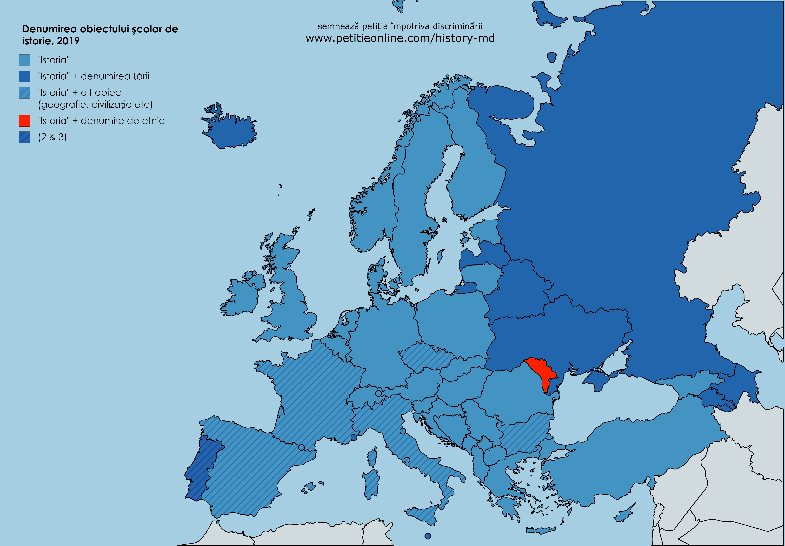
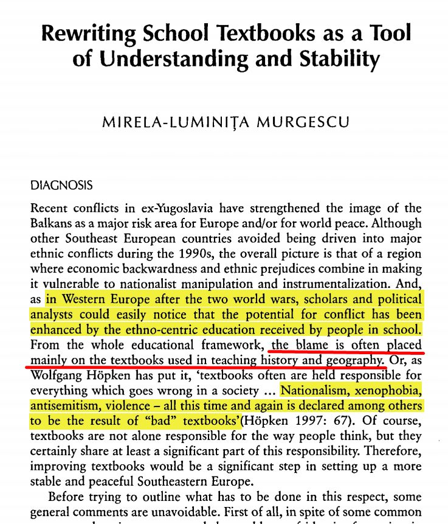

Studiu: 
# Discriminarea în denumirea obiectului școlar de istorie națională în R. Moldova 
în contextul diversității și egalității etnice a elevilor

### Preambul
Acest document reprezintă un studiu la obiectul discriminării etnice a elevilor din școlile Republicii Moldova de către Ministerul Educației. Ministerul impune, în curriculumul școlar, un obiect obligatoriu pentru toți elevii din Republica Moldova - "Istoria Românilor..." - numit în cinstea unei singure etnii (reclamată de 6,9% din populația țării la ultimul recensământ național). Se vor analiza istoricul, situația actuala, legislația națională si internațională, în domeniu, practica altor state.

Vom analiza drept sursă de discriminare exclusiv **denumirea** obiectului de istorie, fără a ne expune opinia asupra *conținutul*ui manualelor, subiect a unui studiu eventual cu mult mai complex și subiectiv. *Conținutul* manualelor de istorie *nu este subiect* al acestui studiu și nu e menit să aducă modificări în acestea, cu toate că autorii și-ar dori, evident, și un conținut echilibrat al acestora, în care s-ar pune în evidență fapte obiective, și nu atitudini personale ale autorilor. Conținutul manualelor, va fi totuși analizat foarte succint, pentru a înțelege fondul problemei și a explica mai bine esența problematicii denumirii obiectului școlar.

## 1. Problematica generală
Este un moment de profundă confuzie pentru părinții și elevii ce se consideră Evrei, Moldoveni, Ucraineni, Găgăuzi, Ruși etc. să explice copiilor la o vârstă fragedă, de ce nu despre toți ei înșiși este obiectul de istorie, dar despre "români". "Nenea ministru probabil nu știa că și noi am locuit aici" - ar fi unica explicație plauzibilă. 

În opinia noastră situația nu ar fi cu nimic mai avantajoasă dacă acest obiect s-ar numi "Istoria Moldovenilor", "Istoria Ucrainenilor" sau "Istoria Romilor" - în oricare din cazuri ar fi lezate sentimentele etnice ale celorlalte etnii, ce s-ar simți etnii "aparte", istoria cărora nu merită de a fi inclusă în denumire a unui obiect școlar din unele sau altele motive.

Pe când în Republica Moldova există *o limbă oficială* consfințită în Constituția Republicii, în legislație nu se constată *nicio etnie/naționalitate oficială*.

Recensămintele populației din anii 1989, 2004, 2014 arată ca majoritatea populației Republicii Moldova - 69-76% - se auto-identifică de naționalitate/etnie moldovenească. Componența națională/etnică a populației Republicii Moldova din următorul tabel, prezintă cifrele oficiale ale Recensământului Național al populației din anii 2004 și 2014: 

_Fig.1 - Tabelul reprezentând diferite naționalități/etnii din Republica Moldova (sursa: Biroul Național de Statistică al Moldovei, statistica.md, Rezultatele recensământului populației din 2014)_

Amintim că recensămintele înregistrează declarația personală a cetățenilor în ce privește apartenența lor etnică/naționalitatea, deci este vorba de autoidentificare - unica metodă modernă de determinare a apartenenței etnice a unui individ, luat în parte. Suma autoidentificarilor personale prezintă o metodă democratică, independentă, științific adaptată, de a identifica, a măsura cantitativ și de a analiza grupurile etnice din interiorul unei comunități. 

Din tabel se vede că în cadrul ultimului recensământ, din 2014, Moldoveni s-au declarat 73.5% din cetățeni, români - 6.9%, ucraineni - 6.5%, găgăuzi - 4.5%, ruși - 4% etc. Subliniem că este opinia directă, brută, declarată a cetățenilor. Nu este aplicat niciun filtru subiectiv a unor "experți" individuali sau grupuri "științifice", politice, sau de altă natură.

**Republica Moldova a rămas unica țară din Europa (probabil și din lume) cu elementul etnic în denumirea obiectului școlar de istorie.** *Nicio altă țară Europeană nu mai include elementul etnic în denumirea obiectului școlar de istorie ([sursa](https://dudnic.com/2019/11/22/denumirea-obiectului-scolar-de-istorie.html)). Niciuna. Nici România.*

## 2.	Definiții
### 2.1	Etnie & Naționalitate 
În acest document, considerăm noțiunile de etnie și naționalitate ca echivalente. Aceasta deoarece în documentele naționale (acte de naștere, recensăminte naționale etc.) nu există diferență între aceste noțiuni, principiul fiind: o cetățenie – mai multe naționalități (etnii). 
### 2.2	Discriminare 
>Considerăm drept **discriminare etnică** fiind, inclusiv, dar nu numai, *preferențierea/evidențierea unui anumit grup de cetățeni față de alte grupe de cetățeni pe baza de criterii etnice/naționale, ce are ca efect avantajarea acestui grup în detrimentul celorlalte, în exprimarea drepturilor și libertăților fundamentale ale omului, în special a dreptului la educație inclusivă, a dreptului individual de a decide din care grup etnic este, sau nu este, parte, a studierii trecutului istoric comun, a recunoașterii existenței și participării indivizilor, și grupurilor etnice din care sunt, sau consideră că sunt, parte, la făurirea trecutului statului comun - Republica Moldova*.

Considerăm aceasta definiție ca una corespunzătoare la următoarele texte legale naționale si internaționale, sau străine: 

* **Drepul moldovenesc**: *Legea cu privire la asigurarea egalității* (nr. 121 din 25.05.2012 - [sursa](http://lex.justice.md/md/343361/)), definește următorii termeni: 
> * _discriminare_ – orice deosebire, excludere, restricție ori preferință în drepturi și libertăți a persoanei sau a unui grup de persoane, precum și susținerea comportamentului discriminatoriu bazat pe criteriile reale, stipulate de prezenta lege sau pe criterii presupuse;  
> * _discriminare directă_ – tratarea unei persoane în baza oricăruia dintre criteriile prohibitive în manieră mai puțin favorabilă decât tratarea altei persoane într-o situație comparabilă;  
> * _discriminare indirectă_ – orice prevedere, acțiune, criteriu sau practică aparent neutră care are drept efect dezavantajarea unei persoane față de o altă persoană în baza criteriilor stipulate de prezenta lege, în afară de cazul în care acea prevedere, acțiune, criteriu sau practică se justifică în mod obiectiv, printr-un scop legitim și dacă mijloacele de atingere a acelui scop sunt proporționale, adecvate și necesare;  
> * _discriminare prin asociere_ – orice faptă de discriminare săvârșită împotriva unei persoane care, deși nu face parte dintr-o categorie de persoane identificată potrivit criteriilor stipulate de prezenta lege, este asociată cu una sau mai multe persoane aparținând unei astfel de categorii de persoane;  
> * _segregare rasială_ – orice acțiune sau inacțiune care conduce direct sau indirect la separarea ori diferențierea persoanelor pe baza criteriilor de rasă, culoare, origine națională sau etnică;  
> * _hărţuire_ – orice comportament nedorit care conduce la crearea unui mediu intimidant, ostil, degradant, umilitor sau ofensator, având drept scop sau efect lezarea demnității unei persoane pe baza criteriilor stipulate de prezenta lege;

* **Convenția internațională privind eliminarea tuturor formelor de discriminare rasială** ([sursa](https://lege5.ro/Gratuit/he2damby/conventia-internationala-privind-eliminarea-tuturor-formelor-de-discriminare-rasiala-din-21121965)) definește ***discriminarea rasială*** ca fiind "*orice deosebire, excludere, restricție sau preferință întemeiată pe rasă, culoare, ascendență sau origine națională sau etnică, care are ca scop sau efect de a distruge sau compromite recunoașterea, folosința sau exercitarea, în condiții de egalitate, a drepturilor omului și a libertăților fundamentale în domeniile politic, economic, social și cultural sau în oricare alt domeniu al vieții publice.*"

* **Drepul român**: Ordonanța de Guvern nr. 137/2000, privind prevenirea și sancționarea tuturor formelor de discriminare, în Art.2, o definiție similară, discriminarea fiind "*orice deosebire, excludere, restricție sau preferință, pe bază de rasă, naționalitate, etnie, [...] convingeri, [...]sau orice alt criteriu care are ca scop sau efect restrângerea sau înlăturarea recunoașterii, folosinței sau exercitării, în condiții de egalitate, a drepturilor omului și a libertăților fundamentale sau a drepturilor recunoscute de lege, în domeniul politic, economic, social și cultural sau în orice alte domenii ale vieții publice*" 

  În particular, din acestea putem conclude că "discriminare rasială" poate fi definită și ca "preferință întemeiată pe origine națională sau etnică, ce are ca efect restrângerea sau înlăturarea recunoașterii, în condiții de egalitate, a drepturilor și libertăților fundamentale".

  *pe teren* se atestă că preferința etniei române de către Ministerul Educației în denumirea obiectului școlar de istorie, are ca efect compromiterea exercitării în condiții de egalitate a dreptului copiilor Republicii Moldova la descoperirea trecutului etniei/naționalității sale în cadrul spațiului comun al tuturor cetățenilor Republicii Moldova. Ca și din denumirea sau conținutul manualului de istorie națională, participarea celorlalte grupuri etnice este simțitor restrânsă, practic, înlăturată. Aceasta "preferință", cât și "restrângere" este atestată cât în denumirea manualului/obiectului școlar, cât și în conținutul manualelor și a curriculei școlare, cum vom vedea mai jos.

* **Drepul român**: Ordinul nr. 6134/2016 *privind interzicerea segregării școlare în unitățile de învățământ preuniversitar*, Art.3, definește segregarea ca fiind "*o formă gravă de discriminare și are drept consecință accesul inegal al copiilor la o educație de calitate, încălcarea exercitării în condiții de egalitate a dreptului la educație, precum și a demnității umane*"

* **Dreptul american**: *The People's Law Dictionary* de Gerald și Kathleen Hill, definește [discriminarea](https://dictionary.law.com/Default.aspx?selected=532) ca "*tratamentul inegal al persoanelor, dintr-un motiv care nu are nimic de-a face cu drepturile sau capacitatea legală*";

  Etniile/naționalitățile ne-românești sunt tratate inegal în denumirea și conținutul manualului de istorie națională, și aceasta nu are nimic de-a face cu drepturile sau capacitatea legală a acelor grupuri etnice/naționale.

* **Dreptul francez**, se indică, în [legea despre lupta contra discriminării și codul muncii](https://www.legifrance.gouv.fr/affichTexte.do?cidTexte=JORFTEXT000000588617&categorieLien=id), că "*Nicio persoana nu poate fi înlăturată [...] din cauza originii, [...] apartenentei sau non-apartenentei, adevărate sau presupuse, la o etnie, națiune sau rasă*".

  Constatăm practic absența/înlăturarea tuturor etniilor din manualul de istorie națională, cu excepția celei române, exprimată prin simplul motiv că despre ele aproape nu se pomenește nimic în conținutul acestor manuale, cum vom vedea mai jos.

### 2.3 Subiecții discriminați
Enumerăm care, după opinia grupului de inițiativă, sunt subiecții discriminați de această denumire a obiectului școlar:

a) **copiii**, cetățeni ai Republicii Moldova, de apartenență națională/etnică minoritara, ne-români, deoarece sunt excluși din denumirea manualului, în favoarea etnicilor români;  
b) copiii, cetățeni ai Republicii Moldova, de apartenență națională/etnică majoritara(moldovenească), care nu se considera români, deoarece sunt excluși din denumirea manualului, în favoarea etnicilor români;  
c) posibila discriminare analizată acoperă toată perioada de timp a existenței acestei denumiri a obiectului școlar în Republica Moldova, deci practic cu mici excepții toată perioada independenței recente a Republicii Moldova. Asta înseamnă ca se includ în cei discriminați nu doar elevii actuali, cât și **toți elevii ce au învățat acest obiect din anii 90**.  
d) **familiile copiilor** din punctul (a), deoarece sunt obligați să aducă efort didactic suplimentar în cadrul familiei, și sa explice copiilor de ce și ei nu figurează pe coperta manualului de istorie;  
e) familiile copiilor din punctul (b). Dacă familia de moldoveni nu se considera români, ei sunt dezavantajați față de familiile conformiste cu ideologia de stat, deoarece sunt nevoiți sa facă fata dublei sarcini didactice și potențială confruntare cu posibilele conflicte între profesori, elevi și părinți referitor la aceasta ideologie;  
f) **profesorii** de istorie, care, indiferent de naționalitate, și opinia proprie asupra acestui subiect național, sunt obligați să predea istoria cum este văzută de pe coperta manualului, și anume istoria exclusiva a etnicilor români. Ce simte oare un profesor de istorie care nu este/nu se consideră român, când i se cere de a preda istoria *românilor* ca istoria proprie și a propriei sale țări în care trăiește? Este Republica Moldova o țară a *românilor* sau o țară a *tuturor cetățenilor săi*, indiferent de naționalitate?

Familiile ce nu doresc să educe copiii în stilul Ministerului Educației sunt discriminate față de alte familii ce se conformează ideologiei de stat. Și anume, părinții Moldovenilor ne-români trebuie sa depună efort didactic suplimentar atât pentru a contra ideologia impusă de Minister, cât și pentru a explica punctul de vedere al său, care va fi în concurență constantă cu ideile sugerate de profesori și manualul de istorie. Aceasta pune în condiții inegale familiile conformiste și nonconformiste cu ideologia de stat. Aceasta situație poate fi sursa de tensiuni potențiale suplimentare între acei elevi moldoveni și părinți, între elevi moldoveni și profesori, și între elevi moldoveni și elevii care se considera români.  

Existența unei ideologii de stat conform căreia moldovenii sunt români, și exprimarea acesteia prin denumirea obiectului școlar, favorizează un risc sporit de conflicte atât între părinți și copii, între părinți și profesori, cât și între copii ce se considera români, și cei ce nu se consideră, inducând în caz de conflicte confuzie și tensiune în clasele școlilor din Republică.

## 3. Cadrul legal
Următoarele documente naționale și internaționale sunt studiate presupunând încălcări din partea Ministerului (sursele către documente consultabile online sunt prezentate mai jos):

### 3.1 Legislația internațională

Segregarea copiilor în școli este descrisă de Consiliul Europei ca "cea mai gravă formă a
discriminării și o violare serioasă a drepturilor copiilor în cauză" [(sursa, p.5)](https://rm.coe.int/fighting-school-segregationin-europe-throughinclusive-education-a-posi/168073fb65). Deși toate statele membre și-au asumat responsabilitatea de a elimina segregarea pe criterii etnice în școli, informațiile din teren arată în mod îngrijorător, nu doar că segregarea persistă, dar și că la nivel european procentul școlilor și al claselor segregate a crescut. 

#### 3.1.1 ONU
* **Convenția internațională privind eliminarea tuturor formelor de discriminare rasială** ([sursa](https://lege5.ro/Gratuit/he2damby/conventia-internationala-privind-eliminarea-tuturor-formelor-de-discriminare-rasiala-din-21121965))

În afara definiției "discriminării rasiale", din paragraful precedent, Convenția mai menționează: 

> Art.4 Statele părți [...] se angajează [...] c)să nu permită autorităților publice sau instituțiilor publice, naționale sau locale să incite la discriminare rasială sau s-o încurajeze.

*pe teren*, paralel cu educația centrată pe identitatea română (și în special a obiectului de istorie națională) se observa înmulțirea asociațiilor, grupărilor, și partidelor care au ca scop segregarea etnicilor români în cadrul unui stat național român, manifestațiilor diverse rusofobe, în particular proteste la ambasadele rusești, la linia de separare cu regiunea Transnistreană, etc. Autorii cred că educația etnocentristă încurajează apariția în societate a sentimentelor extrem de negative referitor la unele popoare sau etnii, și pozitive/de compasiune față de altele.

> Art.7 angajează statele semnatare "să ia măsuri imediate și eficace în domeniile învățământului, educației, culturii și informației, pentru a lupta împotriva prejudecăților ce duc la discriminare rasială și pentru a favoriza înțelegerea, toleranța și prietenia între națiuni și grupuri rasiale sau etnice".

* **Convenția UNESCO privind lupta împotriva discriminării în domeniul învățământului 1960** ([sursa MD](https://lege5.ro/Gratuit/g43danrs/conventia-privind-lupta-impotriva-discriminarii-in-domeniul-invatamintului-adoptata-la-paris-la-14-decembrie-1960), [Convention against Discrimination in Education 1960](http://portal.unesco.org/en/ev.php-URL_ID=12949&URL_DO=DO_TOPIC&URL_SECTION=201.html))
> Art.3 În scopul de a elimina sau preveni orice discriminare [...], statele participante își iau angajamentul:  
> a) să abroge orice dispoziții legislative și administrative și să pună capăt oricăror practici administrative care ar comporta o discriminare în domeniul învățământului;

Acest articol, utilizat de CEDO în cazul procesului profesorilor din Transnistria împotriva Moldovei și Rusiei pentru cauza școlilor cu predare în grafia latină, probabil se pot aplica și în cazul dat, dacă se confirmă că denumirea dată manualului de Ministerul Educației discriminează etnicii ne-români prin excluderea lor, și-i favorizează pe cei români oferindu-le exclusivitate apariției pe copertă. 

Acest subiect poate constitui o încălcare a drepturilor etnice ale populației Republicii Moldova, și posibil și o încălcare a drepturilor copiilor la o educație echitabilă.

* **Declarația Universală a Drepturilor Omului** ([sursa](https://www.ohchr.org/EN/UDHR/Documents/UDHR_Translations/rum.pdf), [Universal Declaration of Human Rights](https://www.un.org/en/universal-declaration-human-rights/))
> Art.26(2): Învățământul trebuie să urmărească dezvoltarea deplină a personalității umane și întărirea respectului față de drepturile omului și libertățile fundamentale. El trebuie să promoveze înțelegerea, toleranța, prietenia între toate popoarele și toate grupurile rasiale [...] (3) Părinții au dreptul de prioritate în alegerea felului de învățământ pentru copiii lor minori.

*pe teren* - toleranța și prietenia între popoare nu este la ordinea de zi, deoarece despre alte popoare în manualul de istorie analizat practic nici nu se pomenește. Totul este axat pe etnia româna, începând de la titlul și terminând cu conținutul. 
Am luat spre exemplu la conținutul unui manual de istorie - "Istoria românilor și universală: Man. pentru cl. a IV-a / Pavel Cerbușca; Min. Educației al Rep. Moldova - Ch.: Î.E.P. Știința, 2016". După analiza lexicală a textului din manual, se poate constata cu stupoare, că *cuvântul "moldovean"/"moldoveni" în manual se întâlnește de 8 ori, cel "rus" are trei aparențe (limba "rusă", "oștile ruse" și "scriitor rus"), cuvintele "ucrain/ean/eni", "evreu", "bulgar", "țigan/rom", "găgăuz", "neamț", "armean" nu se întâlnesc niciodată(!), pe când cuvântul "român" se întâlnește sub diverse forme de 92 ori* !

  

_Fig.2_ Un exemplu de statistică dintr-un manual de "istoria românilor"

Statistică asemănătoare o regăsim și în [curricula liceală de istorie, 2019](https://mecc.gov.md/sites/default/files/iru_liceu.pdf), unde despre minorități nu se vorbește  deloc (eg. "ucrainean", "evreu", "bulgar" nu se întâlnește niciodată), cuvântul "moldovean/eni" se întâlnește doar o singură dată, "rus" doar cu referire la Imperiu, pe când "românesc/român" de sute de ori.  

Prioritatea părinților la fel nu este luată în considerare: toți copiii indiferent de opiniile părinților învață exclusiv despre români, respectiv are loc îndoctrinarea etnică a copiilor la școală, indiferent de poziția părinților expusă acasă, ducând copiii în confuzie și necesitatea de a alege între școală și părinți, în caz dacă opiniile respective diferă. 

* **Declarația privind drepturile popoarelor indigene ale Adunării Generale a ONU** - [UN Declaration on the Rights of Indigenous Peoples, EN](https://www.un.org/esa/socdev/unpfii/documents/DRIPS_en.pdf) [RU](https://www.un.org/esa/socdev/unpfii/documents/DRIPS_ru.pdf)

> Art.14(2) Indigenous individuals, particularly children, have the right to all levels and forms of education of the State without discrimination. (3) States shall, in conjunction with indigenous peoples, take effective measures, in order for indigenous individuals, particularly children, including those living outside their communities, to have access, when possible, to an education in their own culture and provided in their own language.

*pe teren*, necătând la rezultatele recensămintelor naționale, Ministerul impune populației indigene declarate statistic explicit ca "moldoveni", clișee naționaliste, impunând etnonimul de "român" în denumirea obiectului de istorie. Notăm ca aceleași clișee se aplică și la obiectele naționale de limbă (conform art.13 al Constituției declarate ca "moldovenească"), și literatură, însă acestea nu sunt actualmente subiecte ale prezentei petiții. 

> Art.15(1) Indigenous peoples have the right to the dignity and diversity of their cultures, traditions, histories and aspirations which shall be appropriately reflected in education and public information. (2) States shall take effective measures, in consultation and cooperation with the indigenous peoples concerned, to combat prejudice and eliminate discrimination and to promote tolerance, understanding and good relations among indigenous peoples and all other segments of society.

*pe teren* - demnitatea moldovenilor ce nu se consideră români nu este respectată. Prejudecățile nu doar ca nu sunt combătute, ci sunt înrădăcinate și oficializate de către curricula școlară. Doctrina includerii Moldovenilor în români, prin limbă, istorie și literatură reflectă o tendință de îndoctrinare bolnăvicioasă și consecventă a oficialilor ministerului. S-a ajuns pana la aceea ca nici copiii din România copiii nu mai învață demult istoria "românilor", însă responsabilii Ministerului Educației din Republica Moldova mențin aceasta ideologie rămânând probabil ultimii din lume, la sigur ultimii din Europa, cu așa o denumire a obiectului.  

> Art.31(1) Indigenous peoples have the right to maintain, control, protect and develop their cultural heritage, traditional knowledge and traditional cultural expressions [...] oral traditions, literatures [...]. (2) In conjunction with indigenous peoples, States shall take effective measures to recognize and protect the exercise of these rights.

*pe teren* - expresiile populare și tradițiile moldovenești, utilizarea tradițională a denumirii limbii, etniei, poporului și națiunii moldovenești, așa cum s-a obișnuit și [dovezi scrise](https://dudnic.com/2020/06/08/moldovenesc.html) ale cărora le avem cel puțin din sec XVI, sunt sistematic înlocuite cu termenii de "român/esc", deoarece așa considera elita ministerială ca ar fi, după punctul lor de vedere, mai corect. Denumirea limbii moldovenești, utilizata în decurs de cel puțin 5 secole este scoasă din uz contrar recensămintelor și opiniei majoritare publice. Denumirea etniei moldovenești este înlocuită cu etnie românească. Anume acest concept și stă la baza denumirii obiectului național de istorie, considerând aceasta ca parte a luptei contra trecutului sovietic devenit nepopular. Denumirea de etnie moldovenească și de limba moldovenească au devenit jertfe ale luptei elitelor științifice contra trecutului sovietic. Aceste clișee fără de alternativă sunt prezentate elevilor ca unicul adevăr. Astfel, nu doar minoritățile etnice din Republica Moldova sunt practic excluse din manualele de istorie, însă și majoritatea moldovenească este supusă unei îndoctrinării metodice în decursul ultimelor decenii de independență. 

* **Convenția ONU cu privire la drepturile copilului** ([din 20 noiembrie 1989](http://www.cdep.ro/pls/legis/legis_pck.htp_act_text?idt=28213), [United Nations Convention on the Rights of the Child](https://en.wikisource.org/wiki/United_Nations_Convention_on_the_Rights_of_the_Child))
> Art.2(1) Statele părți se angajează să respecte drepturile care sunt enunțate în prezenta Convenție și să le garanteze tuturor copiilor care țin de jurisdicția lor, fără nicio discriminare, indiferent de [...] opinia publică sau altă opinie a copilului sau a părinților sau a reprezentanților săi legali, de originea lor națională, etnică sau socială [...] de nașterea lor sau de altă situație.  
> (2) Statele părți vor lua toate măsurile corespunzătoare astfel încât copilul să fie efectiv protejat împotriva oricărei forme de discriminare sau de sancțiuni motivate de situația juridică, activitățile, opiniile declarate sau convingerile părinților săi, ale reprezentanților săi legali sau ale membrilor familiei sale.  
> Art.8(1) Statele părți se angajează să respecte dreptul copilului de a-și păstra identitatea [...]

*pe teren* se constată că identitatea familiilor Moldovenești ce nu se consideră române este înlocuită cu identitatea românească. Denumirea cursului oficial de istorie națională nu lasă dubii în aceasta privință: istoria este a "românilor", care preia locul identității pur moldovenești a acestor familii. Copiii de etnie românească sunt unicii etnia cărora apare în denumirea obiectului școlar obligatoriu, în așa fel copiii sunt puși în condiții inegale în timpul studiului acestui obiect.

  * *Articolul 30* din această convenție afirmă că un copil aparținând unei minorități „nu va fi privat de dreptul său de a se bucura de propria sa cultură, de a profesa și practica propria sa religie sau de a folosi propria sa limbă”. Prin implicare, acest drept poate fi încălcat dacă un manual de istorie privilegiază istoria unei anumite etnii în detrimentul altora, având un efect simbolic de marginalizare a altor etnii.

* Deschizând o paranteză, putem aminti și **Rezoluția 60/7 a Adunării Generale a ONU**, despre Memoria Holocaustului, care incita (punct 2) țările membre să elaboreze programe educative în acest sens. 

*pe teren* - nici cuvântul "holocaust", nici măcar cuvântul "evre/u/i" nu se regăsește în conținutul manualului de istorie de care am amintit mai sus. În așa fel, se trece sub tăcere memoria unei din cele mai odioase crime comise în istoria omenirii. Închidem aceasta paranteza, care nu se referă nemijlocit la denumirea obiectului de istorie, ci mai mult la conținutul manualului, însă care arată că, dacă simbolic, birocrații își permit utilizarea unei asemenea denumiri unilaterale pe coperta manualului, pai conținutul nu are cum sa fie mai tolerant sau multilateral. 

#### 3.1.2 Consiliul Europei
> "În multe țări poate exista tendința din partea grupurilor de presiune, din partea unor segmente ale opiniei publice sau din partea politicienilor de a folosi istoria ca pe un mijloc de a induce un sentiment de superioritate și, în unele cazuri, de ură față de "ceilalți", fie că aceștia sunt state sau grupuri etnice minoritare"  
[Raport CoE, "Consiliul Europei și istoria în școală", Ann Low-Beer, Strasbourg, 1997](https://rm.coe.int/1680494436)

Istoria se studiază în toate statele europene. În majoritatea obiectul se numește "Istorie", în unele cazuri în denumire figurează și denumirea țării, însă în nicio țara (cel puțin din Europa) în afara Moldovei nu se specifica vreo denumire de etnie: ([studiu](https://www.dudnic.com/2019/11/denumirea-obiectului-scolar-de-istorie.html)) 
Fig.3 Denumirea obiectului școlar de istorie în țările Europei

Pentru elevii cu vârste între 10 și 14 ani studiul istoriei este obligatoriu în toate școlile din Europa, iar diferențele apar în legătură cu momentul de debut al studiului (la 5, 7 sau 10 ani), precum și în ceea ce privește vârsta la care istoria devine obiect de studiu opțional (14, 15 sau 17 ani). Alte diferențe se referă la timpul de învățare alocat săptămânal (între 45 și peste 90 de minute), la forma – disciplinară sau integrată de studiu, precum și la modelul de construire al programelor școlare: liniar, concentric sau în spirală. Pe de altă parte, alte elemente comune înregistrate de studiul menționat se referă la tendințele comune cu privire la finalitățile studiului istoriei – înțelegerea de către elevi a lumii în care trăiesc, contribuția la dezvoltarea cetățeniei europene și la dezvoltarea gândirii critice, precum și la renunțarea la criteriul cronologic de organizare a conținuturilor în favoarea celui tematic (EUROCLIO, 2003, [link](http://hiphi.ubbcluj.ro/studii/Public/File/cursuri/suporturi_conversie/Didactica-istoriei_I.pdf)).

Dăm mai jos o listă non-exhaustivă a convențiilor și textelor juridice ale Consiliului Europei, ce sunt subiect al posibilei încălcări de către Ministerul Educației:

* **Convenția Europeană a Drepturilor Omului** ([sursa md](https://www.echr.coe.int/documents/convention_ron.pdf), [European Convention on Human Rights](https://www.echr.coe.int/documents/convention_ENG.pdf))
> Art.8 *Dreptul la respectarea vieții private și de familie*  
> (1) Orice persoană are dreptul la respectarea vieții sale private și de familie[...].  
> (2) Nu este admis amestecul unei autorități publice în exercitarea acestui drept decât în măsura în care acesta este prevăzut de lege și constituie, într-o societate democratică, o măsură necesară pentru securitatea națională, siguranța publică, bunăstarea economică a țării, apărarea ordinii și prevenirea faptelor penale, protecția sănătății, a moralei, a drepturilor și a libertăților altora.

*pe teren* observam implicarea directă a statului în afacerile familiei. În particular, dreptul părinților de a educa copilul ca etnic moldovean este compromisă de ideologia impusă în manualele școlare conform cărora etnicii moldoveni sunt, de fapt, români. Aceasta se exprimă inclusiv prin denumirea cursului școlar de istorie. 

> Art.9 *Libertatea de gândire, de conștiință și de religie*  
> (1) Orice persoană are dreptul la libertate de gândire, de conștiință [...]; acest drept include libertatea de a-și schimba [...] convingerile, precum și libertatea de a-și manifesta [...] convingerea în mod individual sau colectiv, în public sau în particular, prin cult, învățământ, practici [...].  
> (2) Nu este admis amestecul unei autorități publice în exercitarea acestui drept decât în măsura în care acesta este prevăzut de lege și constituie, într-o societate democratică, o măsură necesară pentru securitatea națională, siguranța publică, bunăstarea economică a țării, apărarea ordinii și prevenirea faptelor penale, protecția sănătății, a moralei, a drepturilor și a libertăților altora.

*pe teren* observam ca libertatea gândirii este limitată de denumirea obiectului școlar de istorie, prin care se marchează teoria oficială a "românismului". Aceasta teorie impusă nu are nicio interferență cu securitatea națională, siguranța publică sau alte elemente enumerate în punctul 2 ale acestui articol. Respectiv, acest amestec al Statului limitează libertatea opiniei și libertatea gândirii copiilor din Republica Moldova. 

> * Protocolul adițional (1)  
> Art.2 *Dreptul la instruire*  
> Nimănui nu i se poate refuza dreptul la instruire. Statul, în exercitarea funcțiilor pe care și le va asuma în domeniul educației și învățământului, va respecta dreptul părinților de a asigura această educație și acest învățământ conform convingerilor lor religioase și filozofice.  
> Art.14 *Interzicerea discriminării*  
> Exercitarea drepturilor și libertăților recunoscute de prezenta Convenție trebuie să fie asigurată fără nicio deosebire bazată, în special, pe [...], opinii [...], origine națională [...], apartenență la o minoritate națională [...].
> * Protocolul nr. 12; Art.1 *Interzicerea generală a discriminării*
> 1. Exercitarea oricărui drept prevăzut de lege trebuie să fie asigurată fără nicio discriminare bazată, în special, pe [...] limbă, opinii [...], origine națională[...], apartenența la o minoritate națională [...] sau oricare altă situație.  
> 2. Nimeni nu va fi discriminat de o autoritate publică pe baza oricăruia dintre motivele menționate în paragraful 1.

*pe teren* se constată că statul ignoră convingerile unei părți semnificative a populației care se declara moldoveni, ignoră concepțiile filosofice a multor părinți semnatari ai acestei petiții, care nu sunt de acord că copii lor sa fie instruiți drept etnici români. Se atestă o deosebire evidentă bazată pe origine națională. Minoritățile etnice sunt cu desăvârșire absente în cărțile de istorie analizate de noi, cărți acreditate de către Ministerul Educației din Moldova. 

* **Convenția-cadru pentru protecția minorităților naționale** ([md](http://www.anr.gov.ro/docs/legislatie/internationala/Conventia_Cadru_pentru_Protectia_Minoritatilor_Nationale.pdf), [Framework Convention for the Protection of National Minorities](https://www.coe.int/en/web/minorities/text-of-the-convention))
> Art.5(2) [...] părțile se vor abține de la orice politică ori practică având drept scop asimilarea persoanelor aparținând minorităților naționale împotriva voinței acestora și vor proteja aceste persoane împotriva oricărei acțiuni vizând o astfel de asimilare.

*pe teren* se poate remarca că Convenția nu interzice asimilarea *voluntară*, există dovezi că cetățenii Republicii Moldova sunt împotriva practicii etnocentrismului: de exemplu petiția ["Pentru Istoria Moldovei"](https://www.petitieonline.com/history-md) semnată de mii de oameni, atitudinile ce se pot vedea în comentariile la petiția în cauză unde semnatarii își exprimă opiniile la această temă.

> Art.6(1) Părțile vor încuraja [...] toleranta și dialogul [...] dintre toate persoanele ce trăiesc pe teritoriul lor, indiferent de identitatea etnica, culturala, lingvistica[...], _îndeosebi în domeniile educației_...

> Art.7 Părțile vor asigura respectarea drepturilor [...] la _libertatea de gândire_...

> Art.12 Părțile [...] vor lua măsuri în domeniul educației și al cercetării, pentru a încuraja cunoașterea culturii, istoriei, limbii și religiei atât ale minorităților lor naționale, cât și ale majorității

*pe teren* sistemul educativ național a monopolizat studiul istoriei unei singure componente etnice naționale, care nu e nici măcar majoritară. 

> art.20 În exercitarea drepturilor și libertăților [...] orice persoană aparținând unei minorități naționale va respecta [...] drepturile [...] majorității sau altor minorități naționale.
 
*pe teren* se constată ca persoanele din Republica Moldova care se identifică drept "români" au impus, pesemne, un monopol asupra sistemului educativ și asupra ideilor și convingerilor expuse în literatura didactică pentru elevi, aparținând atât celorlalte minorități, cât și a majorității - Moldovenești [v. legea minorităților] - a populației. Anume din această cauză, limba de stat a fost renumită de către Ministerul Educației în "română" din oficiala "moldovenească", în loc de "Istoria Moldovei" copiii învață "Istoria Românilor", iar obiectul de Literatură se numește și el "Literatura română", fără a consulta și asculta publicul larg și opiniile populației majoritare, exprimate prin recensămintele naționale.

##### 3.1.3 Recomandările Adunării Parlamentare a Consiliul Europei

* **Recomandarea 15 (2001) privind Predarea istoriei în Europa în secolul XXI** ([sursa MD](http://www.istorie-bucuresti.ro/e107_files/downloads/Documente%20scolare/Recomandarea%2015%20-2001%20-%20predarea%20istoriei%20in%20Europa%20in%20sec.21.pdf), [Recommendation Rec(2001)15 EN](https://search.coe.int/cm/Pages/result_details.aspx?ObjectID=09000016805e2c31))
> Anexa 1. [...]  
>- să facă posibilă la elevi dezvoltarea capacității intelectuale de a analiza și a interpreta
informația istorică în mod critic și responsabil, pe calea dialogului, prin aflarea dovezilor istorice și prin dezbaterea deschisă, care să aibă la bază perspectivele multiple asupra istoriei, cu precădere în ceea ce privește aspectele controversate și sensibile;
>- să permită cetățenilor Europei să își formeze și să își afirme propria identitate individuală și colectivă [...];

*pe teren* putem constata următoarele: 
- un subiect controversat și sensibil este _identitatea națională_. Ideea ca identitatea este "româna" se impune elevului direct din titlul manualului. Despre care analiza critică sau dialog este atunci vorba?
- "cetățenii Europei" în Republica Moldova sunt denumiți, conform titlului manualului "români". Acest clișeu apare în fața copilului chiar și atunci când manualul este închis, direct de pe coperta. Despre care identitate "proprie" poate sa viseze un elev-cetățean ce se considera moldovean, nu și român? Acest clișeu, impus de unele cercuri academice naționaliste, la minister este considerat drept unicul corect și unicul promovat oficial în manualele școlare.

> "2. Manipularea istoriei
> Predarea istoriei nu trebuie să fie un instrument de manipulare în scop ideologic, de propagandă sau să fie utilizată pentru promovarea ideilor intolerantei, a celor ultranaționaliste, xenofobe sau a antisemitismului";

*pe teren* putem constata următoarele: 
- ideologia etniei "române" (promovate de cercurile ultranaționaliste academice și politice), se sugerează tânărului elev direct și fără ocolișuri, de pe însăși coperta manualului, promovând ideea că unica istorie ce merită de învățat la nivel național este cel al etniei române, dovada faptului este că titlul manualului include unicul și singurul etnonim: "românilor" excluzând alte elemente etnice din contextul istoriei naționale a poporului multietnic al Republicii Moldova, inclusiv, și poate, în special, pentru elevii ce și-ar dori să afirme identitatea majoritară - "moldovenească", indiferent dacă o considera distinctă sau nu de cea "română". Așa idei "incorecte" sunt eradicate din start și încurajate de a fi privite cu ironie și dispreț, manifestând discriminarea lor, de unde și vine acest demers către autorități;

- se promovează prin denumirea manualului de istorie idea că "național" - "istoria națională" - este echivalent cu "român" - "istoria românilor". Așadar, se ignora explicit opiniile majorității moldovenilor, exprimate în recensămintele naționale, privitor la identitatea lor națională - "moldovenească"; 

- acest contrast între opinia naționalistă academică și realitatea de pe teren creează teren propice pentru sentimente de neînțelegere, ură, intoleranță către persoanele ce nu împărtășesc teoria "româna" a identității populației majoritare din Republica Moldova, învinuiri reciproce, marșuri și manifestații etnocentrice, radicalizarea opiniilor exprimate în public și pe rețelele de socializare.

* **Recomandarea 1111/1989 cu privire la dimensiunea europeană a educației** ([Recommendation 1111 (1989)](http://assembly.coe.int/nw/xml/XRef/Xref-XML2HTML-en.asp?fileid=15145&lang=en)), ne vorbește că "dimensiunea europeană a educației, Europa se extinde pe întregul continent" (p.5) și că educația trebuie sa contribuie la "cunoașterea 'altora'" [popoare, națiuni, n.r.] (punct 2)

*pe teren* - "cunoașterea altora" practic se rezumă la "români". Respectul culturii altora este virtual, deoarece "alții" nici nu se pomenesc în manual. Noțiunea de cetățean al Republicii Moldova este pe larg înlocuită cu noțiunea de etnic român, și aceasta rezultă direct de pe coperta manualului, din titlul manualului și a obiectului școlar impus de Ministerul Educației.

* **Recomandarea 98/5 a Comitetului de Miniștri al Consiliului Europei vizând educația în ceea ce privește păstrarea moștenirii istorice** ([fr](http://geapolis.eu/Doc21.pdf), [Recommendation No. R(98)5](https://rm.coe.int/16804f1ca1)) menționează că "una dintre misiunile educației este formarea tinerilor să respecte culturile în diversitatea lor, cetățenia și democrația", și că "moștenirea culturală este rezultatul contribuțiilor și schimburilor de la diferite origini și epoci"

*pe teren* - dacă este vorba de "moștenirea comună", pai cât din conținutul manualului, atât și mai ales din titlu, nu trebuie sa fie exclusă moștenirea lăsată de alte grupuri etnice - aceasta lipsa este constatată cu tristețe la momentul actual răsfoind manualele apărute sub egida ministerului național al educației.  
Multilateralitatea nu este încurajată, ci se dă preferință unui singur punct de vedere asupra istoriei - toată informația - începând cu titlul manualului - se focalizează pe *etnocentrismul național român*, și toate originile sunt limitate la cultura și contribuția românilor, despre alte origini ale patrimoniului cultural al Republicii Moldova nu se pomenește fie ca se pomenește în forma reziduală. 

* **Recomandarea nr. 1353** (1998) a Adunării parlamentare a Consiliului Europei privind accesul minorităților la educație școlară ([sursa EN](https://assembly.coe.int/nw/xml/XRef/Xref-XML2HTML-en.asp?fileid=16579&lang=en)) prevede că "minoritățile ar trebui să poată să-și exprime identitatea și să-și dezvolte educația, cultura, limba și tradițiile și că statele ar trebui să ia toate măsurile necesare în acest scop. Mai mult, acesta este singurul mod prin care Europa va putea păstra bogata sa diversitate culturală";

* **Recomandarea CE 1283 (1996) privind istoria și învățarea istoriei în Europa** [sursa](http://www.istorie-bucuresti.ro/download.php?view.23) susține că istoria "*poate contribui la o mai bună înțelegere, toleranță și încredere între indivizi și între popoarele Europei - sau poate deveni o forță pentru divizare, violență și intoleranță", că învățarea istoriei nu ar trebui sa fie "învățarea pe de rost a evenimentelor istorice luate la întâmplare", ci ar trebui să aibă "o modalitate de dezvoltare a unei abordări critice și a unei atitudini democratice, tolerante și civic responsabile", de "necesitatea realizării unei înțelegeri reciproce și a unei încrederi mai profunde între popoare, în special prin realizarea unui curriculum de istorie care să elimine prejudecățile și stereotipurile și să sublinieze rolul influenței reciproce pozitive între diferite țări, religii și idei în cadrul dezvoltării istorice a Europei*".

*pe teren* - vedem afișat direct pe copertă manualului de istorie stereotipul (promovat de unii academicieni și politicieni din extremă dreapta), despre idea că moldovenii sunt români. Nu avem nimic împotriva informării elevului că așa o teorie există, și chiar este susținută de multă lume de știință, însă suntem împotriva unicității acestei idei și lipsa din manual a opiniilor alternative ce la fel exista în societate și sunt ignorate de manuale. Sa căutăm în manual urme de *influențe reciproce pozitive* ale altor țări, popoare, în afara de România, asupra poporului Moldovenesc! Din păcate influențele externe deseori se limitează la deportările și foametea din perioada sovietică, care se atribuie exclusiv unui popor vecin. Despre influențele pozitive ale altor popoare sau națiuni informația este fie foarte puțin prezentă, fie lipsește cu desăvârșire.
Despre *întemeierea* Țărilor Moldovei și a Valahiei se spune (același manual de mai sus, pag 26) că ar fi țări "române", pe când în acei ani nu se cunosc încă surse istorice ce ar atesta aceste afirmații, sau dacă așa surse și există, ele nu se aduc în manual elevilor. Elevul este impus sa creadă "pe cuvânt" autorii manualelor. În așa fel se impune un stereotip de gândire la copii, capacitatea de analiză și de depistare a propagandei a cărora încă se formează.
Cum sa luptăm cu stereotipurile și falsul, când sărbătoarea oficială națională cu denumirea "Limba Noastră" (vezi hot. 433 a Sovietului Suprem al RSSM din 26-12-1990), sărbătorită pe 31 august, este descrisă (în pagina 47 a aceluiași manual) că ar fi având denumirea de "Limba Noastră cea Română"?!

  
Fig.4 Pagină din manualul de istorie adăugând "cea Română" la denumirea oficială a sărbătorii naționale de 31 august

#### 3.1.4 UE

* **Memorandumul pentru educația permanentă**, elaborat de Uniunea Europeană în 2000 [sursa MD](https://usarb.md/wp-content/uploads/2019/03/Memorandum-asupra-invatarii-permanente-din-30_10_2000_Bruxelles.pdf), [A Memorandum on Lifelong Learning, EN](https://uil.unesco.org/i/doc/lifelong-learning/policies/european-communities-a-memorandum-on-lifelong-learning.pdf) stipulează (punct 2) că "indivizii [...] trebuie să învețe să accepte diversitatea culturală, etnică și lingvistică". 

*pe teren* - acest principiu nu se reflectă nici în denumirea obiectului școlar, nici în conținutul manualelor de istorie, nici în curicula de istorie adoptată de Ministerul Educației. "Diversitatea" etnică în manuale și curicula se rezumă la "român", iar în conținutul manualului nu prea găsim nici limba, nici cultura minorităților, și abia dacă în genere găsim pomenire de aceste minorități, cum am putut vedea în exemplele de mai sus.

* **Tratatul de la Amsterdam** (1997) – permite adoptarea de către toate statele membre ale Comunității Europene a tuturor mijloacelor adecvate pentru a lupta împotriva discriminării pe motive de etnie sau convingeri;

* **Carta Drepturilor Fundamentale** a Uniunii Europene ([sursa](https://eur-lex.europa.eu/legal-content/RO/TXT/HTML/?uri=CELEX:12012P/TXT&from=EN))
> Art. 14 (dreptul la educație potrivit propriilor convingeri), 21 (nediscriminarea), 22 (diversitatea) și 24 (drepturile copilului la opinie).

* **Tratatul privind funcționarea Uniunii Europene** [(MD)](https://eur-lex.europa.eu/legal-content/RO/TXT/?uri=celex:12012E/TXT)

> Art.10 În definirea și punerea în aplicare a politicilor și acțiunilor sale, Uniunea caută să combată orice discriminare pe motive de sex, rasă sau origine etnică[...].  
Art.19 Consiliul [...] poate lua măsurile necesare în vederea combaterii oricărei discriminări bazate pe sex, rasă sau origine etnică[...].  
Art.21(1) Se interzice discriminarea de orice fel, bazată pe motive precum [...] originea etnică sau socială, [...] convingerile, opiniile [...], apartenența la o minoritate națională, [...].  
(2) În domeniul de aplicare a tratatelor și fără a aduce atingere dispozițiilor speciale ale acestora, se interzice orice discriminare pe motiv de cetățenie.  
Art.24(1) Copiii [...] își pot exprima în mod liber opinia. Aceasta se ia în considerare în problemele care îi privesc, în funcție de vârsta și gradul lor de maturitate.  
(2) În toate acțiunile referitoare la copii, indiferent dacă sunt realizate de autorități publice sau de instituții private, interesul superior al copilului trebuie să fie considerat primordial.

* **Rezoluția Parlamentului European din 7 februarie 2018** referitoare la protecție și nediscriminare în ceea ce privește minoritățile în statele membre ale UE (2017/2937(RSP)) [EN](https://eur-lex.europa.eu/legal-content/RO/TXT/HTML/?uri=CELEX:52018IP0032&qid=1599249280140&from=EN) indică "discriminarea bazată pe originea etnică este menționată ca cea mai des întâlnită formă de discriminare"

#### 3.1.5 SUA
* [**Legislația statului Washington**](https://app.leg.wa.gov/RCW/default.aspx?cite=28A.230.020) impune școlilor următoarele restricții de curriculă: "Toate școlile generale vor oferi instrucțiuni de [...], geografie, istoria Statelor Unite, gramatică engleză, [...]", deci, dacă o scoală ar impune "istoria americanilor" în locul celei "a Statelor Unite", aceasta ar putea constitui un motiv de litigiu judiciar.

### 3.2 Legislația națională

* **Constituția Republicii Moldova** 

> Art.5(2) "Nici o ideologie nu poate fi instituită ca ideologie oficială a statului" 
 
*pe teren* - ideologia "identității românești" a poporului și a limbii moldovenilor este predată oficial și fără nicio alternativă în școlile din Republica Moldova, atât ca conținut al manualelor, cât chiar și după denumirea lor. Copiii moldoveni nu au altă alternativă decât a denumi limba "română", literatura - "română", și istoria - "română". Aceasta idee și labelizare discutabilă este unica versiune ce se impune copiilor moldoveni. Minoritățile naționale sunt practic excluse din aceste obiecte. Majoritatea moldoveneasca nu are decât a accepta această ideologie de stat, și a se supune îndoctrinării oficiale a Ministerului Educației.
 
> Art.10. Unitatea poporului și dreptul la identitate
(1) Statul are ca fundament unitatea poporului R. Moldova. R. Moldova este patria comună și indivizibilă a tuturor cetățenilor săi.
(2) Statul recunoaște și garantează dreptul tuturor cetățenilor la păstrarea, la dezvoltarea și la exprimarea identității lor etnice[...]

*pe teren* - statul impune, prin educație, la nivel național, studierea literaturii românești și istoriei românilor, cu toate că Românii nu reprezintă nici naționalitatea majoritară, nici etnie sau naționalitate oficială de stat. Limba oficială moldovenească (art.13 din Constituția RM), urmând aceeași tendință, este renumita și predată la copii ca "română".

> Art.16(2) "Toți cetățenii Republicii Moldova sînt egali în fața legii și a autorităților publice, fără deosebire de [...] naționalitate, origine etnică ..."

*pe teren* - românii sunt unicii istoria cărora se învață oficial de către școlile naționale.

> Art.31(1) "Libertatea conștiinței este garantată. Ea trebuie să se manifeste în spirit de toleranță și de respect reciproc"

*pe teren* - libertatea conștiinței este limitata de ideologia românismului, predata oficial în manualele școlare. Lipsa de alternativă a ideologiei de stat nu favorizează dezvoltarea libertății conștiinței. Familiile în care punctul de vedere este diferit decât cel oficial sunt defavorizate fata de cele care se conformează acestuia, deoarece copiii din aceste familii nimeresc în situații confuze, și au nevoie de eforturi mai mari pentru a asimila materialul școlar.
* **Legea cu privire la asigurarea egalității** (nr. 121 din 25.05.2012), a fost deja menționată mai sus cu definirea discriminării. Alte puncte din aceasta lege, menționează: 
> Formele grave ale discriminării sînt:
>   a) promovarea sau practicarea discriminării de către autoritățile publice;
>   b) susținerea discriminării prin intermediul mijloacelor de informare în masă;
>   c) amplasarea mesajelor și simbolurilor discriminatorii în locurile publice;
>   d) discriminarea persoanelor pe baza a două sau mai multe criterii;
>   e) discriminarea săvîrşită de două sau mai multe persoane;
>   f) discriminarea săvîrşită de două sau mai multe ori;
>   g) discriminarea săvîrşită asupra unui grup de persoane;
>   h) segregarea rasială.

*pe teren* – Ministerul Educației, evidențiază un singur grup etnic/național, pe coperta manualelor, care apar în sălile de clasă a școlilor naționale, în librăriile publice etc.

Sunt numeroase și mijloacele de informare în masă, pentru care segregarea persoanelor de o singura etnie în diverse proiecte politice republicane și extra republicane a devenit o normă. Una din cauzele principale ale acestor comportamente marginale este educația națională a tinerilor cetățeni, care se inspiră din istorie pentru a construi un viitor, unicitatea căruia este indiscutabilă și alternativa căruia nu se analizează de sistemul educațional în materie de istorie.

* **Legea privind drepturile copilului** (nr. 338 din 15.12.1994 - [sursa](https://www.legis.md/cautare/getResults?doc_id=94939&lang=ro)):
> * Art.3 Toți copiii sunt _egali_ în drepturi _fără deosebire de naționalitate, origine etnică_, sex, limbă, [...] convingeri...
> * Art.6 Statul ocrotește inviolabilitatea persoanei copilului, protejându-l de orice formă de [...] discriminare...
> * Art.8(1) Dreptul copilului la libertatea gândirii, la opinie[...] nu pot fi încălcate sub nici o formă... 
> (2) Statul garantează copilului[...], dreptul de a-și _exprima liber aceste opinii_ asupra oricărei probleme care îl privește. De opinia copilului care a atins vârsta de 10 ani se va ține cont...
> (4) Nici un copil nu poate fi _constrîns să împărtășească o opinie_ sau alta, [...] contrar convingerilor sale. _Libertatea conștiinței copilului este garantată_ de către stat...
> (5) Părinții sau persoanele subrogatorii legale au _dreptul să educe copilul conform propriilor convingeri_.
> * Art. 9. Statul asigură tuturor copiilor posibilități și _condiţii egale pentru însușirea valorilor_ culturale...
> * Art. 31(2) Dacă acordul internațional la care Republica Moldova este parte stabilește alte reguli decât cele care se conțin în prezenta lege, se aplică regulile acordului internațional.

* **Legea cu privire la drepturile persoanelor aparținând minorităților naționale și la statutul juridic al organizațiilor** (nr. 382 din 19.07.2001 - [sursa](http://lex.justice.md/index.php?action=view&view=doc&lang=1&id=312817))
> Demonstrând devotament față de _Declaraţia Universală a Drepturilor Omului_ [...] de _Convenţia-cadru privind protecția minorităților naţionale_; [...] ținând cont de diversitatea etnică [...] a poporului R. Moldova [...]; pornind de la principiile juridice internaționale conform cărora protecția minorităților naționale, a drepturilor și libertăților persoanelor aparținând acestor minorități este parte inseparabilă a protecției drepturilor omului; Parlamentul adoptă prezenta lege organică.  
> Art.1 În sensul prezentei legi, prin persoane aparținând minorităților naționale se înțeleg persoanele care [...] se deosebesc de majoritatea populației - moldoveni - și se consideră de altă origine etnică.

*pe teren*, cu toate că legea vorbește despre majoritatea populației ca fiind moldoveni, Ministerul Educației, din considerente cel puțin neobiective, impune denumirea obiectului de istorie a *românilor*. 

> Art.2 Orice persoană aparținând unei minorități naționale are dreptul să aleagă liber dacă aparține minorității respective sau nu...

> Art.6(4) Studierea limbii și literaturii moldovenești, precum și a istoriei Moldovei, în toate instituțiile de învăţămînt este obligatorie.

*pe teren* - istoria *Moldovei*, limba și literatura *moldovenească* nu se învață în școli, au fost înlocuite de birocrații de la Minister cu istoria *românilor*, limba și literatura *română*. 

### 3.3 Precedente juridice similare în lume
Asigurarea nediscriminării și egalității în educație este un principiu fundamental în domeniul juridic internațional. De exemplu, Convenția Internațională asupra Eliminării Tuturor Formelor de Discriminare Rasială a ONU subliniază că statele trebuie să interzică și elimine rasismul în toate formele sale și să garanteze dreptul la egalitate în fața legii, inclusiv în domeniul educației și predării.

Pentru a aplica acest principiu în contextul Republicii Moldova și denumirii manualului de istorie "Istoria românilor", putem analiza mai multe aspecte.

* În primul rând, folosirea unui termen etnic în denumirea unui curs de istorie ar putea fi percepută ca o favoizare a unei anumite etnii la excluderea altora, ceea ce ar putea fi considerat o formă de discriminare. De exemplu, în 1999, în cazul Cyprus vs. Turkey, Curtea Europeană a Drepturilor Omului a constatat că există discriminare în cazul în care persoanele de altă etnie decât majoritara nu au acces la educație în propria limbă.

* În al doilea rând, un manual de istorie cu o denumire etnocentrică poate neglija sau minimaliza contribuțiile altor grupuri etnice la istoria Republicii Moldova. De exemplu, în 2007, Comitetul pentru Drepturile Copilului al ONU a exprimat îngrijorarea că manualele de istorie în Japonia minimizează crimele comise de Japonia în timpul celui de-al doilea război mondial, ceea ce ar putea fi considerat o formă de discriminare.

* În al treilea rând, denumirea etnocentrică a manualului de istorie poate fi considerată ca un act de asimilare forțată, încălcând drepturile minorităților de a-și păstra propria identitate culturală. De exemplu, în 2008, Comisia Interamericană a Drepturilor Omului a dat o decizie în cazul Saramaka vs. Suriname, unde a găsit că Suriname a încălcat drepturile Saramakas, o minoritate etnică, prin încercările de asimilare forțată.

* **Brown vs. Board of Education (1954, SUA)**: ([EN](https://en.wikipedia.org/wiki/Brown_v._Board_of_Education), [RU](https://ru.wikipedia.org/wiki/%D0%91%D1%80%D0%B0%D1%83%D0%BD_%D0%BF%D1%80%D0%BE%D1%82%D0%B8%D0%B2_%D0%A1%D0%BE%D0%B2%D0%B5%D1%82%D0%B0_%D0%BF%D0%BE_%D0%BE%D0%B1%D1%80%D0%B0%D0%B7%D0%BE%D0%B2%D0%B0%D0%BD%D0%B8%D1%8E)) - procesul juridic din SUA care a recunoscut ca anti-constituțională instruirea separată a albilor și negrilor. În aceste dezbateri a fost utilizată lucrarea psihologilor Kenneth B. Clark, Mamie Clark care demonstrau ca segregarea duce la dezvoltarea a complexelor și prejudecăților infantile. Deși acest caz a implicat segregarea rasială în școli și nu se referă direct la manuale școlare, el stabilește un precedent semnificativ în ceea ce privește simbolismul discriminatoriu în educație. Curtea Supremă a SUA a decis că segregarea școlară este neconstituțională, deoarece ea înseamnă "separat dar egal", care în practică nu este adevărat și implică o superioritate de facto a unui grup rasial asupra altuia. Acest principiu poate fi aplicat și la denumirea manualului de istorie din Republica Moldova - chiar dacă intenția nu este de a discrimina, simbolismul unei singure etnii poate transmite un mesaj de superioritate. Se poate de tras paralele și cu educația din Republica Moldova, unde evidențierea etnicilor români în manualele școlare ar putea crea complexe la copii de alte etnii, inclusiv a majorității moldovene.

* **Situația monumentelor în Estonia (2007)**: În Estonia, relocarea unui monument al Al Doilea Război Mondial a fost văzută ca un simbol de discriminare împotriva minorității rusofone. Deși nu este direct legat de educație, acest exemplu arată că simbolurile culturale pot fi percepute ca discriminare dacă ele favorizează un grup etnic în detrimentul altuia.

#### 3.3.1 CEDO (ECHR)
* **Case of Kjeldsen, Busk Madsen and Pedersen v. Denmark** ([source, EN](https://hudoc.echr.coe.int/eng?i=001-57509)) despre refuzul de a urma cursul de educație sexuala a copiilor în Danemarca (refuzat de CEDO).
* **Comisia pentru Drepturile Omului a ONU și Casul D.H. și alții împotriva Cehiei (2007)**
Acest caz a implicat segregarea romilor în școli speciale pentru copii cu deficiențe mintale. În decizia sa, Curtea Europeană a Drepturilor Omului a stabilit că, deși nu exista intenție explicită de discriminare, înscrierea disproporționată a copiilor romi în aceste școli a constituit discriminare indirectă. Acest precedent poate fi aplicat la situația în Republica Moldova, deoarece, chiar dacă nu există o intenție explicită de discriminare, folosirea unui titlu etnocentric pentru un manual de istorie ar putea avea efecte discriminatorii.

#### 3.3.2 Curtea Internațională de Justiție

* **Învățământul bilingv în Țările Basse (Belgia) vs. Spania (2010)**: În acest caz, Curtea Internațională de Justiție a decis că a obliga toți copiii să învețe în limba flamandă în școlile din Țările Basse a fost discriminatoriu pentru copiii de limbă franceză. Chiar dacă nu este direct legat de manualele de istorie, acest caz demonstrează principiul că toți elevii ar trebui să aibă dreptul de a învăța într-un mediu care respectă și reflectă identitatea lor culturală.

#### 3.3.3 UNESCO
* **UNESCO și situația școlilor de limbă turcă în Grecia (1964)**: UNESCO a criticat Grecia pentru faptul că nu a permis funcționarea școlilor de limbă turcă, ceea ce a fost văzut ca o încălcare a drepturilor minorităților de a-și păstra identitatea culturală. Acest caz subliniază importanța respectării diversității culturale în educație.

### 3.4 Legislația națională a altor state
Definirea și interzicerea segregării etnice este prezentă în legislația mai multor țări a Europei. În [acest document, Annex 3. pag. 107](https://www.migpolgroup.com/wp-content/uploads/2020/04/Racial-discrimination-in-education-and-EU-equality-law.pdf) sunt rezumate definițiile segregării etnice în diferite state. 

#### *Definirea segregației în educație*
* **Marea Britanie**: 
Equality Act 2010 Section 13 (1) and (5) A person (A) discriminates against another (B) if, because of a protected characteristic, A treats B less favourably than A treats or would treat others. If the protected characteristic is race, less favourable treatment includes segregating B from others.  
NI Race Relations Order 1997, Art. 3(2) Race Relations Order Segregating a person from other persons on racial grounds is treating him less favourably than they are treated.

* **Bulgaria**:  Article 5 and Additional Provision §1.6 Law on Protection Against Discrimination Racial segregation […] shall be deemed discrimination, [and] shall mean issuing an act, performing an action or omission to act, which leads to compulsory separation, differentiation or dissociation of persons based on their [...] ethnicity [...] .

* **Croatia**: Article 5, (1) and (2) Anti-Discrimination Act Segregation shall […] deem to be discrimination […] meaning [...] a forced and systematic separation of persons on any of the grounds referred to in Article 1 paragraph 1 of [the Anti-discrimination Act]

* **Ungaria**: Article 10 (2) and 27 (3) Antidiscrimination law. Segregation is a behaviour aimed at separating individuals or a group of persons from other individuals or another group of persons in a comparable situation, based on a characteristic defined in [the anti-discrimination law].

#### 3.4.1 România

În România vecină, odată cu aderarea țării la UE (2007), obiectul școlar de "Istoria Românilor" a fost "europenizat", stârnind valuri de nemulțumiri în lumea academică din țară [articol 03/02/2006](https://www.ziaruldeiasi.ro/iasi/laquo-istoria-romanilorraquo-va-disparea-ca-disciplina-scolara-la-liceu~ni3un1) 

În al treilea raport despre România al ECRI (Comisia Europeană împotriva Rasismului și Intoleranței), adoptat pe 24 iunie 2005, se notează ([pag.81](https://rm.coe.int/third-report-on-romania-romanian-translation-/16808b5b92)): 
> "ECRI notează că în ciuda măsurilor mai sus menționate, pe care le întâmpină cu bucurie, rămân multe lucruri de făcut în domeniul educației. Organizații nonguvernamentale încă deplâng faptul că manualele școlare românești conțin stereotipuri și prejudecăți despre grupurile minoritare. Unele manuale, de exemplu, continuă să descrie sosirea în România a unor “hoarde de nomazi barbari care au venit dinspre est pentru a răspândi teroare", iar maghiarii sunt uneori descriși ca străini care au ocupat Transilvania. ECRI mai notează că numele cursului de istorie predat elevilor români este "Istoria românilor", și nu "Istoria României". S-ar părea de asemenea că deși cele mai multe referiri ofensatoare la adresa rromilor au fost șterse din manualele școlare, se acordă în continuare prea puțină atenție contribuției lor la dezvoltarea societății românești"

Iată cum răspunde Ministerul Educației și Cercetării la remarcile ECRI ([sursa](https://rm.coe.int/government-comments-on-the-third-report-on-romania-romanian-translatio/16808b5b9b)):

> "În ceea ce privește denumirea disciplinei „Istoria românilor”, și nu „Istoria României”, precizăm că acesta a fost stabilită imediat după anul 1989 și a ținut cont de anumite particularități ale istoriei naționale (denumirea statului – România - a apărut la jumătatea sec. al XIX-lea și, prin urmare, "Istoria României" ar include numai ultimul secol și jumătate). Ținând însă cont de recomandările Consiliului Europei, România a introdus din anul școlar 2004-2005, cursuri de istorie integrată, denumite "Istorie". Odată cu introducerea noilor programe pentru clasele a VIII-a și a XII-a, în următorii ani va dispărea și sintagma "Istoria românilor". În noile programe vor fi introduse noi teme privind istoria minorităților din România și a minorității române în țările vecine."

*Legea educației naționale 1/2011*, care garantează educația bazată pe principiul echității, garantării identității culturale, recunoașterii și garantării drepturilor persoanelor aparținând minorităților naționale, dreptul la păstrarea, la dezvoltarea și la exprimarea identității lor etnice, culturale, lingvistice și religioase, principiul asigurării egalității de șanse, principiul libertății de gândire și al independenței față de ideologii, dogme religioase și doctrine politice, principiul incluziunii sociale, principiul organizării învățământului confesional potrivit cerințelor specifice fiecărui cult recunoscut (art.3);

Drept urmare, denumirea "Istoria românilor" pentru un manual de istorie care este folosit pentru toți cetățenii Republicii Moldova, indiferent de etnie, ar putea fi considerată discriminatorie din punct de vedere juridic internațional. Alternativ, un titlu mai neutru și incluziv, cum ar fi "Istoria Republicii Moldova", ar putea evita aceste probleme.

## 4. Ce s-a făcut până acum pentru a remedia situația
În anul 2005, la solicitarea Guvernului R. Moldova adresată Consiliului Europei, Institutul de Analiză Internațională a Manualelor "Georg Eckert" din Braunschweig a expertizat de două ori manuscrisele manualelor de istorie integrată și a prezentat părții moldovenești două rapoarte. La finele lunii noiembrie 2005, o ședință cu membrii Guvernului și deputați ai Parlamentului, unde s-a discutat problema implementării cursului de istorie integrată realizat în baza recomandărilor Consiliului Europei. Președintele de atunci al Republicii, Vladimir Voronin a menționat că această acțiune face parte din eforturile Moldovei de a alinia standardele educaționale naționale la cele europene. Guvernul R. Moldova a solicitat expertiza noilor manuale la mijlocul anului 2005, raportul Institutului "Georg Eckert" a parvenit abia la finele anului 2005. Pentru prima dată acest raport a fost prezentat autorilor de manuale la Seminarul din Braunschweig din decembrie 2005. A se vedea Report of Seminar on "The use of multiperspectivity in teaching history", Holercani, Moldova, Friday 14 - Saturday 15 July 2006, Report by Stefan Ihrig, Council of Europe, DGIV/EDU/HIST (2006) 04, p. 9.

Ministrul Educației din acea vreme, V. Ţvircun, a semnat în luna iulie 2006 un ordin prin care a introdus, începând cu 1 septembrie 2006, cursul de "istorie integrată", în curriculumul școlar în locul "Istoria românilor" și "Istoria universală".

Stefan Ihrig, reprezentantul Institutului de Analiză Internațională a Manualelor "Georg Eckert", prezentând cea de-a doua evaluare a manualelor de istorie integrată, a atras atenția că doar autorii manualelor pentru clasele a V-a și a VI-a au ținut cont de observațiile și sugestiile din primul raport și doar aceste manuale întrunesc calitățile unei lucrări didactice realizate după principiile integrării și multiperspectivităţii.

Încercări de a modifica denumirea obiectului de istorie cu ajutorul Consiliului Europei au fost multiple, de către parlamentarii PCRM, în 2002, 2004, 2006. Moldova a fost susținută de Consiliul Europei sa accepte o varianta de compromis - "Istorie - curs integrat". Dl Stepaniuc Victor (în acea perioada în calitate de deputat și președinte al Comisiei parlamentare pentru cultură, știință, educație, tineret, sport și mijloace de informare în masă) a insistat în fața Secretarului General de atunci al Consiliului Europei, Dl Walter Schwimmer (diplomat austriac, secretarul general al CE între 1999-2004) pentru varianta denumirii obiectului "Istoria Moldovei". El a propus organizarea unui referendum național, dar conducerea Moldovei au acceptat, ulterior, compromisul cu structurile europene: "Istoria - curs integrat".

Astfel, în anii 2006-2009, în R. Moldova au fost utilizate noile manuale de istorie integrată. Procese similare au loc și în România vecină.

Însă în 2010 după venirea la guvernare a forțelor politice de centru-dreapta Ministerul Educației din Moldova a restabilit denumirea obiectului în "Istoria Românilor".

În 2012, Asociația Istoricilor și Politologilor PRO-Moldova, în frunte cu directorul executiv al acesteia, istoricul Sergiu Nazaria, se adresează cu o cerere la Curtea de Apel (CA) a RM prin care cer anularea ordinului Ministerului Educației privind introducerea în programele școlare a obiectului "Istoria Românilor". Curtea examinează cererea pe 7 septembrie și respinge acțiunea, considerând-o nefondată și care nu ține de competența ei. Asociația depune atunci un recurs la Curtea Supremă de Justiție acțiunile continua până în 2014, fără niciun rezultat. 

În februarie 2020, la Chișinău s-a desfășurat Conferința internațională "Educația istorică în Moldova Independentă: experiența națională și internațională", organizată de Asociația Istoricilor și Politologilor "PRO-Moldova", în care s-a reiterat ca Moldova rămâne unicul stat în cu istorie mono etnică în școli.  

Recent (în august 2020), grupul de inițiativă al prezentei petiții, a contactat specialiști ai institutului german "Institutul Georg Eckert - Institutul Leibniz pentru Cercetarea Internațională a manualelor", menționat mai sus, care i-au confirmat, că sunt, citez 
> "perfect de acord că denumirea de 'Istoria românilor' este exclusivă și nu contribuie la o educație fără discriminare etnică, așa cum preconizează toate recomandările europene în acest sens".

## 5. Cerințe

Ținând cont de textele legale expuse mai sus, 

**CEREM**

- **Consiliului** pentru prevenirea și eliminarea discriminării și asigurarea egalității în Republica Moldova:
  -  de a recunoaște utilizarea unicului etnonim, "românilor", în denumirea obiectului republican de istorie națională drept *discriminatorie*.

- **Ministerului Educației**, Guvernului și Parlamentului Republicii Moldova:

  - **de a de-etniza** (elimina factorul mono-etnic din) **denumirea obiectului școlar de istorie** națională, luând ca exemplu oricare altă țară din Europa. Denumiri acceptate pot fi, de exemplu "Istoria Moldovei", "Istoria", "Istoria și Geografia", "Istoria națională", "Istoria Republicii Moldova" etc.;
  - **de a modifica prezentul curriculum** pentru obiectul de Istorie, pentru a elimina angajarea politică neobiectivă și monopolul unei ideologii etnocentrice din expunerea datelor și faptelor istoriei naționale din manualele școlare;
  - de a pune în funcție o **bază normativ-juridică**, care ar împiedica funcționarii publici, actuali sau viitori, de a utiliza formulări și alte metode discriminatorii, care ar pune în preferință, sau din contra, ar neglija, grupuri de cetățeni ai R. Moldova, indiferent de apartenența lor etnică, națională, socială sau de altă natură, în cadrul educației publice de stat din Republica Moldova, pentru că toți cetățenii acestui stat sa se simtă incluși, utili, și împliniți în statul nostru comun.

## Bibliografie
* Council of Europe, the Fifth periodic report of the Republic of Moldova on the implementation of the framework convention for the protection of national minorities [(22 May 2019)](https://rm.coe.int/5th-sr-moldova-en/168094d328)
* Thematic review of national policies for education - Moldova, 2002; 
* Consiliul Europei, despre discriminare și intolerantă ([în rusă]( https://www.coe.int/ru/web/compass/discrimination-and-intolerance))
* Общеполитическая рекомендация ЕКРН № 10: [Основные темы](https://rm.coe.int/-10-/16808b7670)
* Mirela-Luminita Murgescu (2002): [Rewriting school textbooks as a tool of understanding and stability, Southeast European and Black Sea Studies, 2:1, 90-104](https://doi.org/10.1080/14683850208454674)

